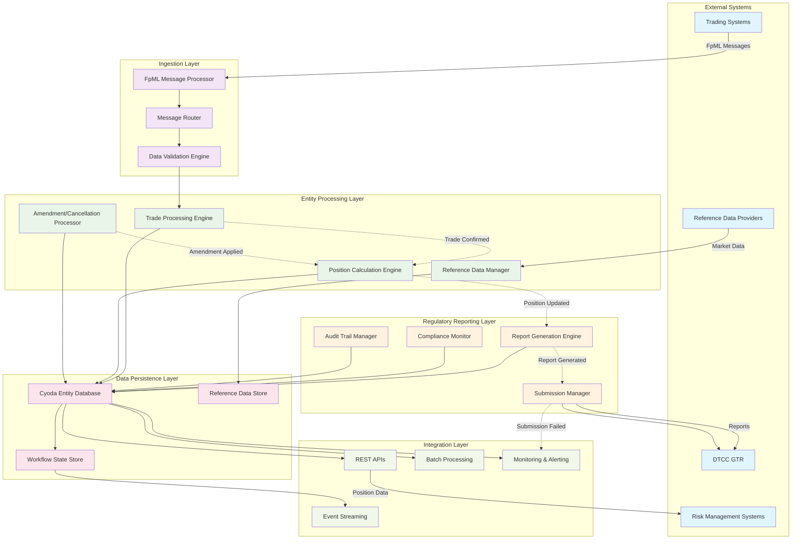
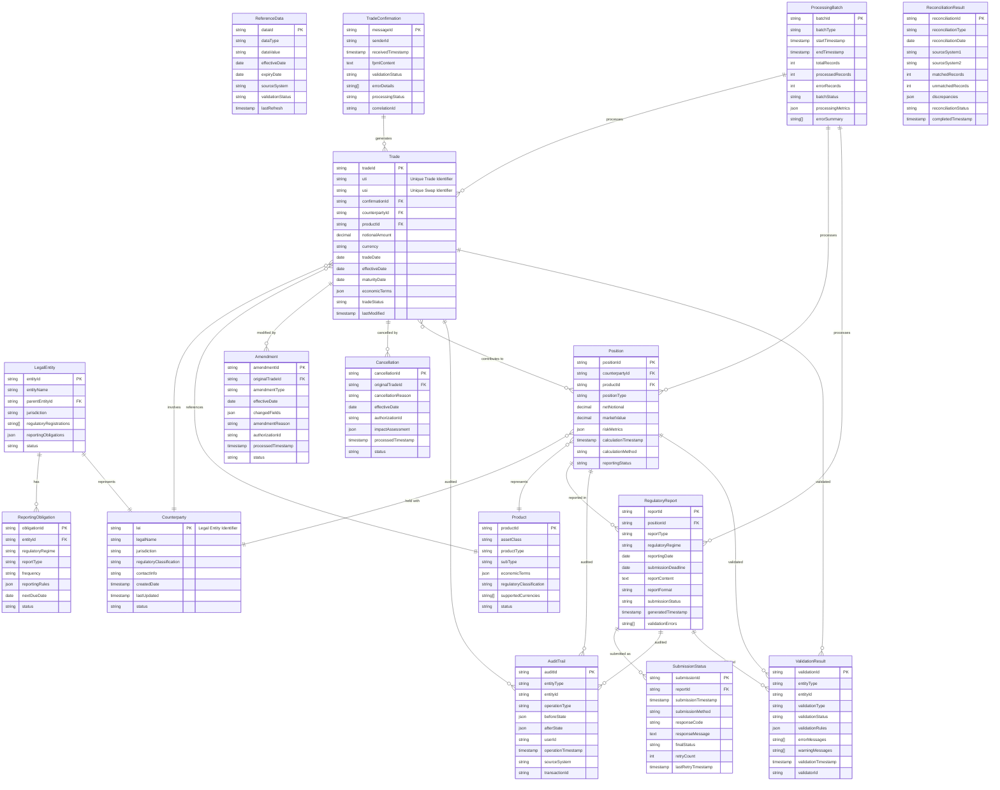

# Agent Session Transcript - Task 1

## Threads

### 09:33 AM - Execute High-Level System Architecture Plan

**Command**: 
```
Execute the plan @/.ai/plans/1-Create-High-Level-System-Architecture-and-Entity-Overview.md Read the @/.ai/tasks/dtcc-reporting/system-specification/system-description.md to understand the overall context. The artefacts you produce should be placed in the same folder as the system-description.md in a structured manner.
```

**Command**: 
```
Execute the plan @1-Create-High-Level-System-Architecture-and-Entity-Overview.md
Read the @system-description.md to understand the overall context. The artefacts you produce should be placed in the same folder as the system-description.md in a structured manner.
```

**Response**:
```
I'll start by reading the plan and system description to understand the context and requirements, Paul Muadib.
```

### File Reading Sequence

**Action**: Read file `1-Create-High-Level-System-Architecture-and-Entity-Overview.md` from `.ai/plans`

**Action**: Read file `1-Create-High-Level-System-Architecture-and-Entity-Overview.md` from `.ai/plans`

**Action**: Read file `system-description.md` from `.ai/tasks/dtcc-reporting/system-specification`

**Response**:
```
Now I'll check the workspace structure to understand where to place the artifacts and look for any existing guidelines.
```

**Action**: Read directory `system-specification` from `.ai/tasks/dtcc-reporting`

**Action**: Read directory `dtcc-reporting` from `.ai/tasks`

**Response**:
```
Let me check the Cyoda design principles and workflow configuration guide to understand the architectural foundation.
```

**Action**: Read file `cyoda-design-principles.md` from `.ai/tasks/dtcc-reporting`

**Action**: Read lines 1-50 from `workflow-config-guide.md` in `.ai/tasks/dtcc-reporting`

### Research Phase

**Response**:
```
Now I need to research DTCC regulatory reporting requirements to understand the business context better.
```

**Action**: Web search
```
DTCC Global Trade Repository GTR OTC derivatives regulatory reporting requirements
```

**Action**: Web Fetch

**Action**: Web search
```
FpML OTC derivatives trade confirmation message format structure
```

### Planning Phase

**Response**:
```
Now I have enough information to create a comprehensive plan. Let me outline the detailed plan for creating the high-level system architecture and entity overview.
```

**Detailed Plan for High-Level System Architecture and Entity Overview**

**Response**:
```
Based on my research and understanding of the DTCC regulatory reporting requirements and Cyoda architecture principles, here's my detailed plan:

Core Business Entities to Define:

Master Data Entities:
- Counterparty - Legal entities involved in trades
- ReferenceData - Market data, currencies, holidays, etc.
- Product - OTC derivative product definitions
- LegalEntity - Regulatory entity information

Transactional Data Entities:
- TradeConfirmation - Incoming FpML trade messages
- Trade - Processed and validated trade records
- Position - Aggregated trade positions
- Amendment - Trade modification records
- Cancellation - Trade cancellation records

Reporting Data Entities:
- RegulatoryReport - DTCC GTR submission records
- ReportingObligation - Regulatory requirements tracking
- SubmissionStatus - Report submission tracking
- AuditTrail - Complete change history

Processing Control Entities:
- ProcessingBatch - Batch processing coordination
- ValidationResult - Data validation outcomes
- ReconciliationResult - Position reconciliation outcomes

Artifacts to Create:
- system-architecture.md - High-level system architecture document
- entity-overview.md - Complete entity landscape and relationships
- entity-relationship-diagram.mmd - Mermaid ERD showing relationships
- system-architecture-diagram.mmd - Mermaid system architecture diagram
- event-driven-architecture.md - Event-driven principles and patterns
- naming-conventions.md - Entity naming and design standards

File Structure:
.ai/tasks/dtcc-reporting/system-specification/
├── system-description.md (existing)
├── system-architecture.md
├── entity-overview.md
├── entity-relationship-diagram.mmd
├── system-architecture-diagram.mmd
├── event-driven-architecture.md
└── naming-conventions.md
```

### File Creation Phase

**Response**:
```
Let me proceed with creating these artifacts:
```

**Action**: Created file `system-architecture.md` in `.ai/tasks/dtcc-reporting/system-specification`

**Action**: Created file `entity-overview.md` in `.ai/tasks/dtcc-reporting/system-specification`

**Action**: Created file `entity-relationship-diagram.mmd` in `.ai/tasks/dtcc-reporting/system-specification`

**Action**: Created file `system-architecture-diagram.mmd` in `.ai/tasks/dtcc-reporting/system-specification`

**Action**: Created file `event-driven-architecture.md` in `.ai/tasks/dtcc-reporting/system-specification`

**Action**: Created file `naming-conventions.md` in `.ai/tasks/dtcc-reporting/system-specification`

### Diagram Rendering Phase

**Response**:
```
Now let me render the diagrams to visualize the architecture and entity relationships:
```

**Action**: Render Mermaid

**DTCC System Architecture Diagram**



**Action**: Render Mermaid

**DTCC Entity Relationship Diagram**


