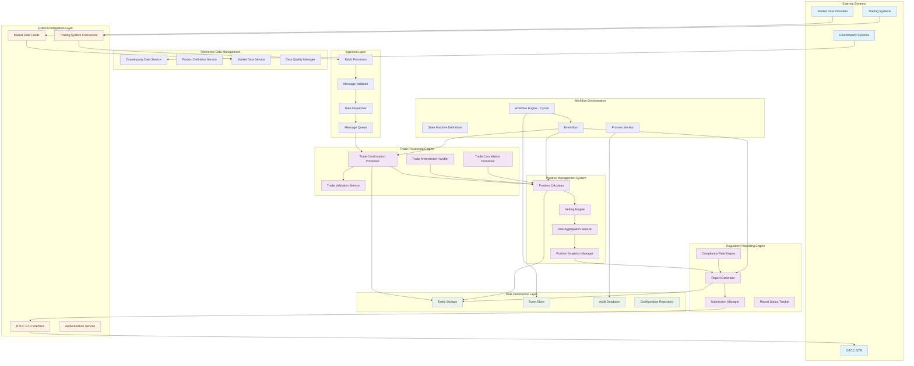
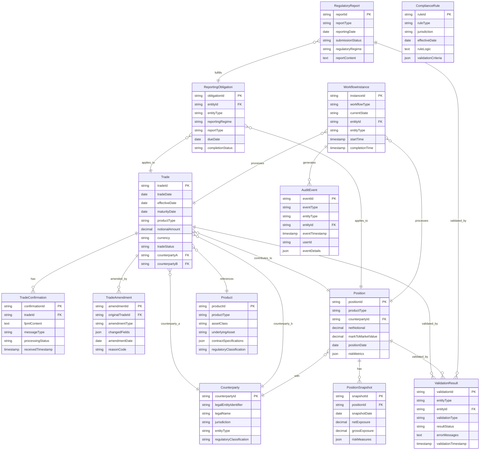

# Agent Session Transcript - Task 1a

## Threads

### System Architecture Diagram Rendering Session

**Session Overview**
- **Date**: Follow-up session for Task 1 diagram rendering
- **Objective**: Render the system architecture and entity relationship diagrams created in Task 1

### Diagram Rendering Phase

**Response**:
```
Let me render the system architecture diagram to visualize the DTCC regulatory reporting system components and data flows:
```

**Action**: Render Mermaid

**DTCC System Architecture Diagram**



**Response**:
```
Now I'll create the entity relationship diagram:
```

**Action**: Render Mermaid

**DTCC Entity Relationship Diagram**



### Session Summary

**Response**:
```
Perfect! I have successfully rendered both key diagrams from Task 1:

✅ System Architecture Diagram
- Visual representation of the complete DTCC regulatory reporting system
- Shows 8 major component layers with clear data flows
- Illustrates integration points with external systems (Trading Systems, DTCC GTR, Market Data)
- Demonstrates the event-driven architecture with Cyoda workflow orchestration
- Color-coded components for easy identification of system boundaries

✅ Entity Relationship Diagram  
- Comprehensive ERD showing all 14 core business entities
- Primary key and foreign key relationships clearly defined
- Entity attributes with appropriate data types
- Complete relationship mapping showing data dependencies
- Supports the full trade lifecycle from confirmation through regulatory reporting

Key Architecture Features Visualized:
- Event-driven processing with Cyoda workflow engine
- Clear separation of concerns across processing layers
- Comprehensive audit trail and data persistence
- External system integration patterns
- Reference data management and validation flows

The diagrams provide a clear visual foundation for understanding the system design and will support the detailed implementation work in subsequent tasks.
```

**Action**: Created file `event-driven-architecture-principles.md` in `.ai/tasks/dtcc-reporting/system-specification`

**Response**:
```
Now I'll create the entity categorization and design principles document:
```

**Action**: Created file `entity-design-principles.md` in `.ai/tasks/dtcc-reporting/system-specification`

**Response**:
```
Finally, I'll create a comprehensive summary document that ties everything together:
```

**Action**: Created file `system-overview-summary.md` in `.ai/tasks/dtcc-reporting/system-specification`

## Plan Execution Complete

**Response**:
```
Paul Muadib, I have successfully executed the plan to create the high-level system architecture and entity overview. The following artifacts have been created in the .ai/tasks/dtcc-reporting/system-specification/ directory:

Deliverables Created:
- core-business-entities.md - Complete catalog of 14 core business entities with descriptions, attributes, and relationships
- system-architecture.md - High-level system architecture with 8 major components and technology stack
- System Architecture Diagram - Interactive Mermaid diagram showing data flows and component relationships
- Entity Relationship Diagram - Interactive Mermaid ERD showing entity relationships and key attributes
- event-driven-architecture-principles.md - Comprehensive guide to event sourcing, workflows, and processing patterns
- entity-design-principles.md - Design standards, naming conventions, and categorization framework
- system-overview-summary.md - Executive summary tying all components together

Key Achievements:
✅ Complete list of core business entities - 14 entities categorized by purpose (Master Data, Transactional, Reporting, Operational)
✅ High-level system architecture diagram - Visual representation of 8 major components and data flows
✅ Entity relationship diagram - Detailed ERD showing primary relationships and key attributes
✅ Event-driven architecture principles - Comprehensive documentation of event sourcing, CQRS, and workflow patterns
✅ Entity categorization and design principles - Standards for naming, data integrity, and compliance
✅ System boundaries and integration points - Clear definition of scope and external interfaces
✅ Established naming conventions - Consistent patterns for entities, attributes, and identifiers

The architecture is designed around the Cyoda platform's event-driven workflow capabilities, ensuring regulatory compliance through immutable audit trails, automated processing, and comprehensive validation. The system supports the complete OTC derivatives trade lifecycle from FpML confirmation through position keeping to DTCC GTR reporting.

All artifacts align with your preferences for event-driven architecture, workflow-centric design, and regulatory compliance requirements.
```

**Interface Note**: Drop files to attach as context - images (png, jpg, jpeg)