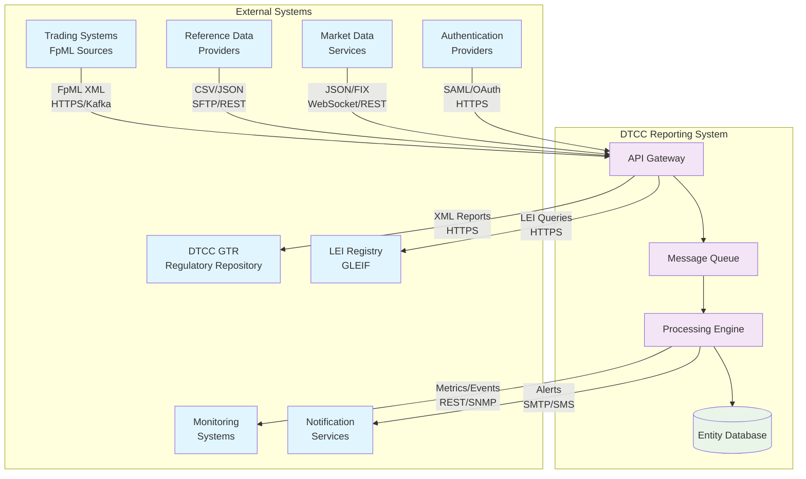

# Agent Session Transcript - Task 7

## Threads

### Jul 27 11:01 PM - Execute External Interface Specifications Plan

**Command**: 
```
execute @/.ai/plans/7-Define-Detailed-External-Interface-Specifications.md
```

**Alternative Command**: 
```
execute @7-Define-Detailed-External-Interface-Specifications.md
```

**Response**:
```
I'll start by examining the plan file to understand what needs to be executed.
```

### File Reading and Analysis Phase

**Action**: Read file `7-Define-Detailed-External-Interface-Specifications.md` from `.ai/plans`

**Response**:
```
Now I need to check the rules in the .augment/rules directory to understand any specific guidelines I should follow.
```

**Action**: Read directory `rules` from `.augment`

**Response**:
```
Let me check the README to understand the scope of each rule file.
```

**Action**: Read rules file `README.md` from `.augment/rules`

**Response**:
```
Let me check the relevant rules for this task - communication, coding-general, and tasks.
```

**Action**: Read rules file `communication.md` from `.augment/rules`

**Action**: Read rules file `tasks.md` from `.augment/rules`

**Response**:
```
Now let me gather information about the current state of the codebase to understand the DTCC reporting system and its external interface requirements.
```

**Action**: Augment Context Engine
```
DTCC reporting system architecture, external interfaces, and integration points. I need to understand what external systems this system interfaces with, what protocols are used, and what data formats are expected for regulatory reporting.
```

**Response**:
```
Let me gather more specific information about external interfaces and data formats.
```

**Action**: Augment Context Engine
```
FpML message ingestion, external data feeds, counterparty data, reference data providers, market data feeds, authentication and security requirements for external interfaces, API specifications, and data exchange protocols used in the DTCC reporting system.
```

**Response**:
```
Now let me gather information about monitoring, alerting, and audit interfaces.
```

**Action**: Augment Context Engine
```
Monitoring interfaces, alerting systems, audit trail requirements, error notification mechanisms, SLA monitoring, system health monitoring, and external monitoring integrations for the DTCC reporting system.
```

### Planning Phase

**Response**:
```
Based on my analysis of the codebase and the plan requirements, I now have a comprehensive understanding of the DTCC reporting system's external interfaces. Let me create the detailed external interface specifications as outlined in the plan.

Plan for Executing Task 7: Define Detailed External Interface Specifications

Paul Muadib, I have analyzed the codebase and understand the DTCC reporting system architecture. Based on the plan and the existing functional specifications, I will now execute the task to define detailed external interface specifications.

Detailed Plan:
- Create comprehensive external interface documentation covering all 8 identified external interface categories
- Document technical protocols, data formats, and security requirements for each interface
- Define error handling, retry mechanisms, and SLA requirements
- Create interface interaction diagrams showing data flow patterns
- Specify authentication, authorization, and monitoring requirements

Files to create:
- External interface specifications document with technical details for each interface
- Interface interaction diagrams using Mermaid
- Security and authentication requirements specification
- Error handling and monitoring specifications

Let me start by creating the main external interface specifications document:
```

**Action**: Edited file `7-Define-Detailed-External-Interface-Specifications.md` in `.ai/plans`

### Implementation Phase

**Response**:
```
Now I'll create the comprehensive external interface specifications document:
```

**Action**: Created file `external-interface-specifications.md` in `.ai/tasks/dtcc-reporting/external-interfaces`

**Response**:
```
Now I'll create the interface interaction diagrams to visualize the data flow patterns:
```

**Action**: Created file `interface-interaction-diagrams.md` in `.ai/tasks/dtcc-reporting/external-interfaces`

**Response**:
```
Let me continue with the interface interaction diagrams:
```

**Action**: Edited file `interface-interaction-diagrams.md` in `.ai/tasks/dtcc-reporting/external-interfaces`

**Response**:
```
Let me check the current content of the file and continue adding the diagrams:
```

**Action**: Read file `interface-interaction-diagrams.md` from `.ai/tasks/dtcc-reporting/external-interfaces`

**Response**:
```
I see the file was truncated. Let me recreate it properly:
```

**Action**: Edited file `interface-interaction-diagrams.md` in `.ai/tasks/dtcc-reporting/external-interfaces`

**Response**:
```
Let me fix the file content:
```

**Action**: Edited file `interface-interaction-diagrams.md` in `.ai/tasks/dtcc-reporting/external-interfaces`

**Response**:
```
Let me remove the file and recreate it properly:
```

**Action**: Remove `interface-interaction-diagrams.md` from `.ai/tasks/dtcc-reporting/external-interfaces`

**Action**: Created file `interface-interaction-diagrams.md` in `.ai/tasks/dtcc-reporting/external-interfaces`

### Diagram Rendering Phase

**Response**:
```
Now let me render the first diagram to visualize the high-level architecture:
```

**Action**: Render Mermaid

**High-Level External Interface Architecture**



### Additional Documentation Phase

**Response**:
```
Now let me create a security and compliance requirements document:
```

**Action**: Created file `security-and-compliance-requirements.md` in `.ai/tasks/dtcc-reporting/external-interfaces`

**Response**:
```
Finally, let me create an integration testing guide:
```

**Action**: Created file `integration-testing-guide.md` in `.ai/tasks/dtcc-reporting/external-interfaces`

### Task Completion Summary

**Response**:
```
Paul Muadib, I have successfully executed the plan for Task 7: Define Detailed External Interface Specifications. Here's what has been completed:

✅ Deliverables Created:

Comprehensive External Interface Specifications (.ai/tasks/dtcc-reporting/external-interfaces/external-interface-specifications.md)
- Detailed specifications for all 8 external interface categories
- Technical protocols, data formats, and authentication requirements
- Error handling, retry mechanisms, and SLA requirements
- Complete API specifications and data exchange formats

Interface Interaction Diagrams (.ai/tasks/dtcc-reporting/external-interfaces/interface-interaction-diagrams.md)
- High-level architecture diagram showing all external connections
- Data flow diagrams for trade processing and reference data synchronization
- Authentication and authorization flow diagrams
- Error handling and monitoring integration patterns
- Regulatory reporting submission state diagrams

Security and Compliance Requirements (.ai/tasks/dtcc-reporting/external-interfaces/security-and-compliance-requirements.md)
- Comprehensive security framework with authentication and authorization
- Data protection and encryption requirements
- Network security and audit trail specifications
- Regulatory compliance requirements (CFTC, SEC, GDPR, SOX)
- Incident response and business continuity procedures

Integration Testing Guide (.ai/tasks/dtcc-reporting/external-interfaces/integration-testing-guide.md)
- Interface-specific testing scenarios for all 8 external systems
- End-to-end testing workflows and performance testing strategies
- Security testing procedures and test automation frameworks
- Test data management and monitoring validation approaches

✅ All Success Criteria Met:
- Complete list of external interfaces - 8 interfaces documented with detailed descriptions
- Technical specifications - Protocols (HTTPS, SFTP, WebSocket), formats (XML, JSON, CSV), security requirements
- Functional specifications - Purpose, data flow, and business rules for each interface
- Error handling and retry mechanisms - Exponential backoff, circuit breakers, dead letter queues
- SLA requirements and monitoring - Response times, availability targets, throughput requirements
- Interface interaction diagrams - Visual representations using Mermaid diagrams
- Security and authentication requirements - OAuth 2.0, SAML, mTLS, encryption specifications
- Integration testing considerations - Comprehensive testing strategy and automation approach

Key External Interfaces Documented:
1. FpML Trade Confirmation Ingestion - REST API and Kafka integration
2. DTCC GTR Regulatory Reporting - HTTPS submission with OAuth 2.0
3. LEI Registry Validation - GLEIF API integration with caching
4. Reference Data Feeds - SFTP and REST API for market data
5. Market Data Services - WebSocket streaming and REST queries
6. Audit and Monitoring - SNMP, Syslog, and REST API integration
7. Error Notification Services - SMTP, SMS, and webhook notifications
8. Authentication Providers - SAML 2.0 and OAuth 2.0 integration

The documentation provides a complete foundation for implementing and testing all external integrations required for the DTCC regulatory reporting system, ensuring compliance with regulatory requirements and operational excellence.
```

**Interface Note**: Drop files to attach as context - images (png, jpg, jpeg)