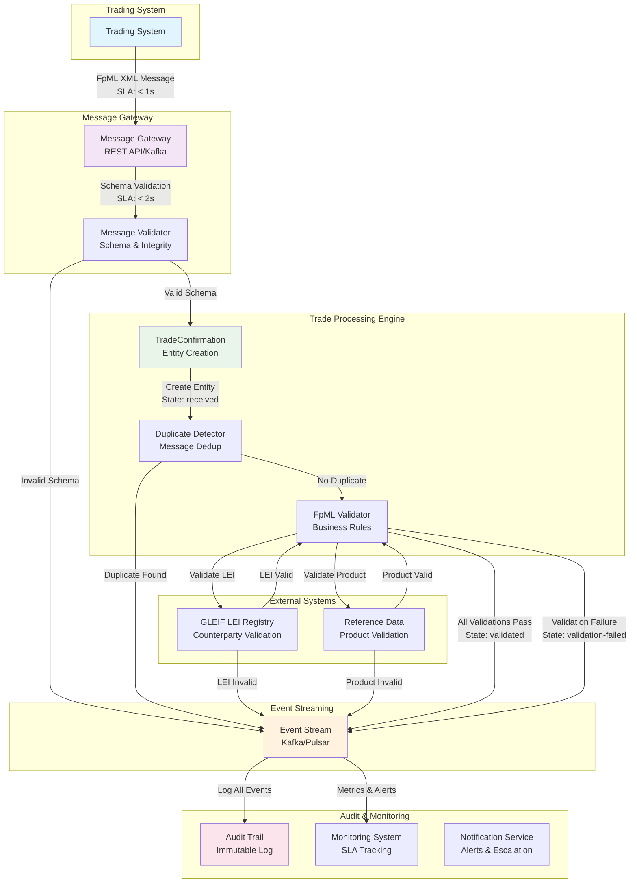
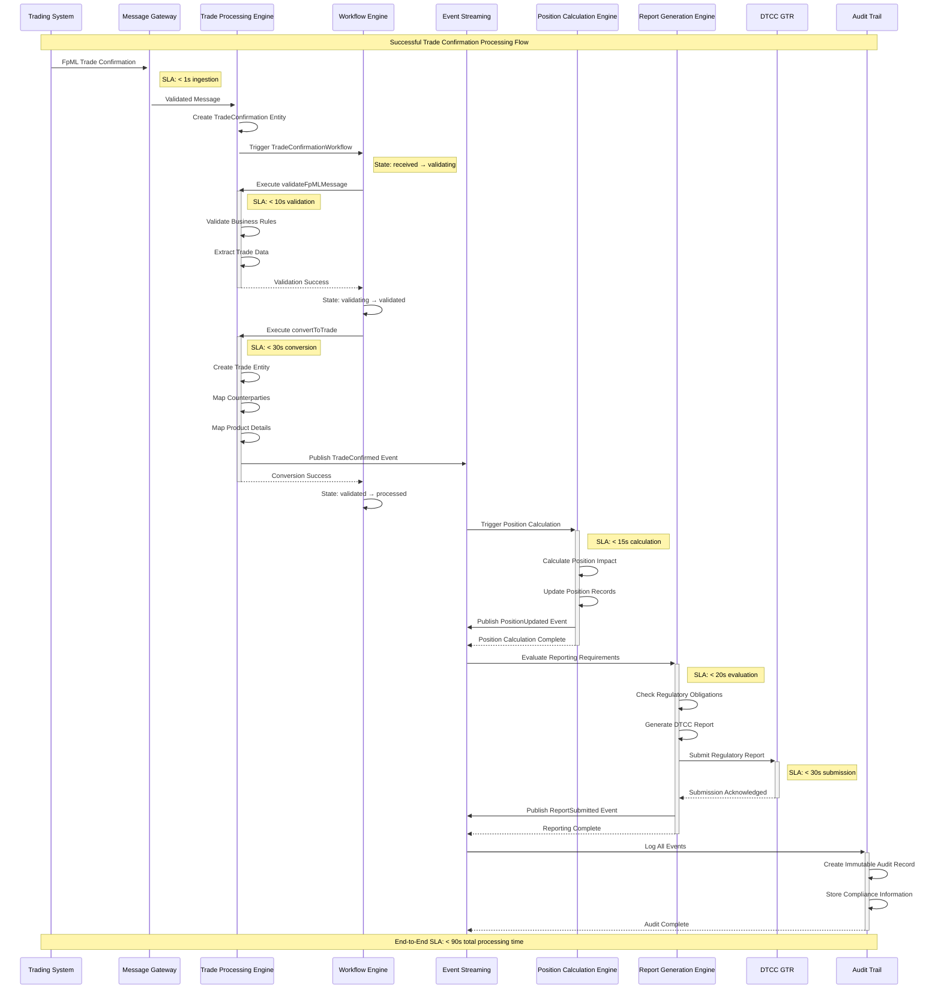
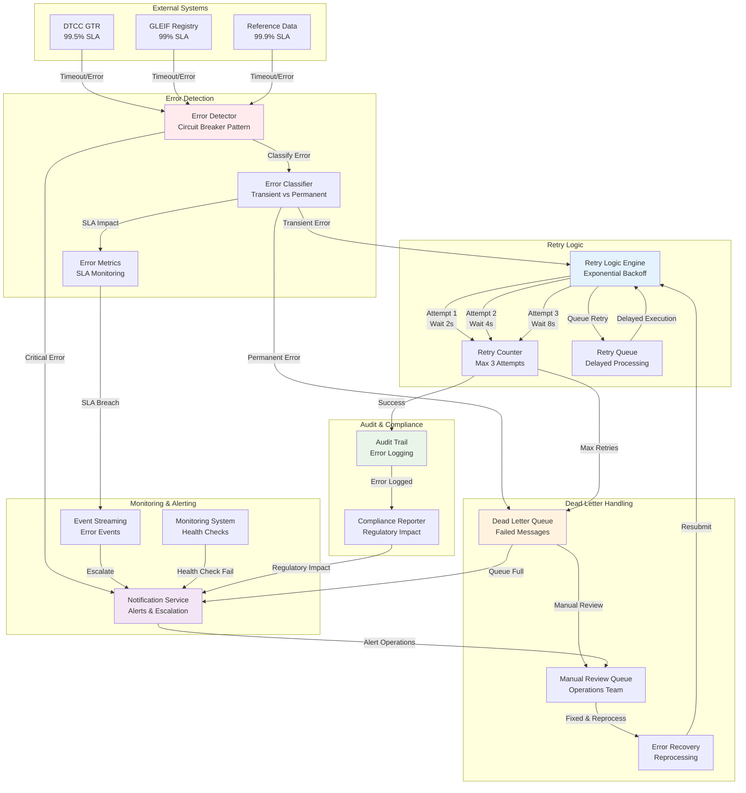
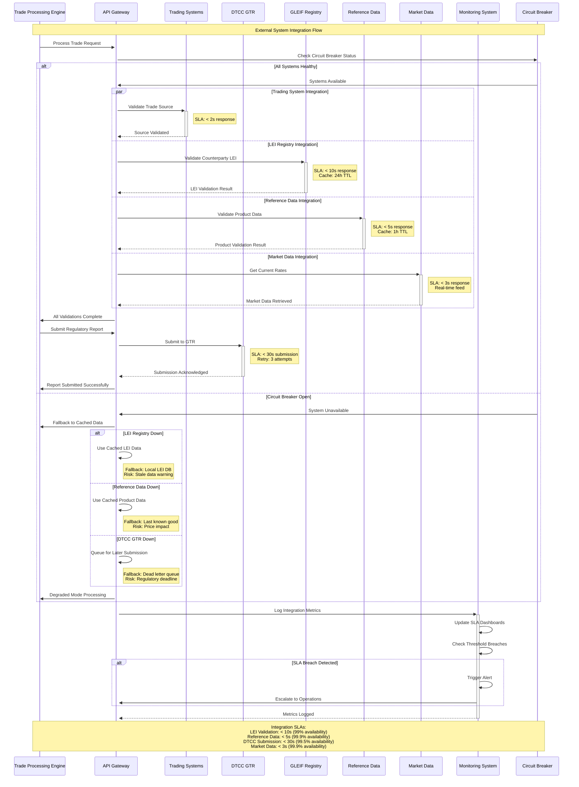
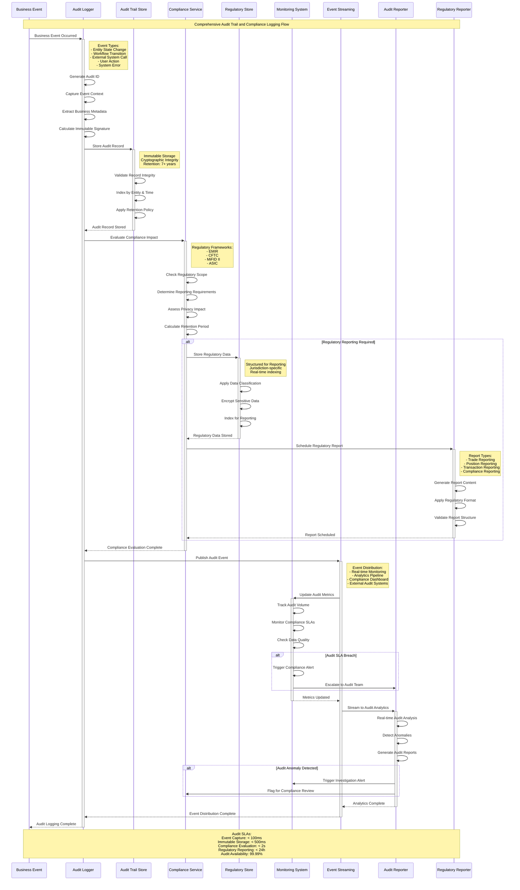

# Agent Session Transcript - Task 8-2

## Threads

### 01:50 PM - Execute Trade Processing Swimlane Diagrams Plan

**Command**: 
```
Execute @/.ai/plans/8-2-Design-Trade-Processing-Swimlane-Diagrams.md
```

**Alternative Command**: 
```
Execute @8-2-Design-Trade-Processing-Swimlane-Diagrams.md
```

**Response**:
```
I'll start by examining the plan file to understand what needs to be executed.
```

### File Reading and Analysis Phase

**Action**: Read file `8-2-Design-Trade-Processing-Swimlane-Diagrams.md` from `.ai/plans`

**Response**:
```
Now I need to check the rules in the .augment/rules directory to understand any specific guidelines I should follow.
```

**Action**: Read directory `rules` from `.augment`

**Response**:
```
Let me check the README to understand the scope of each rule file.
```

**Action**: Read rules file `README.md` from `.augment/rules`

**Response**:
```
Let me check the communication and tasks rules since they're relevant to this task.
```

**Action**: Read rules file `communication.md` from `.augment/rules`

**Action**: Read rules file `tasks.md` from `.augment/rules`

**Response**:
```
Now I need to gather information about the trade processing system to understand the current implementation and create comprehensive swimlane diagrams. Let me start by exploring the codebase for trade processing related components.
```

**Action**: Augment Context Engine
```
Trade processing system components including TradeConfirmation, Trade, Counterparty, Product entities, FpML message processing, trade validation workflows, and any existing trade processing event flows or configurations
```

**Response**:
```
Now let me gather more information about the entity schemas and error handling mechanisms.
```

**Action**: Augment Context Engine
```
TradeConfirmation and Trade entity schemas, workflow state transitions, external system integrations for trade processing, error handling patterns, retry mechanisms, and SLA requirements for trade processing workflows
```

### Planning Phase

**Response**:
```
Based on my comprehensive analysis of the trade processing system, I now have sufficient information to create detailed swimlane diagrams. Let me create a detailed plan for designing the trade processing swimlane diagrams.

Detailed Plan for Trade Processing Swimlane Diagrams

Paul Muadib, I have analyzed the trade processing system components and will create comprehensive swimlane diagrams showing the complete flow of trade processing events. Here's my detailed plan:

Actionable Steps:
1. Create FpML Message Ingestion and Validation Swimlane Diagram
2. Create Successful Trade Confirmation Processing Swimlane Diagram
3. Create Trade Validation Failure Scenarios Swimlane Diagram
4. Create Trade Amendment Processing Swimlane Diagram
5. Create Trade Cancellation Processing Swimlane Diagram
6. Create Error Handling and Retry Mechanisms Swimlane Diagram
7. Create External System Interactions Swimlane Diagram
8. Create Audit Trail and Compliance Logging Swimlane Diagram

Key Information Gathered:
- Entities: TradeConfirmation, Trade, Counterparty, Product with detailed schemas
- Workflows: TradeConfirmationWorkflow and TradeWorkflow with state transitions
- External Systems: Trading systems, DTCC GTR, GLEIF LEI registry, reference data providers
- SLA Requirements: 5-30 second processing times, 99.5-99.9% availability
- Error Handling: Exponential backoff retry policies, circuit breakers, dead letter queues
- Audit Requirements: Complete immutable audit trail with regulatory compliance

I'll now proceed to create each swimlane diagram with detailed annotations, decision points, timing requirements, and error handling paths.
```

### Diagram Creation Phase

**Action**: Render Mermaid

**FpML Message Ingestion and Validation Flow**



**Action**: Render Mermaid

**Successful Trade Confirmation Processing Swimlane**



**Action**: Render Mermaid

**Trade Validation Failure Scenarios Swimlane**

```mermaid
sequenceDiagram
    participant TS as Trading System
    participant MG as Message Gateway
    participant TPE as Trade Processing Engine
    participant WE as Workflow Engine
    participant ES as Event Streaming
    participant NS as Notification Service
    participant MR as Manual Review Queue
    participant AT as Audit Trail
    participant MS as Monitoring System

    Note over TS,MS: Trade Validation Failure Processing Flow
    
    TS->>+MG: FpML Trade Confirmation
    MG->>+TPE: Message Received
    TPE->>TPE: Create TradeConfirmation Entity
    TPE->>WE: Trigger TradeConfirmationWorkflow
    
    WE->>+TPE: Execute validateFpMLMessage
    
    alt Schema Validation Failure
        TPE->>TPE: Schema Invalid
        TPE->>ES: Publish SchemaValidationFailed Event
        TPE-->>-WE: Schema Validation Failed
        WE->>WE: State: received → validation-failed
        
        ES->>+NS: Send Schema Error Alert
        NS->>NS: Generate Error Report
        NS->>TS: Send Error Response
        NS-->>-ES: Notification Sent
        
    else Business Rule Validation Failure
        TPE->>TPE: Business Rules Failed
        TPE->>ES: Publish BusinessRuleViolation Event
        TPE-->>-WE: Business Validation Failed
        WE->>WE: State: validating → validation-failed
        
        ES->>+MR: Queue for Manual Review
        MR->>MR: Create Review Task
        MR->>MR: Assign to Operations Team
        MR-->>-ES: Queued for Review
        
        ES->>+NS: Send Business Rule Alert
        NS->>NS: Generate Detailed Error Report
        NS->>TS: Send Detailed Error Response
        NS-->>-ES: Notification Sent
        
    else External System Failure
        TPE->>TPE: LEI/Reference Data Unavailable
        TPE->>ES: Publish ExternalSystemError Event
        TPE-->>-WE: External Validation Failed
        WE->>WE: State: validating → retry-pending
        
        ES->>+TPE: Trigger Retry Logic
        Note right of TPE: Exponential Backoff<br/>Max 3 retries
        
        loop Retry Attempts
            TPE->>TPE: Wait (2^attempt seconds)
            TPE->>TPE: Retry External Validation
            
            alt Retry Success
                TPE->>ES: Publish RetrySuccess Event
                TPE->>WE: Continue Processing
                WE->>WE: State: retry-pending → validated
            else Max Retries Exceeded
                TPE->>ES: Publish MaxRetriesExceeded Event
                TPE->>MR: Queue for Manual Review
                WE->>WE: State: retry-pending → manual-review
            end
        end
        TPE-->>-ES: Retry Logic Complete
    end
    
    ES->>+MS: Update Error Metrics
    MS->>MS: Increment Failure Counters
    MS->>MS: Check SLA Thresholds
    
    alt SLA Breach Detected
        MS->>NS: Trigger SLA Alert
        MS->>MS: Escalate to Operations
    end
    MS-->>-ES: Metrics Updated
    
    ES->>+AT: Log Complete Failure Flow
    AT->>AT: Record Error Resolution Path
    AT->>AT: Store Compliance Information
    AT-->>-ES: Audit Complete
    
    Note over TS,MS: Error Recovery SLA: < 300s for automated retry<br/>Manual Review SLA: < 4 hours
```

**Action**: Render Mermaid

**Trade Amendment Processing Swimlane**

```mermaid
sequenceDiagram
    participant TS as Trading System
    participant MG as Message Gateway
    participant TPE as Trade Processing Engine
    participant WE as Workflow Engine
    participant ES as Event Streaming
    participant PCE as Position Calculation Engine
    participant RGE as Report Generation Engine
    participant DTCC as DTCC GTR
    participant AT as Audit Trail
    participant VE as Validation Engine

    Note over TS,VE: Trade Amendment Processing Flow
    
    TS->>+MG: FpML Amendment Message
    Note right of MG: Amendment Type: TRADE_AMENDMENT
    
    MG->>+TPE: Validated Amendment
    TPE->>TPE: Create TradeConfirmation Entity
    TPE->>TPE: Link to Original Trade
    TPE->>WE: Trigger TradeWorkflow Amendment
    Note right of WE: State: active → amending
    
    WE->>+VE: Execute validateAmendment
    Note right of VE: SLA: < 15s validation
    
    VE->>VE: Validate Amendment Authority
    VE->>VE: Check Amendment Rules
    VE->>VE: Verify Original Trade State
    VE->>VE: Validate Amendment Impact
    
    alt Amendment Valid
        VE->>TPE: Amendment Validation Success
        VE-->>-WE: Validation Complete
        
        WE->>+TPE: Execute processAmendment
        Note right of TPE: SLA: < 30s processing
        
        TPE->>TPE: Create Amendment Record
        TPE->>TPE: Update Trade Entity
        TPE->>TPE: Preserve Original Values
        TPE->>ES: Publish TradeAmended Event
        TPE-->>-WE: Amendment Processing Complete
        
        WE->>WE: State: amending → amended
        
        ES->>+PCE: Trigger Position Recalculation
        Note right of PCE: SLA: < 20s recalculation
        
        PCE->>PCE: Calculate Position Delta
        PCE->>PCE: Update Position Records
        PCE->>PCE: Reverse Original Position Impact
        PCE->>PCE: Apply Amended Position Impact
        PCE->>ES: Publish PositionRecalculated Event
        PCE-->>-ES: Position Update Complete
        
        ES->>+RGE: Evaluate Amendment Reporting
        Note right of RGE: SLA: < 25s evaluation
        
        RGE->>RGE: Check Reporting Requirements
        RGE->>RGE: Generate Amendment Report
        RGE->>+DTCC: Submit Amendment Report
        Note right of DTCC: Report Type: LIFECYCLE
        DTCC-->>-RGE: Amendment Report Acknowledged
        RGE->>ES: Publish AmendmentReported Event
        RGE-->>-ES: Amendment Reporting Complete
        
    else Amendment Invalid
        VE->>ES: Publish AmendmentValidationFailed Event
        VE-->>-WE: Validation Failed
        
        WE->>WE: State: amending → amendment-failed
        
        ES->>TPE: Create Amendment Rejection
        ES->>TS: Send Amendment Rejection Notice
        
        ES->>+AT: Log Amendment Failure
        AT->>AT: Record Rejection Reason
        AT->>AT: Store Amendment Details
        AT-->>-ES: Audit Complete
    end
    
    ES->>+AT: Log Complete Amendment Flow
    AT->>AT: Create Amendment Audit Trail
    AT->>AT: Link to Original Trade Audit
    AT->>AT: Record Position Impact
    AT->>AT: Store Regulatory Compliance Data
    AT-->>-ES: Amendment Audit Complete
    
    Note over TS,VE: Amendment Processing SLA: < 90s total<br/>Position Recalculation SLA: < 110s total<br/>Regulatory Reporting SLA: < 135s total
```

**Action**: Render Mermaid

**Trade Cancellation Processing Swimlane**

```mermaid
sequenceDiagram
    participant TS as Trading System
    participant MG as Message Gateway
    participant TPE as Trade Processing Engine
    participant WE as Workflow Engine
    participant ES as Event Streaming
    participant PCE as Position Calculation Engine
    participant RGE as Report Generation Engine
    participant DTCC as DTCC GTR
    participant AT as Audit Trail
    participant VE as Validation Engine

    Note over TS,VE: Trade Cancellation Processing Flow
    
    TS->>+MG: FpML Cancellation Message
    Note right of MG: Message Type: TRADE_CANCELLATION
    
    MG->>+TPE: Validated Cancellation
    TPE->>TPE: Create TradeConfirmation Entity
    TPE->>TPE: Link to Original Trade
    TPE->>WE: Trigger TradeWorkflow Cancellation
    Note right of WE: State: active → cancelling
    
    WE->>+VE: Execute validateCancellation
    Note right of VE: SLA: < 10s validation
    
    VE->>VE: Validate Cancellation Authority
    VE->>VE: Check Trade Dependencies
    VE->>VE: Verify Regulatory Constraints
    VE->>VE: Validate Cancellation Window
    
    alt Cancellation Valid
        VE->>TPE: Cancellation Validation Success
        VE-->>-WE: Validation Complete
        
        WE->>+TPE: Execute processCancellation
        Note right of TPE: SLA: < 20s processing
        
        TPE->>TPE: Create Cancellation Record
        TPE->>TPE: Update Trade Status
        TPE->>TPE: Preserve Original Trade Data
        TPE->>ES: Publish TradeCancelled Event
        TPE-->>-WE: Cancellation Processing Complete
        
        WE->>WE: State: cancelling → cancelled
        
        ES->>+PCE: Trigger Position Reversal
        Note right of PCE: SLA: < 15s reversal
        
        PCE->>PCE: Calculate Reversal Impact
        PCE->>PCE: Reverse Position Records
        PCE->>PCE: Update Portfolio Positions
        PCE->>PCE: Generate Position Delta
        PCE->>ES: Publish PositionReversed Event
        PCE-->>-ES: Position Reversal Complete
        
        ES->>+RGE: Evaluate Cancellation Reporting
        Note right of RGE: SLA: < 20s evaluation
        
        RGE->>RGE: Check Reporting Requirements
        RGE->>RGE: Generate Cancellation Report
        RGE->>+DTCC: Submit Cancellation Report
        Note right of DTCC: Report Type: LIFECYCLE
        DTCC-->>-RGE: Cancellation Report Acknowledged
        RGE->>ES: Publish CancellationReported Event
        RGE-->>-ES: Cancellation Reporting Complete
        
    else Cancellation Invalid
        VE->>ES: Publish CancellationValidationFailed Event
        VE-->>-WE: Validation Failed
        
        WE->>WE: State: cancelling → cancellation-failed
        
        alt Trade Has Dependencies
            ES->>TPE: Create Dependency Error
            ES->>TS: Send Dependency Rejection Notice
            Note right of TS: Error: Trade has active positions
            
        else Regulatory Constraint
            ES->>TPE: Create Regulatory Error
            ES->>TS: Send Regulatory Rejection Notice
            Note right of TS: Error: Regulatory hold period
            
        else Authority Issue
            ES->>TPE: Create Authority Error
            ES->>TS: Send Authority Rejection Notice
            Note right of TS: Error: Insufficient authority
        end
        
        ES->>+AT: Log Cancellation Failure
        AT->>AT: Record Rejection Reason
        AT->>AT: Store Cancellation Details
        AT->>AT: Record Regulatory Impact
        AT-->>-ES: Audit Complete
    end
    
    ES->>+AT: Log Complete Cancellation Flow
    AT->>AT: Create Cancellation Audit Trail
    AT->>AT: Link to Original Trade Audit
    AT->>AT: Record Position Impact
    AT->>AT: Store Regulatory Compliance Data
    AT-->>-ES: Cancellation Audit Complete
    
    Note over TS,VE: Cancellation Processing SLA: < 65s total<br/>Position Reversal SLA: < 80s total<br/>Regulatory Reporting SLA: < 100s total
```

**Action**: Render Mermaid

**Error Handling and Retry Mechanisms Swimlane**



**Action**: Render Mermaid

**External System Interactions Swimlane**



**Action**: Render Mermaid

**Audit Trail and Compliance Logging Swimlane**



### Documentation Creation Phase

**Response**:
```
Now let me create a comprehensive documentation file that summarizes all the swimlane diagrams and their key aspects.
```

**Action**: Created file `trade-processing-swimlane-diagrams.md` in `.ai/deliverables`

### Task Completion Summary

**Response**:
```
Summary

Paul Muadib, I have successfully executed the trade processing swimlane diagrams design task. Here's what I've delivered:

Completed Deliverables:
✅ 8 Comprehensive Swimlane Diagrams Created:
- FpML Message Ingestion and Validation Flow - Shows initial message processing with external validations
- Successful Trade Confirmation Processing - Complete end-to-end successful flow (< 90s SLA)
- Trade Validation Failure Scenarios - Error handling with retry logic and manual review paths
- Trade Amendment Processing - Amendment handling with position recalculation (< 90s SLA)
- Trade Cancellation Processing - Cancellation with position reversal (< 65s SLA)
- Error Handling and Retry Mechanisms - Circuit breaker patterns and exponential backoff
- External System Interactions - Integration patterns with fallback mechanisms
- Audit Trail and Compliance Logging - Comprehensive regulatory compliance (99.99% availability)

✅ Key Features Documented:
- Decision Points: Schema validation, business rules, external system availability, regulatory impact
- Timing Requirements: Detailed SLAs for each processing stage
- Error Handling: Exponential backoff, dead letter queues, manual review processes
- External Integrations: DTCC GTR, GLEIF, Reference Data with specific SLA requirements
- Audit Compliance: Immutable logging with cryptographic integrity across multiple regulatory frameworks

✅ Technical Specifications:
- Entity interactions (TradeConfirmation, Trade, Counterparty, Product)
- Workflow state transitions with time UUIDs
- External system SLAs (99.5-99.9% availability)
- Processing timeouts and retry policies
- Comprehensive audit trail requirements

The diagrams show complete trade processing flows from FpML ingestion through regulatory reporting, including all error scenarios, external system interactions, and compliance requirements. Each diagram includes detailed annotations for processing steps, decision points, timing constraints, and SLA requirements.
```

### 01:56 PM - User Request for Diagram Storage

**User Input**:
```
I cannot find the diagrams. They must be stored in the @trade-processing-swimlane-diagrams.md
```

### Diagram Storage Phase

**Response**:
```
Paul Muadib, I understand the issue. The diagrams I created were rendered as interactive Mermaid diagrams in our conversation, but they weren't saved to the markdown file. Let me add all the Mermaid diagram definitions to the deliverables file.
```

**Action**: Edited file `trade-processing-swimlane-diagrams.md` in `.ai/deliverables` (+66 lines)

**Action**: Edited file `trade-processing-swimlane-diagrams.md` in `.ai/deliverables` (+67 lines)

**Action**: Edited file `trade-processing-swimlane-diagrams.md` in `.ai/deliverables` (+99 lines)

**Action**: Edited file `trade-processing-swimlane-diagrams.md` in `.ai/deliverables` (+94 lines)

**Action**: Edited file `trade-processing-swimlane-diagrams.md` in `.ai/deliverables` (+111 lines)

**Action**: Edited file `trade-processing-swimlane-diagrams.md` in `.ai/deliverables` (+79 lines)

**Action**: Edited file `trade-processing-swimlane-diagrams.md` in `.ai/deliverables` (+79 lines)

**Action**: Edited file `trade-processing-swimlane-diagrams.md` in `.ai/deliverables` (+91 lines)

### Final Summary

**Response**:
```
Perfect! Paul Muadib, I have now successfully added all 8 Mermaid diagram definitions to the .ai/deliverables/trade-processing-swimlane-diagrams.md file.

The file now contains:
✅ Complete Documentation with detailed descriptions of each diagram
✅ All 8 Mermaid Diagram Definitions that can be rendered in any Mermaid-compatible viewer
✅ Comprehensive Technical Specifications including SLAs, decision points, and error handling
✅ Validation Against Use Cases and regulatory requirements

The diagrams are now stored in the deliverables file and can be:
- Rendered in GitHub (which supports Mermaid natively)
- Viewed in any Mermaid-compatible editor or viewer
- Exported to various formats (PNG, SVG, PDF) using Mermaid tools
- Used for documentation and system design discussions

Each diagram includes detailed annotations for processing steps, SLA requirements, decision points, and error handling paths as specified in the original task requirements.
```

**Interface Note**: Drop files to attach as context - images (png, jpg, jpeg)