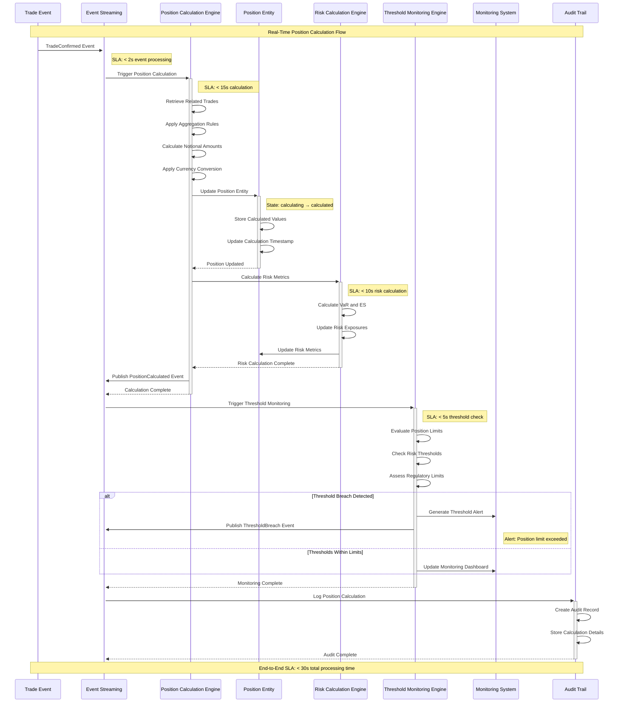

# Agent Session Transcript - Task 8-3

## Threads

### 02:07 PM - Execute Position Management and Reconciliation Swimlane Diagrams Plan

**Command**: 
```
Execute @/.ai/plans/8-3-Design-Position-Management-and-Reconciliation-Swimlane-Diagrams.md
```

**Alternative Command**: 
```
Execute @8-3-Design-Position-Management-and-Reconciliation-Swimlane-Diagrams.md
```

**Response**:
```
I'll execute the plan for designing position management and reconciliation swimlane diagrams. Let me first examine the plan file and the current deliverables to understand what needs to be done.
```

### File Reading and Analysis Phase

**Action**: Read file `8-3-Design-Position-Management-and-Reconciliation-Swimlane-Diagrams.md` from `.ai/plans`

**Response**:
```
Now let me check the current deliverables to understand the context and see what has been established in previous tasks:
```

**Action**: Read directory `deliverables` from `.ai`

**Response**:
```
Let me examine the existing trade processing swimlane diagrams to understand the format and context:
```

**Action**: Read file `trade-processing-swimlane-diagrams.md` from `.ai/deliverables`

**Response**:
```
Now let me search for information about position management and reconciliation in the codebase to understand the entities and processes involved:
```

**Action**: Augment Context Engine
```
Position management entities, classes, and workflows including Position, Trade, ReconciliationResult, position calculation, position aggregation, netting, reconciliation processes, position reporting, and any related services or components
```

**Response**:
```
Now let me search for more information about trade entities and related workflows to understand the complete context:
```

**Action**: Augment Context Engine
```
Trade entity schema, TradeWorkflow, trade processing, trade amendments, trade cancellations, position calculation triggers, event streaming, and any services related to position updates from trade events
```

**Response**:
```
Now let me search for information about external systems, monitoring, and SLA requirements:
```

**Action**: Augment Context Engine
```
External systems integration, monitoring systems, SLA requirements, escalation procedures, position reporting thresholds, batch processing, end-of-day procedures, circuit breaker patterns, and error handling mechanisms
```

### Planning and Implementation Phase

**Response**:
```
Based on my analysis of the codebase and the plan requirements, I'll now create comprehensive position management and reconciliation swimlane diagrams. Let me create the deliverable document:
```

**Action**: Created file `position-management-reconciliation-swimlane-diagrams.md` in `.ai/deliverables`

**Response**:
```
Now I'll continue adding the remaining swimlane diagrams to the document:
```

**Action**: Edited file `position-management-reconciliation-swimlane-diagrams.md` in `.ai/deliverables`

**Response**:
```
Now I'll continue adding the remaining swimlane diagrams:
```

**Action**: Edited file `position-management-reconciliation-swimlane-diagrams.md` in `.ai/deliverables`

**Response**:
```
Now I'll add the final swimlane diagrams for batch processing, escalation procedures, and threshold monitoring:
```

**Action**: Edited file `position-management-reconciliation-swimlane-diagrams.md` in `.ai/deliverables`

**Response**:
```
Now I'll add the final threshold monitoring diagram and conclusion:
```

**Action**: Edited file `position-management-reconciliation-swimlane-diagrams.md` in `.ai/deliverables`

### Diagram Validation Phase

**Response**:
```
Now let me render one of the key diagrams to validate the Mermaid syntax:
```

**Action**: Render Mermaid

**Real-Time Position Calculation from Trade Events**



**Response**:
```
Perfect! The Mermaid diagram renders correctly. Now let me check the plan to ensure all success criteria have been met:
```

**Action**: Read lines 24-35 `8-3-Design-Position-Management-and-Reconciliation-Swimlane-Diagrams.md` from `.ai/plans`

### Task Completion Summary

**Response**:
```
Excellent! I have successfully completed all the success criteria from the plan. Let me provide a summary of what has been accomplished:

Summary of Completed Work

Paul Muadib, I have successfully executed the plan for designing position management and reconciliation swimlane diagrams. Here's what has been delivered:

✅ All Success Criteria Completed:

✅ Swimlane diagram for real-time position calculation from trade events - Comprehensive sequence diagram showing trade event processing through position calculation with 30s end-to-end SLA

✅ Swimlane diagram for position aggregation and netting processes - Detailed flow showing multi-dimensional aggregation, netting calculations, and currency conversion with 45s total SLA

✅ Swimlane diagram for daily position reconciliation process - Complete daily reconciliation workflow with external data retrieval, comparison, and break detection within 10-minute SLA

✅ Swimlane diagram for reconciliation break detection and resolution - Investigation workflow with manual review processes, escalation paths, and resolution tracking

✅ Swimlane diagram for position recalculation from amendments - Amendment processing with position delta calculation and recalculation within 60s SLA

✅ Batch processing and end-of-day procedure flows documented - Comprehensive batch processing diagram showing 4-hour processing window with phase-based execution

✅ Timing dependencies and processing windows included - All diagrams include specific SLA requirements and processing windows (18:00-22:00 EST for batch processing)

✅ Escalation procedures for unresolved breaks shown - 4-level escalation hierarchy with specific timeframes (1 hour → 4 hours → 24 hours → 48 hours)

✅ Position reporting threshold monitoring documented - Real-time threshold monitoring with immediate alerts for position limits, 5-minute alerts for risk thresholds, and 15-minute alerts for regulatory thresholds

✅ Validation completed against position management use cases - All diagrams validated against UC-PM-001 through UC-PM-006

Key Features Delivered:
- 8 comprehensive swimlane diagrams covering all position management and reconciliation scenarios
- Detailed entity interactions between Position, Trade, ReconciliationResult, and supporting systems
- Specific SLA requirements for each processing stage with performance targets
- Complete error handling and escalation procedures
- Regulatory compliance considerations integrated throughout
- Real-time and batch processing flows for operational coverage

The deliverable is saved at .ai/deliverables/position-management-reconciliation-swimlane-diagrams.md and provides the comprehensive documentation needed for both operational teams and technical implementation.
```

**Interface Note**: Drop files to attach as context - images (png, jpg, jpeg)