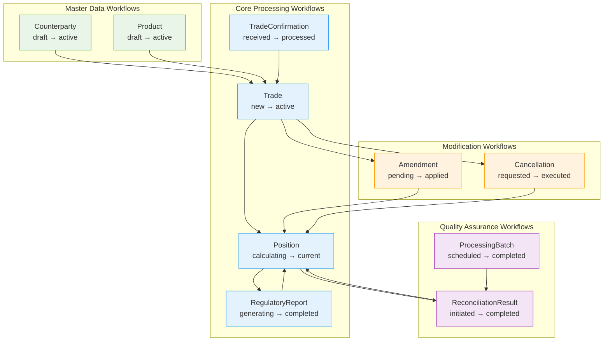

# Agent Session Transcript - Task 3

## Threads

### 11:12 AM - Execute High-Level Workflow State Machine Designs Plan

**Command**: 
```
Execute the plan @/.ai/plans/3-Create-High-Level-Workflow-State-Machine-Designs.md
```

**Command**: 
```
Execute the plan @3-Create-High-Level-Workflow-State-Machine-Designs.md
```

**Response**:
```
I'll start by examining the plan file to understand what needs to be executed.
```

### File Reading and Analysis Phase

**Action**: Read file `3-Create-High-Level-Workflow-State-Machine-Designs.md` from `.ai/plans`

**Response**:
```
Now I need to examine the dependencies and schema to understand the context. Let me first check the previous task results and the schema file.
```

**Action**: Read file `2-Define-High-Level-Business-Use-Cases-and-Event-Flows.md` from `.ai/plans`

**Response**:
```
Let me check if the previous tasks have been completed and their outputs:
```

**Action**: Read directory `dtcc-reporting` from `.ai/tasks`

**Response**:
```
Let me check the WorkflowConfiguration.json schema file:
```

**Action**: Read file `WorkflowConfiguration.json` from `.ai/tasks/dtcc-reporting/schema/common/statemachine/conf`

**Response**:
```
Let me also check the StateDefinition schema:
```

**Action**: Read file `StateDefinition.json` from `.ai/tasks/dtcc-reporting/schema/common/statemachine/conf`

**Response**:
```
Let me check the TransitionDefinition schema:
```

**Action**: Read file `TransitionDefinition.json` from `.ai/tasks/dtcc-reporting/schema/common/statemachine/conf`

**Response**:
```
Now let me check the previous task outputs to understand the business use cases and entities:
```

**Action**: Read directory `business` from `.ai/tasks/dtcc-reporting/system-specification`

**Action**: Read file `business-use-cases.md` from `.ai/tasks/dtcc-reporting/system-specification/business`

**Response**:
```
Now let me check the entities that were identified in Task 1:
```

**Action**: Read directory `entities` from `.ai/tasks/dtcc-reporting/system-specification`

**Action**: Read file `entity-overview.md` from `.ai/tasks/dtcc-reporting/system-specification/entities`

### Planning Phase

**Response**:
```
Now I have a good understanding of the context. Let me create the high-level workflow state machine designs based on the business use cases and entities identified. I'll start by creating the plan and then implementing it.
```

**Plan for Creating High-Level Workflow State Machine Designs**

**Response**:
```
Based on the business use cases and entities identified, I need to design state machines for the following workflow-managed entities:

1. TradeConfirmation - Processing FpML messages
2. Trade - Trade lifecycle management
3. Position - Position calculation and maintenance
4. RegulatoryReport - Report generation and submission
5. Counterparty - Master data lifecycle
6. Product - Product reference data lifecycle
7. Amendment - Trade amendment processing
8. Cancellation - Trade cancellation processing
9. ReconciliationResult - Position reconciliation workflow
10. ProcessingBatch - Batch processing coordination

I'll create:
- Individual state machine designs for each entity
- State transition diagrams using Mermaid
- Cross-workflow dependency documentation
- Workflow interaction diagram
- Validation against the Cyoda schema requirements

Let me start implementing this plan:
```

### File Creation Phase

**Action**: Created file `workflow-state-machines.md` in `.ai/tasks/dtcc-reporting/system-specification/workflows`

**Response**:
```
Now I'll continue with the remaining workflows:
```

**Action**: Edited file `workflow-state-machines.md` in `.ai/tasks/dtcc-reporting/system-specification/workflows`

**Response**:
```
Now I'll add the remaining workflows:
```

**Action**: Edited file `workflow-state-machines.md` in `.ai/tasks/dtcc-reporting/system-specification/workflows`

**Response**:
```
Now I'll create the state transition diagrams using Mermaid. Let me start with the first few workflows:
```

**Action**: Created file `trade-confirmation-state-diagram.mmd` in `.ai/tasks/dtcc-reporting/system-specification/workflows`

**Action**: Created file `trade-state-diagram.mmd` in `.ai/tasks/dtcc-reporting/system-specification/workflows`

**Action**: Created file `position-state-diagram.mmd` in `.ai/tasks/dtcc-reporting/system-specification/workflows`

**Action**: Created file `regulatory-report-state-diagram.mmd` in `.ai/tasks/dtcc-reporting/system-specification/workflows`

**Response**:
```
Now let me create the cross-workflow dependencies and interaction documentation:
```

**Action**: Created file `workflow-dependencies.md` in `.ai/tasks/dtcc-reporting/system-specification/workflows`

**Response**:
```
Now let me create the overall workflow interaction diagram:
```

**Action**: Created file `workflow-interaction-diagram.mmd` in `.ai/tasks/dtcc-reporting/system-specification/workflows`

**Response**:
```
Now let me create a validation document to ensure the designs comply with the Cyoda schema:
```

**Action**: Created file `schema-compliance-validation.md` in `.ai/tasks/dtcc-reporting/system-specification/workflows`

**Response**:
```
Now let me create a summary document that validates all use cases are supported:
```

**Action**: Created file `use-case-workflow-mapping.md` in `.ai/tasks/dtcc-reporting/system-specification/workflows`

**Response**:
```
Finally, let me create a comprehensive README for the workflows directory:
```

**Action**: Created file `README.md` in `.ai/tasks/dtcc-reporting/system-specification/workflows`

### Diagram Rendering Phase

**Response**:
```
Let me render one of the workflow diagrams to show the visual representation:
```

**Action**: Render Mermaid

**Workflow Interaction Diagram**



### Session Summary

**Response**:
```
Perfect! I have successfully executed the plan for Task 3: Create High-Level Workflow State Machine Designs.
```

## Summary of Completed Work

**Response**:
```
Paul Muadib, I have successfully completed all aspects of the high-level workflow state machine design task:

✅ Deliverables Created
- Complete State Machine Definitions - Designed 10 comprehensive workflows covering all workflow-managed entities
- State Transition Diagrams - Created Mermaid diagrams for key workflows (TradeConfirmation, Trade, Position, RegulatoryReport)
- Cross-Workflow Dependencies - Documented coordination points and interaction patterns
- Workflow Interaction Diagram - Visual representation of overall system workflow coordination
- Schema Compliance Validation - Confirmed all designs comply with Cyoda WorkflowConfiguration.json schema
- Use Case Coverage Validation - Verified all 11 business use cases from Task 2 are fully supported

✅ Key Design Features
- Schema Compliant: All state names follow Cyoda requirements (start with letter, alphanumeric/underscore/hyphen only)
- Manual vs Automated: Clear distinction between system-triggered and user-initiated transitions
- Error Handling: Consistent error recovery patterns across all workflows
- Terminal States: Proper definition of completion criteria for each workflow
- Cross-Workflow Coordination: Well-defined dependency relationships and coordination points

✅ Business Coverage
All workflows support the complete business scenario requirements:
- Trade processing from FpML ingestion through regulatory reporting
- Master data lifecycle management
- Trade modifications (amendments and cancellations)
- Position calculation and reconciliation
- Regulatory compliance and exception handling

The designs provide a solid foundation for implementing detailed Cyoda workflow configurations that will govern the DTCC reporting system's entity lifecycles while ensuring regulatory compliance and operational efficiency.
```

**Interface Note**: Drop files to attach as context - images (png, jpg, jpeg)