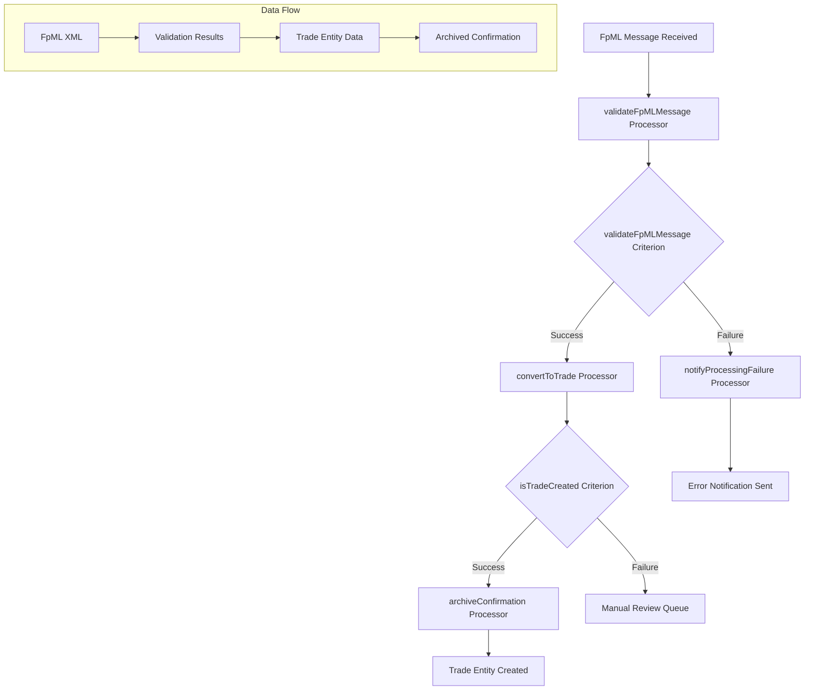
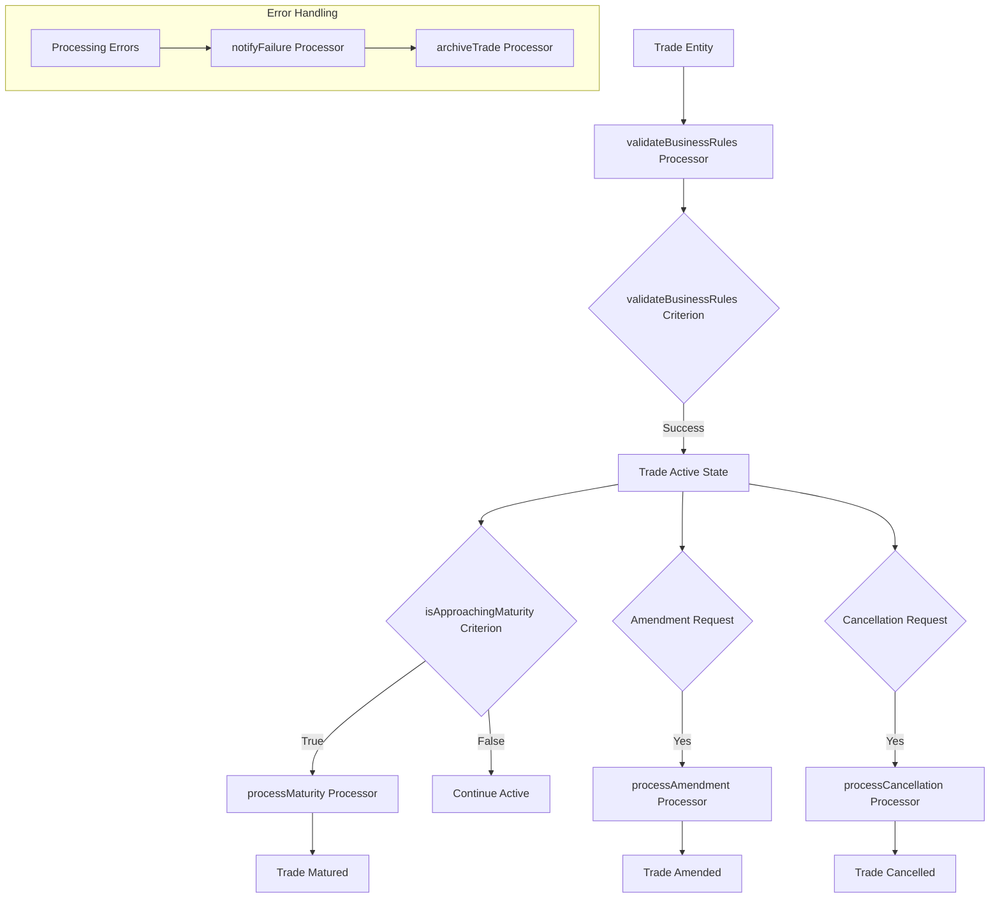
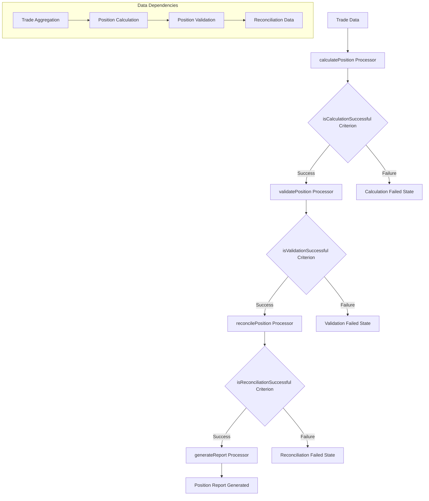
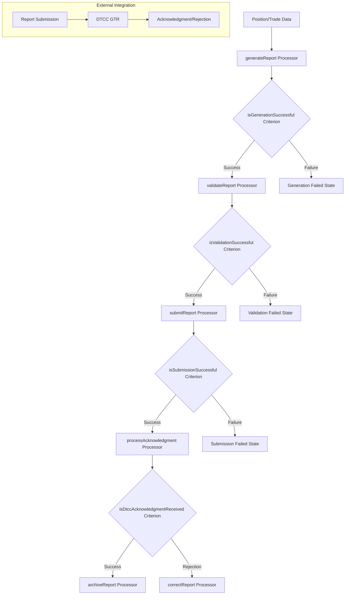
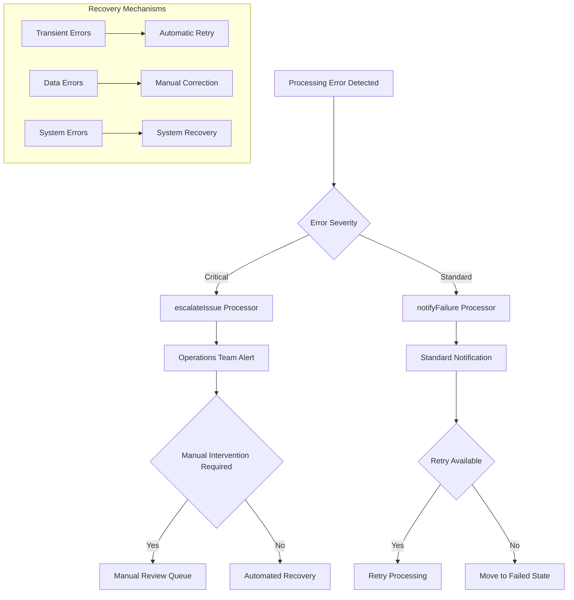
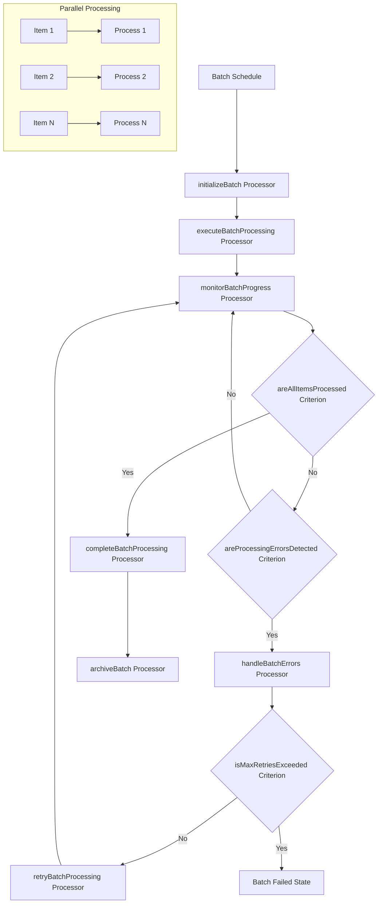
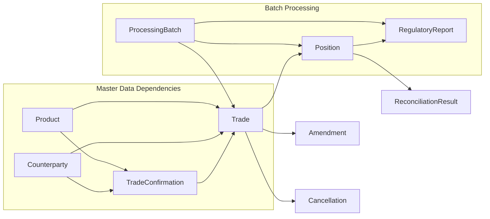
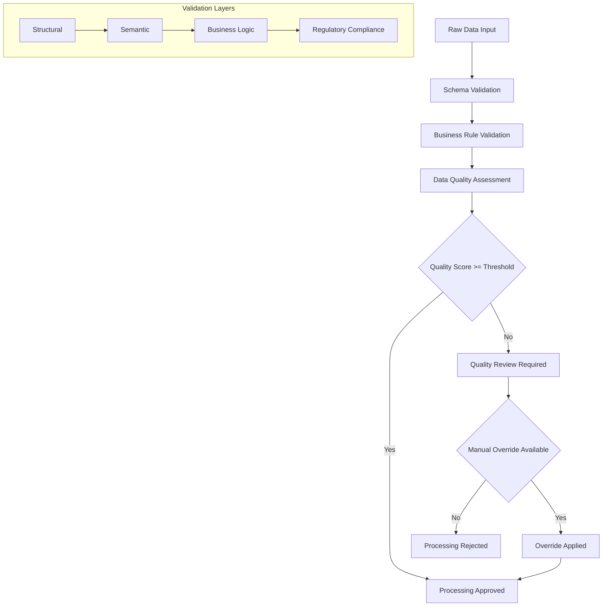
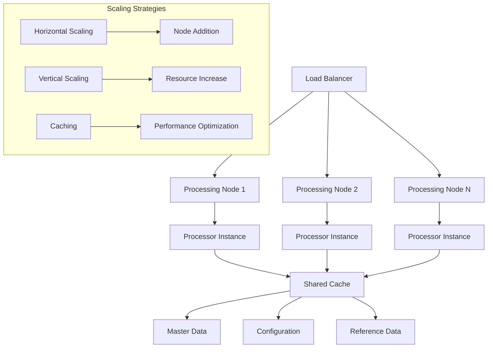
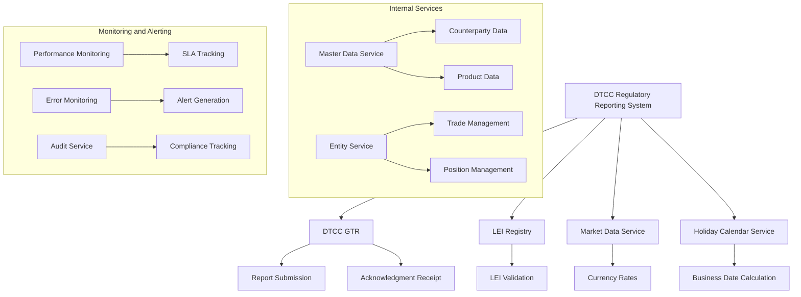

# Component Interaction Diagrams

## Overview

This document provides comprehensive diagrams showing data flow and interactions between workflow components in the DTCC regulatory reporting system. Each diagram illustrates how processors and criteria work together to implement business workflows.

## Trade Confirmation Processing Flow

## Trade Lifecycle Management Flow

## Position Management Flow

## Regulatory Reporting Flow

## Error Handling and Escalation Flow

## Batch Processing Coordination

## Cross-Workflow Dependencies

## Data Quality and Validation Chain

## Performance and Scalability Patterns

## Integration Points and External Dependencies

## Component Interaction Summary

### Key Interaction Patterns

1. **Sequential Processing**: Components execute in defined order with validation gates
2. **Conditional Branching**: Criteria determine processing paths based on business logic
3. **Error Propagation**: Failures trigger appropriate error handling and notification
4. **Parallel Execution**: Batch processing enables concurrent component execution
5. **Data Transformation**: Processors transform data between workflow states
6. **External Integration**: Components interact with external services for validation and submission

### Performance Considerations

1. **Caching Strategy**: Shared cache for master data and configuration reduces latency
2. **Load Distribution**: Processing nodes distribute workload for scalability
3. **Timeout Management**: Each component has appropriate timeout configurations
4. **Resource Optimization**: Components designed for efficient resource utilization

### Error Handling Strategy

1. **Graceful Degradation**: Components handle partial failures appropriately
2. **Retry Mechanisms**: Transient errors trigger automatic retry with backoff
3. **Manual Intervention**: Complex errors route to manual review queues
4. **Escalation Paths**: Critical errors escalate to operations teams

### Data Flow Integrity

1. **Validation Gates**: Each processing step includes validation checkpoints
2. **Audit Trail**: All component interactions logged for compliance
3. **Data Quality**: Continuous quality assessment throughout processing
4. **Consistency Checks**: Cross-component data consistency validation
