# Event Correlation Patterns

## Overview

Event correlation patterns define how events are related, tracked, and coordinated throughout the DTCC Regulatory Reporting System. These patterns enable end-to-end process tracking, causality analysis, and comprehensive audit trails for regulatory compliance.

## Correlation ID Patterns

### Business Process Correlation
All events within a single business process share the same correlation ID, enabling complete process tracking from initiation to completion.

#### Trade Processing Correlation
```mermaid
graph LR
    A[FpMLMessageReceived] --> B[TradeConfirmationReceived]
    B --> C[TradeValidated]
    C --> D[TradeConfirmed]
    D --> E[PositionCalculationTriggered]
    E --> F[ReportingObligationIdentified]
    F --> G[ReportGenerated]
    
    style A fill:#e1f5fe
    style B fill:#e1f5fe
    style C fill:#e1f5fe
    style D fill:#e1f5fe
    style E fill:#e1f5fe
    style F fill:#e1f5fe
    style G fill:#e1f5fe
```

**Correlation Pattern**: `trade-process-{uuid}`
- **Scope**: From FpML message receipt to regulatory report submission
- **Duration**: Minutes to hours depending on complexity
- **Participants**: Trading systems, validation engines, position calculators, reporting services

#### Amendment Processing Correlation
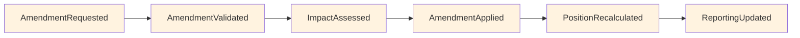

**Correlation Pattern**: `amendment-process-{uuid}`
- **Scope**: From amendment request to impact propagation
- **Duration**: Minutes to hours for complex amendments
- **Participants**: Amendment services, validation engines, impact assessment, reporting services

### Request-Response Correlation
Request and response events use the same correlation ID to track synchronous and asynchronous operations.

#### Processor Calculation Correlation
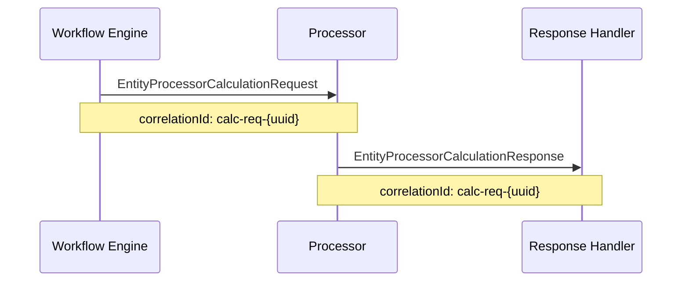

**Correlation Pattern**: `calc-req-{uuid}`
- **Scope**: Single calculation request-response cycle
- **Duration**: Seconds to minutes
- **Participants**: Workflow engine, processors, response handlers

### Batch Processing Correlation
All events within a batch operation share a batch correlation ID, with individual item correlation IDs for detailed tracking.

#### Batch Structure
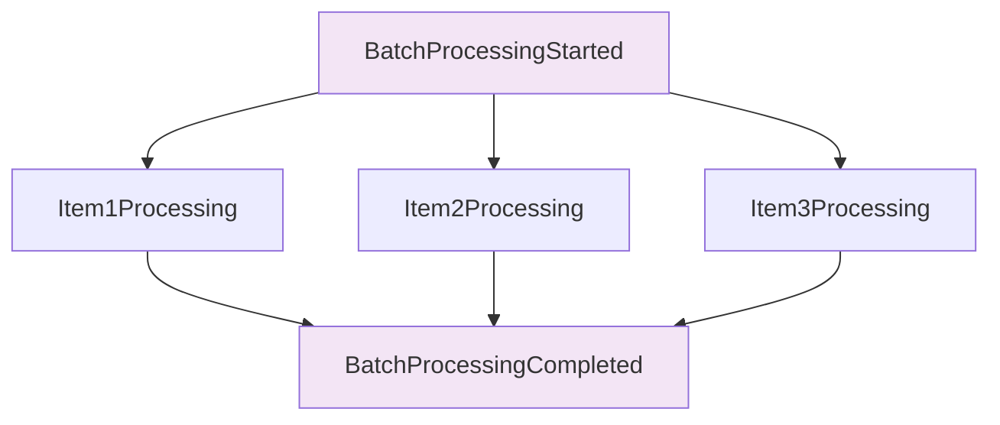

**Correlation Hierarchy**:
- **Batch Level**: `batch-{batch-id}`
- **Item Level**: `batch-{batch-id}-item-{item-id}`

## Causation Chain Patterns

### Direct Causation
Event A directly causes Event B, with Event B's causationId referencing Event A's eventId.

#### Example: Trade Validation Chain
```json
{
  "eventId": "evt-001",
  "eventType": "TradeConfirmationReceived",
  "correlationId": "trade-proc-123",
  "causationId": null
}

{
  "eventId": "evt-002", 
  "eventType": "TradeValidated",
  "correlationId": "trade-proc-123",
  "causationId": "evt-001"
}

{
  "eventId": "evt-003",
  "eventType": "TradeConfirmed", 
  "correlationId": "trade-proc-123",
  "causationId": "evt-002"
}
```

### Parallel Causation
Multiple events caused by the same triggering event, creating parallel processing paths.

#### Example: Position Update Triggering Multiple Reports
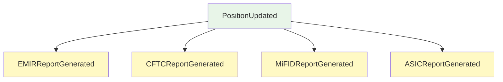

**Causation Pattern**: All reports reference the same PositionUpdated event as their cause.

### Indirect Causation
Event chain A → B → C where each event references its immediate cause, creating a causation chain.

#### Example: Amendment Impact Chain
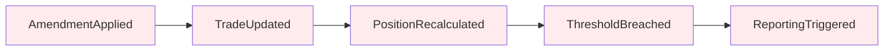

**Causation Chain**: A causes B, B causes C, C causes D, D causes E

## Event Ordering Patterns

### Strict Ordering
Within entity boundaries, events maintain strict temporal ordering to ensure data consistency.

#### Entity State Progression
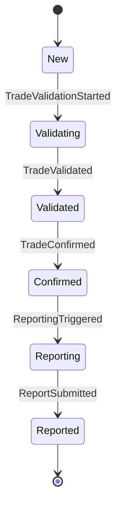

**Ordering Guarantee**: Events for a single entity are processed in strict chronological order.

### Causal Ordering
Related events across entity boundaries maintain causal ordering.

#### Cross-Entity Dependencies
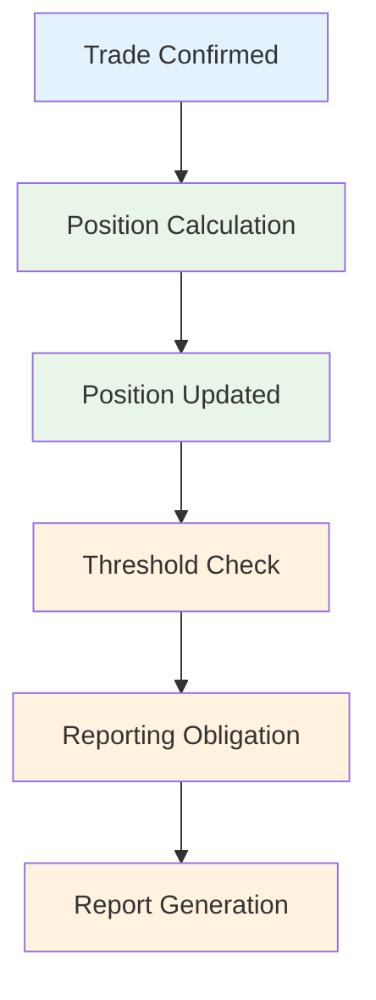

**Causal Constraint**: Position events cannot occur before trade events that trigger them.

### Eventual Consistency
Cross-system events achieve eventual consistency through compensation and reconciliation.

#### External System Integration
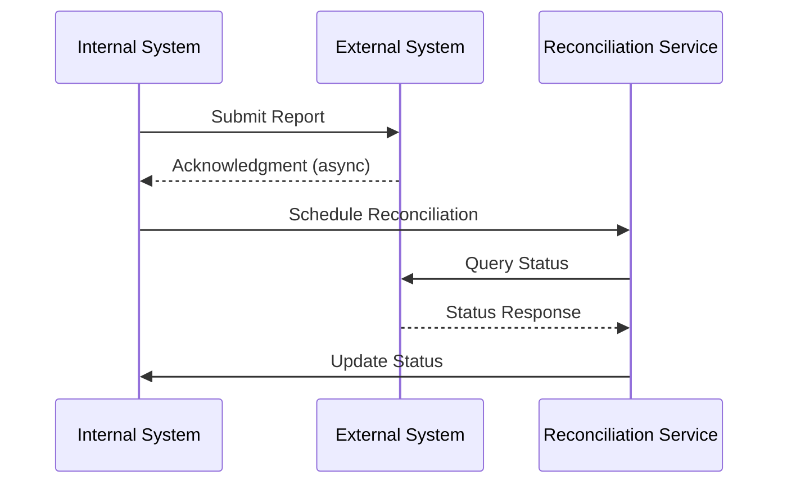

## Correlation Metadata

### Trace Context
Distributed tracing information carried across all related events.

```json
{
  "metadata": {
    "traceId": "trace-{uuid}",
    "spanId": "span-{uuid}",
    "parentSpanId": "parent-span-{uuid}",
    "traceFlags": "01",
    "baggage": {
      "businessProcess": "trade-processing",
      "priority": "high",
      "deadline": "2024-01-15T17:00:00Z"
    }
  }
}
```

### Business Context
Business-specific correlation information for process tracking.

```json
{
  "metadata": {
    "businessContext": {
      "tradingDesk": "rates-desk",
      "businessUnit": "fixed-income",
      "counterparty": "BANK001",
      "product": "IRS",
      "notional": 10000000,
      "currency": "USD"
    }
  }
}
```

### Temporal Context
Time-based correlation for deadline and SLA tracking.

```json
{
  "metadata": {
    "temporalContext": {
      "businessDate": "2024-01-15",
      "processingDeadline": "2024-01-15T17:00:00Z",
      "slaTarget": "2024-01-15T16:30:00Z",
      "urgency": "high"
    }
  }
}
```

## Event Aggregation Patterns

### Time-Window Aggregation
Events aggregated within time windows for monitoring and reporting.

#### Hourly Processing Metrics
```mermaid
gantt
    title Event Processing Metrics
    dateFormat HH:mm
    axisFormat %H:%M
    
    section Trade Events
    Received    :active, 09:00, 10:00
    Validated   :active, 09:05, 10:05
    Confirmed   :active, 09:10, 10:10
    
    section Position Events
    Calculated  :active, 09:15, 10:15
    Updated     :active, 09:20, 10:20
    
    section Report Events
    Generated   :active, 09:25, 10:25
    Submitted   :active, 09:30, 10:30
```

### Entity-Based Aggregation
Events aggregated by entity type for business analysis.

#### Daily Entity Processing Summary
```json
{
  "aggregationId": "daily-summary-2024-01-15",
  "aggregationPeriod": "2024-01-15T00:00:00Z/2024-01-16T00:00:00Z",
  "entityMetrics": {
    "TRADE": {
      "eventsProcessed": 1250,
      "successRate": 0.998,
      "avgProcessingTime": 2.3
    },
    "POSITION": {
      "eventsProcessed": 450,
      "successRate": 0.995,
      "avgProcessingTime": 15.7
    },
    "REGULATORY_REPORT": {
      "eventsProcessed": 89,
      "successRate": 1.0,
      "avgProcessingTime": 45.2
    }
  }
}
```

### Error Correlation Aggregation
Error events aggregated to identify patterns and root causes.

#### Error Pattern Analysis
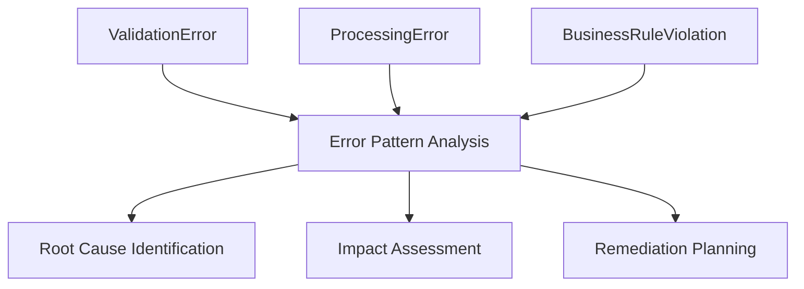

## Monitoring and Alerting Correlation

### SLA Monitoring
Events correlated to track SLA compliance across business processes.

#### SLA Tracking Pattern
```json
{
  "slaMonitoring": {
    "processId": "trade-processing",
    "slaTarget": 300,
    "actualDuration": 285,
    "slaStatus": "WITHIN_SLA",
    "milestones": [
      {
        "milestone": "validation",
        "targetTime": 30,
        "actualTime": 25,
        "status": "WITHIN_SLA"
      },
      {
        "milestone": "confirmation", 
        "targetTime": 60,
        "actualTime": 55,
        "status": "WITHIN_SLA"
      }
    ]
  }
}
```

### Alert Correlation
Related alerts correlated to prevent alert storms and identify systemic issues.

#### Alert Correlation Rules
- **Temporal Correlation**: Alerts within 5-minute window
- **Component Correlation**: Alerts from related system components
- **Causality Correlation**: Alerts with shared causation chains
- **Business Impact Correlation**: Alerts affecting same business process

## Event Replay and Recovery

### Event Sourcing Pattern
Complete event history enables state reconstruction and replay capabilities.

#### State Reconstruction
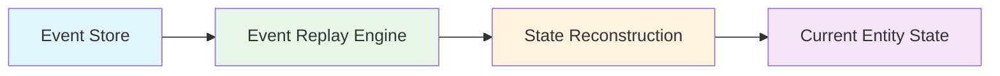

### Compensation Pattern
Failed operations compensated through reverse event chains.

#### Compensation Chain
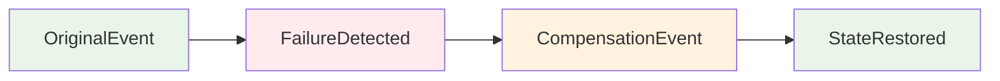

## Compliance and Audit Correlation

### Regulatory Audit Trail
Events correlated to provide complete audit trails for regulatory compliance.

#### Audit Trail Structure
```json
{
  "auditTrail": {
    "businessProcess": "trade-lifecycle",
    "regulatoryFramework": "EMIR",
    "auditPeriod": "2024-01-15T00:00:00Z/2024-01-16T00:00:00Z",
    "eventChain": [
      {
        "eventId": "evt-001",
        "eventType": "TradeConfirmationReceived",
        "timestamp": "2024-01-15T09:00:00Z",
        "actor": "trading-system"
      },
      {
        "eventId": "evt-002",
        "eventType": "TradeValidated", 
        "timestamp": "2024-01-15T09:02:00Z",
        "actor": "validation-engine"
      }
    ]
  }
}
```

### Immutable Event Correlation
Event correlation data stored immutably for audit integrity.

#### Correlation Signature
```json
{
  "correlationSignature": {
    "correlationId": "trade-proc-123",
    "eventCount": 15,
    "firstEvent": "evt-001",
    "lastEvent": "evt-015",
    "correlationHash": "sha256-hash",
    "digitalSignature": "rsa-signature"
  }
}
```
