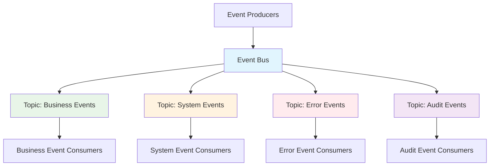
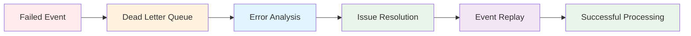

# Event Routing and Subscription Patterns

## Overview

Event routing and subscription patterns define how events are distributed, consumed, and processed throughout the DTCC Regulatory Reporting System. These patterns ensure efficient event delivery, scalable processing, and reliable system integration.

## Event Bus Architecture

### Central Event Bus
All events flow through a central event bus that provides routing, filtering, and delivery guarantees.



### Event Bus Components
- **Event Publishers**: Components that generate and publish events
- **Event Router**: Routes events to appropriate topics based on event type and metadata
- **Topic Managers**: Manage topic partitions and consumer groups
- **Event Consumers**: Components that subscribe to and process events
- **Dead Letter Queues**: Handle failed event processing

## Topic-Based Routing

### Business Event Topics

#### Trade Lifecycle Topic
**Topic**: `business.trade.lifecycle`
**Partition Key**: `entityId` (ensures ordering per trade)
**Retention**: 7 days

```json
{
  "topicConfig": {
    "name": "business.trade.lifecycle",
    "partitions": 12,
    "replicationFactor": 3,
    "retentionMs": 604800000,
    "compressionType": "gzip"
  },
  "routingRules": [
    {
      "condition": "eventType LIKE 'Trade%'",
      "action": "ROUTE_TO_TOPIC"
    },
    {
      "condition": "entityType = 'TRADE'",
      "action": "ROUTE_TO_TOPIC"
    }
  ]
}
```

#### Position Management Topic
**Topic**: `business.position.management`
**Partition Key**: `payload.positionId`
**Retention**: 30 days

```json
{
  "topicConfig": {
    "name": "business.position.management",
    "partitions": 8,
    "replicationFactor": 3,
    "retentionMs": 2592000000
  },
  "routingRules": [
    {
      "condition": "eventType LIKE 'Position%'",
      "action": "ROUTE_TO_TOPIC"
    },
    {
      "condition": "entityType = 'POSITION'",
      "action": "ROUTE_TO_TOPIC"
    }
  ]
}
```

#### Regulatory Compliance Topic
**Topic**: `business.regulatory.compliance`
**Partition Key**: `payload.regulatoryFramework`
**Retention**: 7 years (regulatory requirement)

```json
{
  "topicConfig": {
    "name": "business.regulatory.compliance",
    "partitions": 16,
    "replicationFactor": 3,
    "retentionMs": 220752000000
  },
  "routingRules": [
    {
      "condition": "eventType LIKE 'Regulatory%' OR eventType LIKE 'Report%' OR eventType LIKE 'Compliance%'",
      "action": "ROUTE_TO_TOPIC"
    }
  ]
}
```

### System Event Topics

#### Processing Events Topic
**Topic**: `system.processing.events`
**Partition Key**: `correlationId`
**Retention**: 7 days

```json
{
  "topicConfig": {
    "name": "system.processing.events",
    "partitions": 24,
    "replicationFactor": 3,
    "retentionMs": 604800000
  },
  "routingRules": [
    {
      "condition": "eventType LIKE '%Calculation%' OR eventType LIKE 'Batch%'",
      "action": "ROUTE_TO_TOPIC"
    }
  ]
}
```

#### Integration Events Topic
**Topic**: `system.integration.events`
**Partition Key**: `payload.systemId`
**Retention**: 30 days

```json
{
  "topicConfig": {
    "name": "system.integration.events",
    "partitions": 6,
    "replicationFactor": 3,
    "retentionMs": 2592000000
  },
  "routingRules": [
    {
      "condition": "eventType LIKE 'External%' OR eventType LIKE '%Connected' OR eventType LIKE '%Disconnected'",
      "action": "ROUTE_TO_TOPIC"
    }
  ]
}
```

### Error and Audit Topics

#### Error Events Topic
**Topic**: `error.events`
**Partition Key**: `payload.errorCode`
**Retention**: 2 years

```json
{
  "topicConfig": {
    "name": "error.events",
    "partitions": 8,
    "replicationFactor": 3,
    "retentionMs": 63072000000
  },
  "routingRules": [
    {
      "condition": "eventType LIKE '%Error' OR eventType LIKE '%Violation' OR eventType LIKE '%Failed'",
      "action": "ROUTE_TO_TOPIC"
    }
  ]
}
```

#### Audit Events Topic
**Topic**: `audit.events`
**Partition Key**: `entityId`
**Retention**: 7 years (regulatory requirement)

```json
{
  "topicConfig": {
    "name": "audit.events",
    "partitions": 12,
    "replicationFactor": 3,
    "retentionMs": 220752000000
  },
  "routingRules": [
    {
      "condition": "eventType LIKE 'audit.%'",
      "action": "ROUTE_TO_TOPIC"
    }
  ]
}
```

## Subscription Patterns

### Entity-Specific Subscriptions
Components subscribe to events for specific entities or entity types.

#### Trade Processing Service Subscription
```json
{
  "subscriptionId": "trade-processing-service",
  "consumerGroup": "trade-processors",
  "topics": ["business.trade.lifecycle"],
  "filterCriteria": {
    "entityType": ["TRADE", "TRADE_CONFIRMATION"],
    "eventType": ["TradeConfirmationReceived", "TradeValidated", "TradeAmended"]
  },
  "processingConfig": {
    "maxPollRecords": 100,
    "sessionTimeoutMs": 30000,
    "autoCommit": false,
    "offsetReset": "earliest"
  }
}
```

#### Position Calculation Service Subscription
```json
{
  "subscriptionId": "position-calculation-service",
  "consumerGroup": "position-calculators",
  "topics": ["business.trade.lifecycle", "business.position.management"],
  "filterCriteria": {
    "eventType": ["TradeConfirmed", "TradeAmended", "TradeCancelled", "PositionCalculationTriggered"]
  },
  "processingConfig": {
    "maxPollRecords": 50,
    "sessionTimeoutMs": 60000,
    "autoCommit": false
  }
}
```

### Event-Type-Specific Subscriptions
Components subscribe to specific event types across all entities.

#### Validation Service Subscription
```json
{
  "subscriptionId": "validation-service",
  "consumerGroup": "validators",
  "topics": ["business.trade.lifecycle", "business.position.management"],
  "filterCriteria": {
    "eventType": ["*Received", "*Requested"],
    "metadata.validationRequired": true
  },
  "processingConfig": {
    "maxPollRecords": 200,
    "sessionTimeoutMs": 15000,
    "autoCommit": false
  }
}
```

#### Audit Service Subscription
```json
{
  "subscriptionId": "audit-service",
  "consumerGroup": "auditors",
  "topics": ["audit.events"],
  "filterCriteria": {
    "eventType": ["audit.*"],
    "payload.auditLevel": ["FULL", "SUMMARY"]
  },
  "processingConfig": {
    "maxPollRecords": 1000,
    "sessionTimeoutMs": 45000,
    "autoCommit": true
  }
}
```

### Workflow-Specific Subscriptions
Components subscribe to events relevant to specific workflows.

#### Regulatory Reporting Workflow Subscription
```json
{
  "subscriptionId": "regulatory-reporting-workflow",
  "consumerGroup": "regulatory-reporters",
  "topics": ["business.regulatory.compliance", "business.position.management"],
  "filterCriteria": {
    "eventType": ["ReportingObligationIdentified", "PositionThresholdBreached", "ComplianceDeadlineApproaching"],
    "metadata.businessContext.regulatoryFramework": ["EMIR", "CFTC", "MiFID"]
  },
  "processingConfig": {
    "maxPollRecords": 25,
    "sessionTimeoutMs": 120000,
    "autoCommit": false
  }
}
```

### Error-Specific Subscriptions
Components subscribe to error events for monitoring and alerting.

#### Error Monitoring Service Subscription
```json
{
  "subscriptionId": "error-monitoring-service",
  "consumerGroup": "error-monitors",
  "topics": ["error.events"],
  "filterCriteria": {
    "payload.errorSeverity": ["CRITICAL", "HIGH"],
    "payload.errorCategory": ["VALIDATION", "BUSINESS_RULE", "SYSTEM"]
  },
  "processingConfig": {
    "maxPollRecords": 50,
    "sessionTimeoutMs": 10000,
    "autoCommit": true
  }
}
```

## Dynamic Routing Rules

### Content-Based Routing
Events routed based on event content and metadata.

#### Regulatory Framework Routing
```json
{
  "routingRule": {
    "name": "regulatory-framework-routing",
    "condition": "payload.regulatoryFramework = 'EMIR'",
    "actions": [
      {
        "type": "ROUTE_TO_TOPIC",
        "target": "regulatory.emir.events"
      },
      {
        "type": "ADD_HEADER",
        "key": "jurisdiction",
        "value": "EU"
      }
    ]
  }
}
```

#### Priority-Based Routing
```json
{
  "routingRule": {
    "name": "priority-routing",
    "condition": "metadata.businessContext.urgency = 'IMMEDIATE'",
    "actions": [
      {
        "type": "ROUTE_TO_TOPIC",
        "target": "high-priority.events"
      },
      {
        "type": "SET_PARTITION",
        "partition": 0
      }
    ]
  }
}
```

### Time-Based Routing
Events routed based on temporal characteristics.

#### Business Hours Routing
```json
{
  "routingRule": {
    "name": "business-hours-routing",
    "condition": "timestamp BETWEEN '09:00:00' AND '17:00:00' AND dayOfWeek NOT IN ('SATURDAY', 'SUNDAY')",
    "actions": [
      {
        "type": "ROUTE_TO_TOPIC",
        "target": "business-hours.events"
      }
    ],
    "elseActions": [
      {
        "type": "ROUTE_TO_TOPIC",
        "target": "after-hours.events"
      }
    ]
  }
}
```

## Load Balancing and Scaling

### Consumer Group Scaling
Consumer groups automatically scale based on partition count and load.

#### Horizontal Scaling Configuration
```json
{
  "scalingConfig": {
    "consumerGroup": "trade-processors",
    "minInstances": 2,
    "maxInstances": 12,
    "scalingMetrics": {
      "lagThreshold": 1000,
      "cpuThreshold": 80,
      "memoryThreshold": 85
    },
    "scalingPolicy": {
      "scaleUpCooldown": 300,
      "scaleDownCooldown": 600,
      "scaleUpStep": 2,
      "scaleDownStep": 1
    }
  }
}
```

### Partition Assignment Strategy
Partitions assigned to consumers for optimal load distribution.

#### Sticky Assignment Strategy
```json
{
  "partitionAssignment": {
    "strategy": "sticky",
    "config": {
      "sessionTimeoutMs": 30000,
      "rebalanceTimeoutMs": 60000,
      "heartbeatIntervalMs": 3000
    }
  }
}
```

## Event Filtering and Transformation

### Server-Side Filtering
Events filtered at the broker level to reduce network traffic.

#### Filter Expression Examples
```json
{
  "filters": [
    {
      "name": "trade-events-only",
      "expression": "entityType = 'TRADE' AND eventType LIKE 'Trade%'"
    },
    {
      "name": "high-priority-errors",
      "expression": "eventType LIKE '%Error' AND payload.errorSeverity IN ('CRITICAL', 'HIGH')"
    },
    {
      "name": "regulatory-deadlines",
      "expression": "eventType = 'ComplianceDeadlineApproaching' AND payload.hoursUntilDeadline <= 24"
    }
  ]
}
```

### Event Transformation
Events transformed during routing for consumer-specific formats.

#### Transformation Rules
```json
{
  "transformations": [
    {
      "name": "add-processing-timestamp",
      "type": "ADD_FIELD",
      "field": "metadata.processingTimestamp",
      "value": "{{now}}"
    },
    {
      "name": "enrich-business-context",
      "type": "LOOKUP_ENRICHMENT",
      "lookupKey": "entityId",
      "lookupTable": "entity-metadata",
      "targetField": "metadata.enrichedContext"
    }
  ]
}
```

## Dead Letter Queue Handling

### Failed Event Processing
Events that fail processing are routed to dead letter queues for investigation.

#### Dead Letter Queue Configuration
```json
{
  "deadLetterConfig": {
    "topic": "dead-letter-queue",
    "retentionMs": 2592000000,
    "maxRetries": 3,
    "retryBackoffMs": [1000, 5000, 15000],
    "poisonPillDetection": {
      "enabled": true,
      "threshold": 5,
      "windowMs": 300000
    }
  }
}
```

### Error Recovery Patterns
Failed events can be replayed after issue resolution.

#### Recovery Process


## Monitoring and Metrics

### Event Flow Monitoring
Comprehensive monitoring of event flow through the system.

#### Key Metrics
- **Throughput**: Events per second by topic and consumer group
- **Latency**: End-to-end processing latency
- **Consumer Lag**: Difference between produced and consumed events
- **Error Rate**: Failed event processing rate
- **Dead Letter Rate**: Events routed to dead letter queues

#### Monitoring Dashboard
```json
{
  "dashboardMetrics": [
    {
      "metric": "event_throughput_per_second",
      "aggregation": "sum",
      "groupBy": ["topic", "consumerGroup"]
    },
    {
      "metric": "consumer_lag",
      "aggregation": "max",
      "groupBy": ["topic", "partition"]
    },
    {
      "metric": "processing_latency_p99",
      "aggregation": "percentile",
      "percentile": 99,
      "groupBy": ["eventType"]
    }
  ]
}
```

## Security and Access Control

### Topic-Level Security
Access control enforced at the topic level.

#### Access Control Lists
```json
{
  "topicACL": {
    "topic": "business.trade.lifecycle",
    "permissions": [
      {
        "principal": "service:trade-processing",
        "operations": ["READ", "WRITE"],
        "hosts": ["*"]
      },
      {
        "principal": "service:audit-service",
        "operations": ["READ"],
        "hosts": ["*"]
      }
    ]
  }
}
```

### Event-Level Security
Sensitive events encrypted and access-controlled.

#### Encryption Configuration
```json
{
  "encryptionConfig": {
    "algorithm": "AES-256-GCM",
    "keyRotationPeriod": "P30D",
    "encryptedFields": [
      "payload.sensitiveData",
      "metadata.personalData"
    ]
  }
}
```
