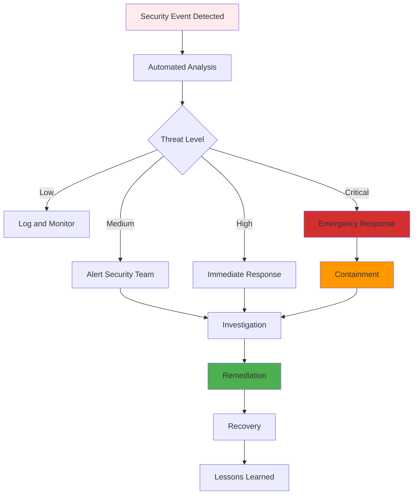

# Event Security Requirements

## Overview

Event security requirements define the comprehensive security controls, access management, and compliance measures for all events in the DTCC Regulatory Reporting System. These requirements ensure data protection, regulatory compliance, and operational security across the entire event-driven architecture.

## Security Classification Framework

### Event Classification Levels

#### Public Events
Events that contain no sensitive information and can be accessed by all system components.

**Classification**: `PUBLIC`
**Examples**: System health checks, general status updates, non-sensitive monitoring events
**Security Controls**: Basic authentication, standard logging
**Retention**: Standard operational retention periods

```json
{
  "securityClassification": {
    "level": "PUBLIC",
    "dataTypes": ["system_status", "health_metrics", "general_alerts"],
    "accessControls": {
      "authentication": "basic",
      "authorization": "role_based",
      "encryption": "in_transit_only"
    },
    "auditRequirements": {
      "logLevel": "summary",
      "retentionPeriod": "P1Y"
    }
  }
}
```

#### Internal Events
Events containing internal business information restricted to authorized system components.

**Classification**: `INTERNAL`
**Examples**: Workflow state transitions, processing metrics, internal system coordination
**Security Controls**: Strong authentication, role-based access, encrypted transmission
**Retention**: Extended operational retention

```json
{
  "securityClassification": {
    "level": "INTERNAL",
    "dataTypes": ["workflow_data", "processing_metrics", "system_coordination"],
    "accessControls": {
      "authentication": "strong",
      "authorization": "role_based_with_attributes",
      "encryption": "in_transit_and_at_rest"
    },
    "auditRequirements": {
      "logLevel": "detailed",
      "retentionPeriod": "P3Y"
    }
  }
}
```

#### Confidential Events
Events containing sensitive business data requiring strict access controls.

**Classification**: `CONFIDENTIAL`
**Examples**: Trade details, counterparty information, financial positions, regulatory reports
**Security Controls**: Multi-factor authentication, attribute-based access, full encryption
**Retention**: Regulatory compliance periods

```json
{
  "securityClassification": {
    "level": "CONFIDENTIAL",
    "dataTypes": ["trade_data", "counterparty_info", "financial_positions", "regulatory_reports"],
    "accessControls": {
      "authentication": "multi_factor",
      "authorization": "attribute_based",
      "encryption": "full_encryption_with_key_rotation"
    },
    "auditRequirements": {
      "logLevel": "comprehensive",
      "retentionPeriod": "P7Y"
    }
  }
}
```

#### Restricted Events
Events containing highly sensitive or regulated data with maximum security controls.

**Classification**: `RESTRICTED`
**Examples**: Personal data, security events, compliance violations, audit trails
**Security Controls**: Certificate-based authentication, need-to-know access, advanced encryption
**Retention**: Maximum regulatory periods with immutable storage

```json
{
  "securityClassification": {
    "level": "RESTRICTED",
    "dataTypes": ["personal_data", "security_events", "compliance_violations", "audit_trails"],
    "accessControls": {
      "authentication": "certificate_based",
      "authorization": "need_to_know",
      "encryption": "advanced_encryption_with_hsm"
    },
    "auditRequirements": {
      "logLevel": "immutable_comprehensive",
      "retentionPeriod": "P10Y"
    }
  }
}
```

## Access Control Framework

### Role-Based Access Control (RBAC)

#### System Roles
```json
{
  "systemRoles": {
    "event_producer": {
      "permissions": ["event:publish", "topic:write"],
      "restrictions": ["no_admin_topics"],
      "eventTypes": ["business", "system"]
    },
    "event_consumer": {
      "permissions": ["event:subscribe", "topic:read"],
      "restrictions": ["classification_level_based"],
      "eventTypes": ["business", "system", "error"]
    },
    "audit_reader": {
      "permissions": ["event:read", "audit:access"],
      "restrictions": ["audit_events_only"],
      "eventTypes": ["audit"]
    },
    "system_admin": {
      "permissions": ["event:*", "topic:*", "admin:*"],
      "restrictions": ["mfa_required"],
      "eventTypes": ["*"]
    }
  }
}
```

#### Business Roles
```json
{
  "businessRoles": {
    "trade_processor": {
      "permissions": ["trade_events:read_write", "position_events:read"],
      "dataAccess": ["TRADE", "TRADE_CONFIRMATION"],
      "classificationAccess": ["PUBLIC", "INTERNAL", "CONFIDENTIAL"]
    },
    "compliance_officer": {
      "permissions": ["regulatory_events:read_write", "audit_events:read"],
      "dataAccess": ["REGULATORY_REPORT", "COMPLIANCE_EVENT", "AUDIT_TRAIL"],
      "classificationAccess": ["PUBLIC", "INTERNAL", "CONFIDENTIAL", "RESTRICTED"]
    },
    "risk_manager": {
      "permissions": ["position_events:read", "risk_events:read_write"],
      "dataAccess": ["POSITION", "RISK_METRIC", "THRESHOLD_BREACH"],
      "classificationAccess": ["PUBLIC", "INTERNAL", "CONFIDENTIAL"]
    }
  }
}
```

### Attribute-Based Access Control (ABAC)

#### Access Policy Rules
```json
{
  "accessPolicies": [
    {
      "policyId": "trade_data_access",
      "description": "Access to trade-related events",
      "rules": [
        {
          "condition": "user.role = 'trade_processor' AND event.entityType = 'TRADE'",
          "action": "ALLOW",
          "permissions": ["read", "write"]
        },
        {
          "condition": "user.businessUnit = event.metadata.businessContext.businessUnit",
          "action": "ALLOW",
          "permissions": ["read"]
        }
      ]
    },
    {
      "policyId": "regulatory_data_access",
      "description": "Access to regulatory events",
      "rules": [
        {
          "condition": "user.role = 'compliance_officer' AND event.eventType LIKE 'Regulatory%'",
          "action": "ALLOW",
          "permissions": ["read", "write"]
        },
        {
          "condition": "event.payload.regulatoryFramework IN user.authorizedJurisdictions",
          "action": "ALLOW",
          "permissions": ["read"]
        }
      ]
    }
  ]
}
```

### Context-Based Access Control

#### Temporal Access Controls
```json
{
  "temporalControls": {
    "business_hours_only": {
      "condition": "time BETWEEN '09:00:00' AND '17:00:00' AND dayOfWeek NOT IN ('SATURDAY', 'SUNDAY')",
      "applicableRoles": ["trade_processor", "risk_manager"],
      "exceptions": ["emergency_access"]
    },
    "deadline_based_access": {
      "condition": "event.metadata.temporalContext.processingDeadline - now() < 'PT2H'",
      "enhancedPermissions": ["expedited_processing"],
      "applicableEvents": ["regulatory_reports", "compliance_deadlines"]
    }
  }
}
```

#### Location-Based Access Controls
```json
{
  "locationControls": {
    "geographic_restrictions": {
      "condition": "user.location.country IN event.metadata.authorizedCountries",
      "applicableClassifications": ["CONFIDENTIAL", "RESTRICTED"],
      "exceptions": ["emergency_override"]
    },
    "network_restrictions": {
      "condition": "user.ipAddress IN allowedNetworks",
      "applicableRoles": ["external_auditor", "vendor_access"],
      "allowedNetworks": ["10.0.0.0/8", "192.168.0.0/16"]
    }
  }
}
```

## Encryption Requirements

### Data in Transit Encryption

#### Transport Layer Security
```json
{
  "tlsConfig": {
    "minVersion": "TLS1.3",
    "cipherSuites": [
      "TLS_AES_256_GCM_SHA384",
      "TLS_CHACHA20_POLY1305_SHA256",
      "TLS_AES_128_GCM_SHA256"
    ],
    "certificateValidation": "strict",
    "mutualTLS": true
  }
}
```

#### Message-Level Encryption
```json
{
  "messageEncryption": {
    "algorithm": "AES-256-GCM",
    "keyDerivation": "PBKDF2",
    "keyRotationPeriod": "P30D",
    "encryptedFields": [
      "payload.sensitiveData",
      "metadata.personalInformation",
      "payload.financialData"
    ]
  }
}
```

### Data at Rest Encryption

#### Event Store Encryption
```json
{
  "eventStoreEncryption": {
    "encryptionAtRest": {
      "algorithm": "AES-256-XTS",
      "keyManagement": "HSM",
      "keyRotationPeriod": "P90D"
    },
    "fieldLevelEncryption": {
      "sensitiveFields": [
        "payload.tradeDetails",
        "payload.counterpartyData",
        "payload.personalData"
      ],
      "algorithm": "AES-256-GCM",
      "keyPerField": true
    }
  }
}
```

#### Backup Encryption
```json
{
  "backupEncryption": {
    "algorithm": "AES-256-CBC",
    "keyEscrow": true,
    "compressionBeforeEncryption": true,
    "integrityChecks": "SHA-256"
  }
}
```

## Authentication and Authorization

### Service Authentication

#### Certificate-Based Authentication
```json
{
  "certificateAuth": {
    "certificateAuthority": "internal_ca",
    "certificateValidation": {
      "checkRevocation": true,
      "validateChain": true,
      "requireClientCert": true
    },
    "certificateRotation": {
      "rotationPeriod": "P365D",
      "preExpiryWarning": "P30D"
    }
  }
}
```

#### API Key Authentication
```json
{
  "apiKeyAuth": {
    "keyFormat": "JWT",
    "keyExpiration": "PT24H",
    "keyRotation": "automatic",
    "scopeValidation": true,
    "rateLimiting": {
      "requestsPerMinute": 1000,
      "burstLimit": 100
    }
  }
}
```

### User Authentication

#### Multi-Factor Authentication
```json
{
  "mfaConfig": {
    "requiredForRoles": ["system_admin", "compliance_officer"],
    "requiredForClassifications": ["RESTRICTED"],
    "methods": ["TOTP", "hardware_token", "biometric"],
    "sessionTimeout": "PT8H",
    "reauthenticationRequired": "PT4H"
  }
}
```

## Audit and Compliance

### Security Event Logging

#### Audit Event Structure
```json
{
  "securityAuditEvent": {
    "eventId": "uuid",
    "eventType": "SecurityAuditEvent",
    "timestamp": "iso8601",
    "securityContext": {
      "userId": "string",
      "sessionId": "string",
      "ipAddress": "string",
      "userAgent": "string",
      "authenticationMethod": "string"
    },
    "accessDetails": {
      "resourceType": "event",
      "resourceId": "string",
      "accessType": "read|write|delete",
      "accessResult": "granted|denied|failed",
      "accessReason": "string"
    },
    "riskAssessment": {
      "riskScore": "number",
      "riskFactors": ["string"],
      "threatLevel": "low|medium|high|critical"
    }
  }
}
```

#### Compliance Logging Requirements
```json
{
  "complianceLogging": {
    "regulatoryFrameworks": ["SOX", "GDPR", "EMIR", "MiFID"],
    "logRetention": {
      "securityEvents": "P7Y",
      "accessLogs": "P5Y",
      "auditTrails": "P10Y"
    },
    "logIntegrity": {
      "digitalSignatures": true,
      "tamperEvidence": true,
      "chainOfCustody": true
    }
  }
}
```

### Privacy Protection

#### Personal Data Handling
```json
{
  "privacyControls": {
    "personalDataIdentification": {
      "automaticDetection": true,
      "dataTypes": ["PII", "financial_data", "contact_info"],
      "classificationTags": ["personal", "sensitive", "restricted"]
    },
    "dataMinimization": {
      "purposeLimitation": true,
      "retentionLimits": true,
      "accessLogging": true
    },
    "rightToErasure": {
      "dataSubjectRequests": true,
      "erasureVerification": true,
      "dependencyTracking": true
    }
  }
}
```

## Threat Detection and Response

### Anomaly Detection

#### Behavioral Analysis
```json
{
  "anomalyDetection": {
    "userBehaviorAnalysis": {
      "baselineEstablishment": "P30D",
      "anomalyThresholds": {
        "accessPatternDeviation": 2.5,
        "volumeDeviation": 3.0,
        "timePatternDeviation": 2.0
      },
      "alerting": {
        "realTimeAlerts": true,
        "alertThreshold": "medium",
        "escalationRules": ["immediate_for_critical"]
      }
    },
    "systemBehaviorAnalysis": {
      "eventVolumeMonitoring": true,
      "errorRateMonitoring": true,
      "latencyMonitoring": true,
      "alertThresholds": {
        "volumeSpike": 5.0,
        "errorRateIncrease": 2.0,
        "latencyIncrease": 3.0
      }
    }
  }
}
```

### Incident Response

#### Security Incident Workflow


#### Response Procedures
```json
{
  "incidentResponse": {
    "responseTeam": {
      "securityOfficer": "primary_contact",
      "systemAdministrator": "technical_lead",
      "complianceOfficer": "regulatory_liaison",
      "businessOwner": "business_impact_assessment"
    },
    "escalationMatrix": {
      "low": "P4 - 24 hours",
      "medium": "P3 - 4 hours", 
      "high": "P2 - 1 hour",
      "critical": "P1 - 15 minutes"
    },
    "containmentActions": {
      "accountSuspension": "automatic_for_critical",
      "accessRevocation": "immediate",
      "systemIsolation": "if_compromise_detected",
      "dataQuarantine": "for_data_breaches"
    }
  }
}
```

## Compliance Framework Integration

### Regulatory Compliance

#### SOX Compliance
```json
{
  "soxCompliance": {
    "applicableEvents": ["financial_data", "audit_trails", "access_controls"],
    "controls": {
      "accessControls": "segregation_of_duties",
      "changeManagement": "approval_workflows",
      "auditTrails": "immutable_logging"
    },
    "reporting": {
      "frequency": "quarterly",
      "attestation": "required",
      "externalAudit": "annual"
    }
  }
}
```

#### GDPR Compliance
```json
{
  "gdprCompliance": {
    "applicableEvents": ["personal_data", "consent_events", "data_processing"],
    "controls": {
      "lawfulBasis": "legitimate_interest",
      "consentManagement": "explicit_consent",
      "dataSubjectRights": "automated_fulfillment"
    },
    "dataProtectionImpactAssessment": {
      "required": true,
      "frequency": "annual",
      "scope": "high_risk_processing"
    }
  }
}
```

### Industry Standards

#### ISO 27001 Alignment
```json
{
  "iso27001Alignment": {
    "informationSecurityManagement": {
      "policies": "documented_and_approved",
      "procedures": "implemented_and_tested",
      "controls": "continuously_monitored"
    },
    "riskManagement": {
      "riskAssessment": "annual",
      "riskTreatment": "documented_plans",
      "riskMonitoring": "continuous"
    }
  }
}
```

## Security Monitoring and Metrics

### Key Security Metrics
```json
{
  "securityMetrics": {
    "accessMetrics": {
      "successfulLogins": "count_per_hour",
      "failedLogins": "count_per_hour",
      "privilegedAccess": "count_per_day",
      "anomalousAccess": "count_per_day"
    },
    "eventSecurityMetrics": {
      "encryptedEvents": "percentage",
      "classifiedEvents": "percentage",
      "auditedEvents": "percentage",
      "complianceViolations": "count_per_day"
    },
    "incidentMetrics": {
      "securityIncidents": "count_per_month",
      "meanTimeToDetection": "minutes",
      "meanTimeToResponse": "minutes",
      "meanTimeToResolution": "hours"
    }
  }
}
```

### Security Dashboard
```json
{
  "securityDashboard": {
    "realTimeMonitoring": {
      "activeThreats": "current_count",
      "securityAlerts": "last_24_hours",
      "systemHealth": "current_status",
      "complianceStatus": "current_percentage"
    },
    "trendAnalysis": {
      "threatTrends": "30_day_trend",
      "accessPatterns": "weekly_analysis",
      "complianceMetrics": "monthly_trend"
    }
  }
}
```
