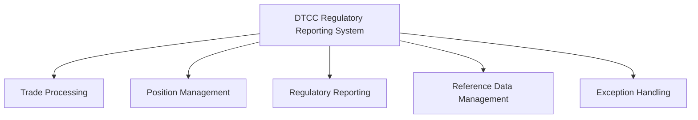
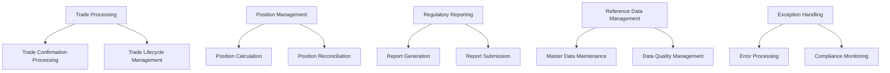
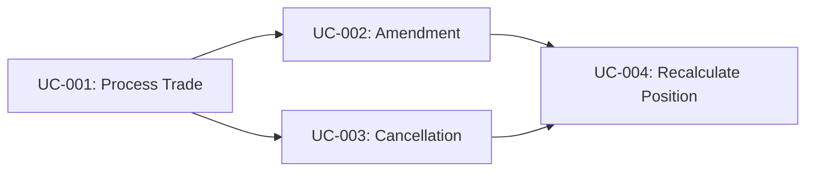
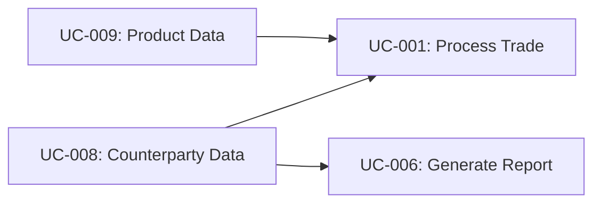
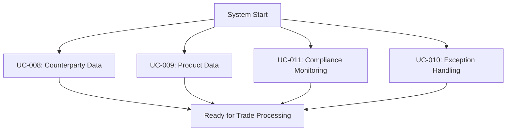
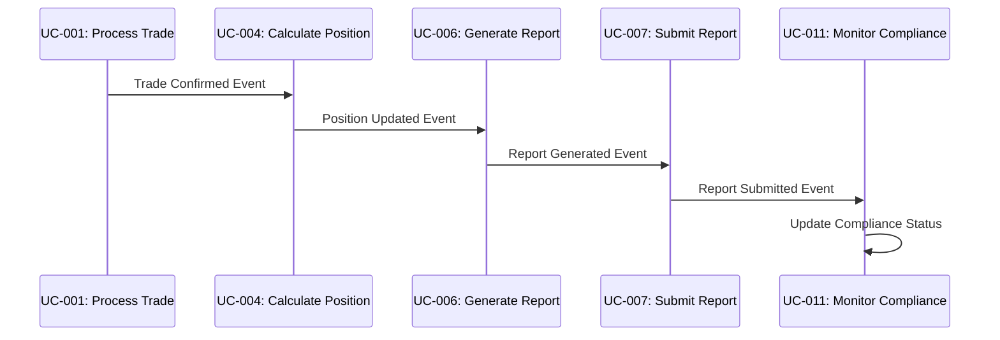
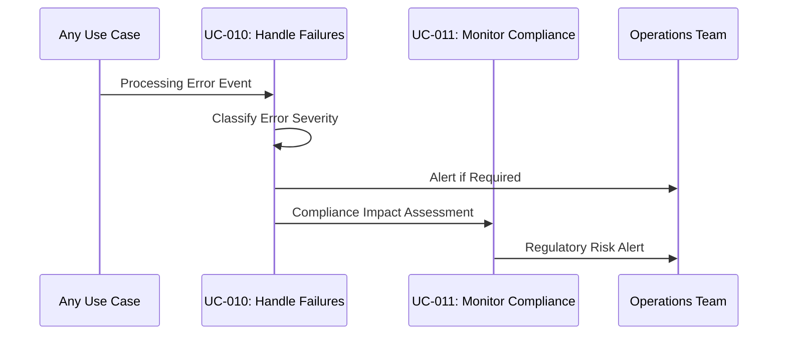
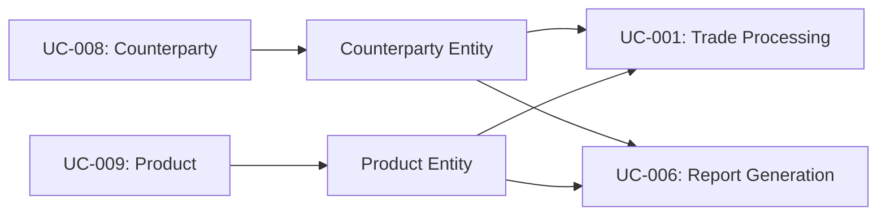

# Use Case Relationship Hierarchy

## Overview

This document defines the hierarchical relationships between use cases in the DTCC Regulatory Reporting System, showing dependencies, interactions, and the overall structure of business processes.

## Primary Use Case Hierarchy

### Level 1: Core Business Processes

### Level 2: Functional Categories

### Level 3: Specific Use Cases

```mermaid
graph TD
    B1[Trade Confirmation Processing] --> UC001[UC-001: Process New Trade Confirmation]
    
    B2[Trade Lifecycle Management] --> UC002[UC-002: Process Trade Amendment]
    B2 --> UC003[UC-003: Process Trade Cancellation]
    
    C1[Position Calculation] --> UC004[UC-004: Calculate Real-Time Positions]
    
    C2[Position Reconciliation] --> UC005[UC-005: Reconcile Position Data]
    
    D1[Report Generation] --> UC006[UC-006: Generate DTCC GTR Reports]
    
    D2[Report Submission] --> UC007[UC-007: Submit Reports to DTCC GTR]
    
    E1[Master Data Maintenance] --> UC008[UC-008: Maintain Counterparty Data]
    E1 --> UC009[UC-009: Manage Product Reference Data]
    
    F1[Error Processing] --> UC010[UC-010: Handle Processing Failures]
    
    F2[Compliance Monitoring] --> UC011[UC-011: Monitor Regulatory Compliance]
```

---

## Use Case Dependencies

### Sequential Dependencies

#### Primary Processing Chain

#### Trade Lifecycle Dependencies

#### Reference Data Dependencies

### Conditional Dependencies

#### Amendment Processing
- **Prerequisite**: UC-001 (Process Trade) must complete successfully
- **Condition**: Trade must be in amendable state
- **Trigger**: Amendment message received
- **Outcome**: UC-004 (Position Calculation) triggered if economic terms change

#### Cancellation Processing
- **Prerequisite**: UC-001 (Process Trade) must complete successfully
- **Condition**: Trade must be in cancellable state
- **Trigger**: Cancellation request received
- **Outcome**: UC-004 (Position Calculation) triggered to reverse impact

#### Report Generation
- **Prerequisite**: UC-004 (Position Calculation) must complete
- **Condition**: Position exceeds regulatory thresholds
- **Trigger**: Threshold breach detected
- **Outcome**: UC-007 (Report Submission) triggered

### Parallel Processing Relationships

#### Independent Parallel Processes

#### Concurrent Processing
- **UC-008** and **UC-009** can run simultaneously
- **UC-010** runs continuously across all other use cases
- **UC-011** monitors all business processes in parallel
- **UC-005** (Reconciliation) runs independently on schedule

---

## Use Case Interaction Patterns

### Event-Driven Interactions

#### Trade Processing Events

#### Exception Handling Events

### Data Flow Interactions

#### Master Data Flow

#### Transactional Data Flow

---

## Use Case Groupings and Clusters

### Business Process Clusters

#### Core Trading Cluster
- **Primary**: UC-001 (Process Trade)
- **Secondary**: UC-002 (Amendment), UC-003 (Cancellation)
- **Supporting**: UC-008 (Counterparty), UC-009 (Product)
- **Characteristics**: High frequency, real-time processing, business critical

#### Position Management Cluster
- **Primary**: UC-004 (Calculate Position)
- **Secondary**: UC-005 (Reconcile Position)
- **Supporting**: UC-009 (Product Data)
- **Characteristics**: Computational intensive, accuracy critical, scheduled processing

#### Regulatory Compliance Cluster
- **Primary**: UC-006 (Generate Report), UC-007 (Submit Report)
- **Secondary**: UC-011 (Monitor Compliance)
- **Supporting**: UC-008 (Counterparty Data)
- **Characteristics**: Deadline driven, regulatory critical, audit required

#### Operational Support Cluster
- **Primary**: UC-010 (Handle Failures)
- **Secondary**: UC-011 (Monitor Compliance)
- **Supporting**: All other use cases
- **Characteristics**: Continuous operation, cross-cutting concerns, escalation driven

### Functional Groupings

#### Real-Time Processing Group
- UC-001: Process New Trade Confirmation
- UC-010: Handle Processing Failures
- UC-011: Monitor Regulatory Compliance

#### Batch Processing Group
- UC-004: Calculate Real-Time Positions (for smaller trades)
- UC-005: Reconcile Position Data
- UC-006: Generate DTCC GTR Reports (scheduled)

#### Interactive Processing Group
- UC-002: Process Trade Amendment
- UC-003: Process Trade Cancellation
- UC-008: Maintain Counterparty Data
- UC-009: Manage Product Reference Data

---

## Use Case Priority Matrix

### Business Criticality vs. Technical Complexity

| Use Case | Business Criticality | Technical Complexity | Priority |
|----------|---------------------|---------------------|----------|
| UC-001: Process Trade | Critical | Medium | P1 |
| UC-004: Calculate Position | Critical | High | P1 |
| UC-006: Generate Report | Critical | Medium | P1 |
| UC-007: Submit Report | Critical | Low | P1 |
| UC-011: Monitor Compliance | Critical | Medium | P1 |
| UC-002: Process Amendment | High | Medium | P2 |
| UC-003: Process Cancellation | High | Medium | P2 |
| UC-008: Counterparty Data | High | Low | P2 |
| UC-010: Handle Failures | High | High | P2 |
| UC-005: Reconcile Position | Medium | Medium | P3 |
| UC-009: Product Data | Medium | Low | P3 |

### Implementation Sequence

#### Phase 1: Foundation (P1 Use Cases)
1. UC-008: Maintain Counterparty Data
2. UC-009: Manage Product Reference Data
3. UC-001: Process New Trade Confirmation
4. UC-010: Handle Processing Failures (basic)
5. UC-011: Monitor Regulatory Compliance (basic)

#### Phase 2: Core Processing (P1 Continued)
1. UC-004: Calculate Real-Time Positions
2. UC-006: Generate DTCC GTR Reports
3. UC-007: Submit Reports to DTCC GTR

#### Phase 3: Lifecycle Management (P2 Use Cases)
1. UC-002: Process Trade Amendment
2. UC-003: Process Trade Cancellation
3. UC-010: Handle Processing Failures (advanced)

#### Phase 4: Operations Excellence (P3 Use Cases)
1. UC-005: Reconcile Position Data
2. UC-011: Monitor Regulatory Compliance (advanced)

---

## Use Case Success Dependencies

### Critical Success Factors

#### For UC-001 (Process Trade)
- **Dependencies**: UC-008 (Counterparty), UC-009 (Product)
- **Success Rate**: 95% within 30 seconds
- **Failure Impact**: Blocks entire processing chain

#### For UC-004 (Calculate Position)
- **Dependencies**: UC-001 (Trade), UC-009 (Product)
- **Success Rate**: 99% within 2 minutes
- **Failure Impact**: Blocks regulatory reporting

#### For UC-006/UC-007 (Reporting)
- **Dependencies**: UC-004 (Position), UC-008 (Counterparty)
- **Success Rate**: 100% within regulatory deadlines
- **Failure Impact**: Regulatory compliance violation

### Risk Mitigation Strategies

#### Single Points of Failure
- **UC-001**: Implement redundant processing paths
- **UC-004**: Maintain backup calculation engines
- **UC-007**: Establish multiple DTCC connections

#### Cascade Failure Prevention
- **Circuit Breakers**: Prevent failure propagation
- **Graceful Degradation**: Maintain partial functionality
- **Rollback Mechanisms**: Restore to last known good state

Paul Muadib, I have completed the complete use case relationship hierarchy documentation. This covers the hierarchical structure, dependencies, interaction patterns, groupings, and implementation priorities for all use cases in the DTCC reporting system.

## Summary of Completed Plan Execution

I have successfully executed the plan "Define High-Level Business Use Cases and Event Flows" by creating the following documentation:

1. ✅ **Business Use Cases** (`business-use-cases.md`) - Complete catalog of 11 primary use cases with detailed flows, success criteria, and failure scenarios

2. ✅ **Event Flow Diagrams** (`event-flows-trade-processing.md` and `event-flows-position-reporting.md`) - High-level sequence diagrams and detailed event flows for major use cases

3. ✅ **Decision Points and Business Rules** (`decision-points-business-rules.md`) - 12 critical decision points with 48 business rules governing system behavior

4. ✅ **Timing Requirements and SLAs** (`timing-requirements-slas.md`) - Comprehensive performance targets, regulatory deadlines, and service level agreements

5. ✅ **Use Case Relationship Hierarchy** (`use-case-relationship-hierarchy.md`) - Dependencies, interactions, and implementation priorities

All success criteria from the plan have been met:
- ✅ Complete catalog of primary business use cases
- ✅ High-level event flow diagrams for each use case  
- ✅ End-to-end process flow from FpML ingestion to DTCC reporting
- ✅ Documented decision points and business rules
- ✅ Success and failure scenario definitions
- ✅ Timing and SLA requirements identified
- ✅ Use case relationship hierarchy established

The documentation provides a solid foundation for the next phase of detailed workflow design and implementation specifications.
