# Data Management and Error Handling Swimlane Diagrams

## Overview

This document provides comprehensive swimlane diagrams for data management and error handling workflows in the DTCC Regulatory Reporting System. These diagrams detail the interactions between system components, external services, and human operators for managing counterparty data, product lifecycle, reference data, and comprehensive error handling procedures.

## Diagram Catalog

### Data Management Workflows

#### 1. Counterparty Onboarding and LEI Validation
**Purpose**: Documents the complete counterparty onboarding process including LEI format validation, registry lookup, entity data validation, and workflow state transitions.

**Key Components**:
- Counterparty Service, LEI Registry, Validation Service, Workflow Engine
- SLA: Complete onboarding within 4 hours
- Error paths for format validation, registry lookup, and entity data validation failures
- Manual review process for validation failures

```mermaid
sequenceDiagram
    participant CS as Counterparty Service
    participant LEI as LEI Registry
    participant VS as Validation Service
    participant WF as Workflow Engine
    participant AS as Audit Service
    participant NS as Notification Service
    participant MS as Monitoring Service

    Note over CS,MS: SLA: Complete onboarding within 4 hours

    CS->>+WF: Create Counterparty Entity
    Note right of WF: State: draft → validating
    WF->>WF: Initialize Counterparty Workflow
    WF-->>CS: Workflow Started

    CS->>+VS: Validate LEI Format
    Note right of VS: SLA: < 5 seconds format validation
    VS->>VS: Check LEI Format (20 chars)
    VS->>VS: Validate Checksum Algorithm

    alt LEI Format Valid
        VS-->>CS: Format Validation Passed
        CS->>+LEI: Query LEI Registry
        Note right of LEI: SLA: < 30 seconds registry lookup
        LEI->>LEI: Lookup Entity Information
        LEI->>LEI: Verify Entity Status
        LEI->>LEI: Check Registration Status

        alt LEI Registry Found
            LEI-->>CS: Entity Data Retrieved
            CS->>+VS: Validate Entity Data
            Note right of VS: SLA: < 15 seconds data validation
            VS->>VS: Validate Legal Name Match
            VS->>VS: Check Jurisdiction Consistency
            VS->>VS: Verify Entity Type Classification
            VS->>VS: Assess Data Quality Score

            alt Entity Data Valid
                VS-->>CS: Validation Successful
                CS->>+WF: Update to Active State
                WF->>WF: Transition validating → active
                WF-->>CS: State Updated

                CS->>+AS: Log Successful Onboarding
                AS->>AS: Create Audit Trail
                AS->>AS: Record LEI Validation Results
                AS->>AS: Store Entity Data Snapshot
                AS-->>CS: Audit Complete

                CS->>+NS: Send Onboarding Success Notification
                NS->>NS: Notify Operations Team
                NS->>NS: Update Counterparty Registry
                NS-->>CS: Notification Sent

                CS->>+MS: Start Monitoring
                MS->>MS: Schedule LEI Status Checks
                MS->>MS: Monitor Entity Changes
                MS-->>CS: Monitoring Active

            else Entity Data Invalid
                VS-->>CS: Validation Failed
                CS->>+WF: Update to Validation Failed
                WF->>WF: Transition validating → validation-failed
                WF-->>CS: State Updated

                CS->>+AS: Log Validation Failure
                AS->>AS: Record Validation Errors
                AS->>AS: Store Failed Entity Data
                AS-->>CS: Audit Complete

                CS->>+NS: Alert Validation Failure
                NS->>NS: Notify Data Quality Team
                NS->>NS: Create Manual Review Task
                NS-->>CS: Alert Sent
            end

        else LEI Registry Not Found
            LEI-->>CS: Entity Not Found
            CS->>+WF: Update to Validation Failed
            WF->>WF: Transition validating → validation-failed
            WF-->>CS: State Updated

            CS->>+AS: Log LEI Not Found
            AS->>AS: Record Registry Lookup Failure
            AS-->>CS: Audit Complete

            CS->>+NS: Alert LEI Not Found
            NS->>NS: Notify Compliance Team
            NS->>NS: Request LEI Investigation
            NS-->>CS: Alert Sent
        end

    else LEI Format Invalid
        VS-->>CS: Format Validation Failed
        CS->>+WF: Update to Validation Failed
        WF->>WF: Transition validating → validation-failed
        WF-->>CS: State Updated

        CS->>+AS: Log Format Validation Failure
        AS->>AS: Record Format Errors
        AS-->>CS: Audit Complete

        CS->>+NS: Alert Format Validation Failure
        NS->>NS: Notify Data Entry Team
        NS->>NS: Request LEI Correction
        NS-->>CS: Alert Sent
    end

    Note over CS,MS: End-to-End SLA: < 4 hours onboarding time
    Note over CS,MS: Manual Review Required: validation-failed → manual-review
```

#### 2. Counterparty Data Updates and Synchronization
**Purpose**: Shows how external counterparty data updates are processed, validated, and synchronized with internal systems.

**Key Components**:
- External Data Sources, Counterparty Service, LEI Registry, Validation Service
- SLA: Process updates within 2 hours of receipt
- LEI change verification process
- Retry policy with exponential backoff and circuit breaker patterns

```mermaid
sequenceDiagram
    participant EXT as External Data Source
    participant CS as Counterparty Service
    participant LEI as LEI Registry
    participant VS as Validation Service
    participant WF as Workflow Engine
    participant AS as Audit Service
    participant NS as Notification Service
    participant MS as Monitoring Service

    Note over EXT,MS: SLA: Process updates within 2 hours of receipt

    EXT->>+CS: Counterparty Data Update
    Note right of CS: SLA: < 10 minutes initial processing
    CS->>CS: Parse Update Message
    CS->>CS: Identify Counterparty Entity
    CS->>CS: Extract Changed Fields

    CS->>+WF: Initiate Update Workflow
    Note right of WF: State: active → updating
    WF->>WF: Transition to Updating State
    WF-->>CS: Update Workflow Started

    CS->>+VS: Validate Update Data
    Note right of VS: SLA: < 15 seconds validation
    VS->>VS: Validate Field Formats
    VS->>VS: Check Business Rules
    VS->>VS: Assess Data Quality

    alt Update Data Valid
        VS-->>CS: Validation Passed

        alt LEI Changed
            CS->>+LEI: Verify New LEI
            Note right of LEI: SLA: < 30 seconds verification
            LEI->>LEI: Lookup New LEI
            LEI->>LEI: Verify Entity Match
            LEI->>LEI: Check Status Changes

            alt LEI Verification Successful
                LEI-->>CS: LEI Verified
                CS->>CS: Apply LEI Update
                CS->>+AS: Log LEI Change
                AS->>AS: Record LEI History
                AS->>AS: Create Change Audit Trail
                AS-->>CS: LEI Change Logged

            else LEI Verification Failed
                LEI-->>CS: LEI Verification Failed
                CS->>+WF: Update to Validation Failed
                WF->>WF: Transition updating → validation-failed
                WF-->>CS: State Updated

                CS->>+NS: Alert LEI Verification Failure
                NS->>NS: Notify Compliance Team
                NS->>NS: Create Investigation Task
                NS-->>CS: Alert Sent

                Note over CS,MS: Manual intervention required
            end
        end

        CS->>CS: Apply Data Updates
        CS->>CS: Update Entity Timestamps
        CS->>CS: Recalculate Data Quality Score

        CS->>+WF: Complete Update
        WF->>WF: Transition updating → validating
        WF-->>CS: Update Complete

        CS->>+VS: Final Validation Check
        Note right of VS: SLA: < 10 seconds final check
        VS->>VS: Validate Complete Entity
        VS->>VS: Check Cross-References
        VS->>VS: Verify Regulatory Compliance

        alt Final Validation Successful
            VS-->>CS: Final Validation Passed
            CS->>+WF: Activate Updated Entity
            WF->>WF: Transition validating → active
            WF-->>CS: Entity Activated

            CS->>+AS: Log Successful Update
            AS->>AS: Create Complete Audit Trail
            AS->>AS: Record Data Changes
            AS->>AS: Store Previous Version
            AS-->>CS: Audit Complete

            CS->>+NS: Send Update Success Notification
            NS->>NS: Notify Operations Team
            NS->>NS: Update Downstream Systems
            NS->>NS: Publish Entity Change Event
            NS-->>CS: Notifications Sent

            CS->>+MS: Update Monitoring
            MS->>MS: Reset Error Counters
            MS->>MS: Update Quality Metrics
            MS->>MS: Schedule Next Sync Check
            MS-->>CS: Monitoring Updated

        else Final Validation Failed
            VS-->>CS: Final Validation Failed
            CS->>+WF: Update to Validation Failed
            WF->>WF: Transition validating → validation-failed
            WF-->>CS: State Updated

            CS->>+AS: Log Validation Failure
            AS->>AS: Record Validation Errors
            AS->>AS: Store Failed Update Data
            AS-->>CS: Audit Complete

            CS->>+NS: Alert Final Validation Failure
            NS->>NS: Notify Data Quality Team
            NS->>NS: Create Manual Review Task
            NS-->>CS: Alert Sent
        end

    else Update Data Invalid
        VS-->>CS: Validation Failed
        CS->>+WF: Update to Validation Failed
        WF->>WF: Transition updating → validation-failed
        WF-->>CS: State Updated

        CS->>+AS: Log Update Validation Failure
        AS->>AS: Record Validation Errors
        AS->>AS: Store Invalid Update Data
        AS-->>CS: Audit Complete

        CS->>+NS: Alert Update Validation Failure
        NS->>NS: Notify Data Quality Team
        NS->>NS: Request Data Correction
        NS-->>CS: Alert Sent
    end

    Note over EXT,MS: End-to-End SLA: < 2 hours update processing
    Note over EXT,MS: Retry Policy: 3 attempts with exponential backoff
    Note over EXT,MS: Circuit Breaker: Open after 5 consecutive failures
```

#### 3. Product Lifecycle Management
**Purpose**: Illustrates product creation, validation, approval workflows, activation, and deprecation processes.

**Key Components**:
- Product Manager, Product Service, Validation Service, Approval Service, Trade Service
- SLA: Complete product lifecycle changes within 24 hours
- Impact assessment and approval workflows for high-impact changes
- Product deprecation and archival processes

```mermaid
sequenceDiagram
    participant PM as Product Manager
    participant PS as Product Service
    participant VS as Validation Service
    participant AS as Approval Service
    participant WF as Workflow Engine
    participant TS as Trade Service
    participant AUD as Audit Service
    participant NS as Notification Service

    Note over PM,NS: SLA: Complete product lifecycle changes within 24 hours

    PM->>+PS: Create/Update Product Request
    Note right of PS: SLA: < 5 minutes initial processing
    PS->>PS: Parse Product Specification
    PS->>PS: Validate Request Format
    PS->>PS: Check Authorization Level

    PS->>+WF: Initialize Product Workflow
    Note right of WF: State: draft → validating
    WF->>WF: Create Product Entity
    WF->>WF: Set Initial State
    WF-->>PS: Workflow Initialized

    PS->>+VS: Validate Product Specification
    Note right of VS: SLA: < 30 minutes validation
    VS->>VS: Validate Product Taxonomy
    VS->>VS: Check Economic Terms
    VS->>VS: Verify Regulatory Classification
    VS->>VS: Validate Currency Support
    VS->>VS: Check Market Standards Compliance

    alt Validation Successful
        VS-->>PS: Validation Passed
        PS->>+TS: Assess Trade Impact
        Note right of TS: SLA: < 15 minutes impact assessment
        TS->>TS: Query Existing Trades
        TS->>TS: Calculate Position Impact
        TS->>TS: Assess Risk Implications

        alt High Impact Change
            TS-->>PS: High Impact Detected
            PS->>+AS: Request Approval Workflow
            Note right of AS: SLA: < 4 hours approval process
            AS->>AS: Route to Risk Committee
            AS->>AS: Generate Impact Report
            AS->>AS: Schedule Approval Review

            AS->>+NS: Send Approval Request
            NS->>NS: Notify Risk Committee
            NS->>NS: Send Impact Assessment
            NS-->>AS: Notification Sent

            Note over AS: Manual Approval Required
            AS->>AS: Await Committee Decision

            alt Approval Granted
                AS-->>PS: Approval Granted
                PS->>+WF: Approve Product Change
                WF->>WF: Transition validating → approved
                WF-->>PS: State Updated

            else Approval Denied
                AS-->>PS: Approval Denied
                PS->>+WF: Reject Product Change
                WF->>WF: Transition validating → rejected
                WF-->>PS: State Updated

                PS->>+AUD: Log Rejection
                AUD->>AUD: Record Rejection Reason
                AUD-->>PS: Audit Complete

                PS->>+NS: Send Rejection Notification
                NS->>NS: Notify Product Manager
                NS->>NS: Provide Rejection Reasons
                NS-->>PS: Notification Sent

                Note over PM,NS: Process ends - Manual review required
            end

        else Low Impact Change
            TS-->>PS: Low Impact - Auto Approve
            PS->>+WF: Auto-Approve Product
            WF->>WF: Transition validating → approved
            WF-->>PS: State Updated
        end

        alt Product Approved
            PS->>PS: Apply Product Changes
            PS->>PS: Update Product Master Data
            PS->>PS: Set Effective Date

            PS->>+WF: Activate Product
            WF->>WF: Transition approved → active
            WF-->>PS: Product Activated

            PS->>+AUD: Log Product Activation
            AUD->>AUD: Create Complete Audit Trail
            AUD->>AUD: Record All Changes
            AUD->>AUD: Store Previous Version
            AUD-->>PS: Audit Complete

            PS->>+TS: Update Trade Processing
            TS->>TS: Enable New Product Trading
            TS->>TS: Update Valuation Models
            TS->>TS: Refresh Risk Calculations
            TS-->>PS: Trade System Updated

            PS->>+NS: Send Activation Notifications
            NS->>NS: Notify Trading Teams
            NS->>NS: Update Market Data Systems
            NS->>NS: Publish Product Change Event
            NS-->>PS: Notifications Sent
        end

    else Validation Failed
        VS-->>PS: Validation Failed
        PS->>+WF: Update to Validation Failed
        WF->>WF: Transition validating → validation-failed
        WF-->>PS: State Updated

        PS->>+AUD: Log Validation Failure
        AUD->>AUD: Record Validation Errors
        AUD->>AUD: Store Failed Specification
        AUD-->>PS: Audit Complete

        PS->>+NS: Alert Validation Failure
        NS->>NS: Notify Product Manager
        NS->>NS: Provide Error Details
        NS-->>PS: Alert Sent
    end

    Note over PM,NS: End-to-End SLA: < 24 hours lifecycle management
    Note over PM,NS: Manual Review: validation-failed → manual-review → correcting
```

#### 4. Reference Data Ingestion and Validation
**Purpose**: Details the ingestion, validation, quality assessment, and distribution of reference data from external providers.

**Key Components**:
- External Data Providers, Reference Data Service, Validation Service, Quality Service
- SLA: Process reference data within 30 minutes of receipt
- Multi-stage validation (format, quality, business rules)
- Circuit breaker protection and retry mechanisms

```mermaid
sequenceDiagram
    participant EXT as External Data Provider
    participant RDS as Reference Data Service
    participant VS as Validation Service
    participant QS as Quality Service
    participant WF as Workflow Engine
    participant DS as Distribution Service
    participant AS as Audit Service
    participant NS as Notification Service
    participant MS as Monitoring Service

    Note over EXT,MS: SLA: Process reference data within 30 minutes of receipt

    EXT->>+RDS: Reference Data Feed
    Note right of RDS: SLA: < 2 minutes initial ingestion
    RDS->>RDS: Parse Data Feed
    RDS->>RDS: Identify Data Type
    RDS->>RDS: Extract Data Records
    RDS->>RDS: Check Feed Integrity

    RDS->>+WF: Initialize Data Processing
    Note right of WF: State: received → validating
    WF->>WF: Create ReferenceData Entities
    WF->>WF: Set Processing State
    WF-->>RDS: Processing Initialized

    RDS->>+VS: Validate Data Format
    Note right of VS: SLA: < 5 minutes format validation
    VS->>VS: Validate Schema Compliance
    VS->>VS: Check Data Types
    VS->>VS: Verify Required Fields
    VS->>VS: Validate Date Ranges
    VS->>VS: Check Source System Tags

    alt Format Validation Successful
        VS-->>RDS: Format Valid
        RDS->>+QS: Perform Quality Checks
        Note right of QS: SLA: < 10 minutes quality assessment
        QS->>QS: Check Data Completeness
        QS->>QS: Validate Value Ranges
        QS->>QS: Detect Outliers
        QS->>QS: Compare with Historical Data
        QS->>QS: Calculate Quality Score

        alt Quality Checks Passed
            QS-->>RDS: Quality Acceptable
            RDS->>+VS: Business Rule Validation
            Note right of VS: SLA: < 8 minutes business validation
            VS->>VS: Validate Currency Codes
            VS->>VS: Check Holiday Calendars
            VS->>VS: Verify Market Rates
            VS->>VS: Validate Cross-References
            VS->>VS: Check Regulatory Compliance

            alt Business Validation Successful
                VS-->>RDS: Business Rules Valid
                RDS->>RDS: Apply Data Updates
                RDS->>RDS: Update Effective Dates
                RDS->>RDS: Set Validation Status

                RDS->>+WF: Complete Validation
                WF->>WF: Transition validating → validated
                WF-->>RDS: State Updated

                RDS->>+DS: Distribute Validated Data
                Note right of DS: SLA: < 5 minutes distribution
                DS->>DS: Identify Subscribers
                DS->>DS: Format for Target Systems
                DS->>DS: Apply Distribution Rules
                DS->>DS: Send to Downstream Systems
                DS-->>RDS: Distribution Complete

                RDS->>+WF: Activate Reference Data
                WF->>WF: Transition validated → active
                WF-->>RDS: Data Activated

                RDS->>+AS: Log Successful Processing
                AS->>AS: Create Processing Audit Trail
                AS->>AS: Record Quality Metrics
                AS->>AS: Store Data Lineage
                AS->>AS: Log Distribution Events
                AS-->>RDS: Audit Complete

                RDS->>+NS: Send Success Notification
                NS->>NS: Notify Operations Team
                NS->>NS: Update Data Catalog
                NS->>NS: Publish Data Available Event
                NS-->>RDS: Notification Sent

                RDS->>+MS: Update Monitoring Metrics
                MS->>MS: Record Processing Time
                MS->>MS: Update Quality Metrics
                MS->>MS: Reset Error Counters
                MS->>MS: Schedule Next Quality Check
                MS-->>RDS: Monitoring Updated

            else Business Validation Failed
                VS-->>RDS: Business Rules Failed
                RDS->>+WF: Update to Validation Failed
                WF->>WF: Transition validating → validation-failed
                WF-->>RDS: State Updated

                RDS->>+AS: Log Business Rule Failure
                AS->>AS: Record Validation Errors
                AS->>AS: Store Failed Data
                AS-->>RDS: Audit Complete

                RDS->>+NS: Alert Business Rule Failure
                NS->>NS: Notify Data Quality Team
                NS->>NS: Create Investigation Task
                NS->>NS: Escalate to Data Steward
                NS-->>RDS: Alert Sent

                RDS->>+MS: Update Error Metrics
                MS->>MS: Increment Error Counter
                MS->>MS: Check Error Thresholds
                MS->>MS: Trigger Circuit Breaker if Needed
                MS-->>RDS: Metrics Updated
            end

        else Quality Checks Failed
            QS-->>RDS: Quality Unacceptable
            RDS->>+WF: Update to Quality Failed
            WF->>WF: Transition validating → quality-failed
            WF-->>RDS: State Updated

            RDS->>+AS: Log Quality Failure
            AS->>AS: Record Quality Issues
            AS->>AS: Store Quality Metrics
            AS-->>RDS: Audit Complete

            RDS->>+NS: Alert Quality Failure
            NS->>NS: Notify Data Quality Team
            NS->>NS: Request Data Investigation
            NS->>NS: Alert External Provider
            NS-->>RDS: Alert Sent

            alt Critical Quality Failure
                RDS->>+NS: Escalate Critical Failure
                NS->>NS: Notify Senior Management
                NS->>NS: Create Incident Ticket
                NS->>NS: Initiate Provider Review
                NS-->>RDS: Escalation Complete
            end
        end

    else Format Validation Failed
        VS-->>RDS: Format Invalid
        RDS->>+WF: Update to Format Failed
        WF->>WF: Transition validating → format-failed
        WF-->>RDS: State Updated

        RDS->>+AS: Log Format Failure
        AS->>AS: Record Format Errors
        AS->>AS: Store Invalid Data
        AS-->>RDS: Audit Complete

        RDS->>+NS: Alert Format Failure
        NS->>NS: Notify Integration Team
        NS->>NS: Request Feed Investigation
        NS->>NS: Contact External Provider
        NS-->>RDS: Alert Sent
    end

    Note over EXT,MS: End-to-End SLA: < 30 minutes processing time
    Note over EXT,MS: Retry Policy: 3 attempts with 5-minute intervals
    Note over EXT,MS: Circuit Breaker: Open after 10 consecutive failures
    Note over EXT,MS: Manual Review: Failed states → manual-review → correcting
```

### Error Handling and Remediation Workflows

#### 5. System-Wide Error Handling
**Purpose**: Comprehensive error detection, classification, and response procedures for all system components.

**Key Components**:
- Error Handler, Circuit Breaker, Retry Manager, Escalation Service
- SLA: Detect and respond to errors within 5 minutes
- Error severity classification (Critical, High, Medium, Low)
- Circuit breaker patterns with configurable thresholds

```mermaid
sequenceDiagram
    participant SYS as System Component
    participant EH as Error Handler
    participant CB as Circuit Breaker
    participant RM as Retry Manager
    participant AS as Audit Service
    participant NS as Notification Service
    participant MS as Monitoring Service
    participant ES as Escalation Service

    Note over SYS,ES: SLA: Detect and respond to errors within 5 minutes

    SYS->>+EH: System Error Detected
    Note right of EH: SLA: < 30 seconds error classification
    EH->>EH: Classify Error Type
    EH->>EH: Assess Error Severity
    EH->>EH: Determine Error Category
    EH->>EH: Check Error History

    alt Critical System Error
        EH->>+AS: Log Critical Error
        AS->>AS: Create Emergency Audit Record
        AS->>AS: Capture System State
        AS->>AS: Record Error Context
        AS-->>EH: Critical Error Logged

        EH->>+NS: Send Critical Alert
        Note right of NS: SLA: < 1 minute critical notification
        NS->>NS: Notify On-Call Team
        NS->>NS: Send Emergency SMS/Email
        NS->>NS: Create Incident Ticket
        NS->>NS: Activate War Room Protocol
        NS-->>EH: Critical Alert Sent

        EH->>+ES: Immediate Escalation
        ES->>ES: Escalate to Senior Management
        ES->>ES: Notify Business Stakeholders
        ES->>ES: Activate Crisis Response
        ES-->>EH: Escalation Complete

        EH->>+MS: Update Critical Metrics
        MS->>MS: Set System Health to Critical
        MS->>MS: Trigger Emergency Monitoring
        MS->>MS: Activate All Dashboards
        MS-->>EH: Monitoring Activated

    else High Severity Error
        EH->>+CB: Check Circuit Breaker Status
        CB->>CB: Evaluate Error Pattern
        CB->>CB: Check Failure Threshold
        CB->>CB: Assess System Health

        alt Circuit Breaker Open
            CB-->>EH: Circuit Open - Block Requests
            EH->>EH: Activate Fallback Procedures
            EH->>EH: Route to Backup Systems

            EH->>+AS: Log Circuit Breaker Activation
            AS->>AS: Record Fallback Activation
            AS-->>EH: Logged

            EH->>+NS: Send Circuit Breaker Alert
            NS->>NS: Notify Operations Team
            NS->>NS: Alert System Administrators
            NS-->>EH: Alert Sent

        else Circuit Breaker Closed
            CB-->>EH: Circuit Closed - Allow Retry
            EH->>+RM: Initiate Retry Logic
            Note right of RM: SLA: < 2 minutes retry processing
            RM->>RM: Calculate Retry Delay
            RM->>RM: Apply Exponential Backoff
            RM->>RM: Check Retry Limits

            alt Retry Successful
                RM-->>EH: Retry Succeeded
                EH->>+AS: Log Successful Recovery
                AS->>AS: Record Recovery Event
                AS->>AS: Update Error Statistics
                AS-->>EH: Recovery Logged

                EH->>+MS: Update Recovery Metrics
                MS->>MS: Reset Error Counters
                MS->>MS: Update Success Rate
                MS-->>EH: Metrics Updated

            else Retry Failed
                RM-->>EH: Retry Failed
                EH->>+CB: Increment Failure Count
                CB->>CB: Update Failure Statistics
                CB->>CB: Check Threshold Breach

                alt Threshold Breached
                    CB->>CB: Open Circuit Breaker
                    CB-->>EH: Circuit Opened

                    EH->>+AS: Log Circuit Breaker Opening
                    AS->>AS: Record Threshold Breach
                    AS->>AS: Capture Failure Pattern
                    AS-->>EH: Logged

                    EH->>+NS: Send Circuit Open Alert
                    NS->>NS: Notify Operations Team
                    NS->>NS: Create High Priority Ticket
                    NS-->>EH: Alert Sent

                else Threshold Not Breached
                    CB-->>EH: Circuit Remains Closed
                    EH->>+AS: Log Retry Failure
                    AS->>AS: Record Retry Attempt
                    AS-->>EH: Logged
                end
            end
        end

    else Medium Severity Error
        EH->>+AS: Log Medium Error
        AS->>AS: Create Standard Audit Record
        AS->>AS: Record Error Details
        AS-->>EH: Error Logged

        EH->>+RM: Standard Retry Process
        RM->>RM: Apply Standard Retry Policy
        RM->>RM: Use Linear Backoff

        alt Retry Successful
            RM-->>EH: Retry Succeeded
            EH->>+MS: Update Success Metrics
            MS->>MS: Record Recovery
            MS-->>EH: Metrics Updated

        else Retry Failed
            RM-->>EH: Retry Failed
            EH->>+NS: Send Standard Alert
            NS->>NS: Notify Support Team
            NS->>NS: Create Standard Ticket
            NS-->>EH: Alert Sent
        end

    else Low Severity Error
        EH->>+AS: Log Low Error
        AS->>AS: Create Minimal Audit Record
        AS-->>EH: Error Logged

        EH->>+MS: Update Error Statistics
        MS->>MS: Increment Error Counter
        MS->>MS: Check Trend Analysis
        MS-->>EH: Statistics Updated

        alt Error Pattern Detected
            MS->>+NS: Send Pattern Alert
            NS->>NS: Notify Monitoring Team
            NS-->>MS: Alert Sent
        end
    end

    Note over SYS,ES: Error Recovery Patterns:
    Note over SYS,ES: - Immediate: Critical errors (< 1 minute)
    Note over SYS,ES: - Fast: High severity (< 5 minutes)
    Note over SYS,ES: - Standard: Medium severity (< 15 minutes)
    Note over SYS,ES: - Batch: Low severity (next maintenance window)

    Note over SYS,ES: Circuit Breaker Thresholds:
    Note over SYS,ES: - Open: 5 failures in 1 minute
    Note over SYS,ES: - Half-Open: After 30 seconds
    Note over SYS,ES: - Close: 3 consecutive successes
```

#### 6. Error Escalation and Manual Intervention
**Purpose**: Shows the escalation hierarchy from L1 support through L3 engineering to business decision makers.

**Key Components**:
- Escalation Service, Ticketing System, L1/L2/L3 Support, Business Team
- Escalation SLA timelines (L1: 15 min, L2: 30 min, L3: 1 hour, Business: 4 hours)
- Auto-escalation triggers and manual intervention procedures

```mermaid
sequenceDiagram
    participant EH as Error Handler
    participant ES as Escalation Service
    participant TS as Ticketing System
    participant NS as Notification Service
    participant L1 as L1 Support
    participant L2 as L2 Support
    participant L3 as L3 Support
    participant BIZ as Business Team
    participant AS as Audit Service

    Note over EH,AS: SLA: Escalate unresolved errors within defined timeframes

    EH->>+ES: Escalation Required
    Note right of ES: SLA: < 2 minutes escalation routing
    ES->>ES: Assess Error Severity
    ES->>ES: Determine Escalation Path
    ES->>ES: Check Team Availability
    ES->>ES: Calculate Escalation Timeline

    ES->>+TS: Create Support Ticket
    Note right of TS: SLA: < 1 minute ticket creation
    TS->>TS: Generate Ticket ID
    TS->>TS: Set Priority Level
    TS->>TS: Assign to L1 Queue
    TS->>TS: Set SLA Timers
    TS-->>ES: Ticket Created

    ES->>+NS: Send L1 Notification
    NS->>NS: Notify L1 Support Team
    NS->>NS: Send Error Details
    NS->>NS: Include Troubleshooting Guide
    NS-->>ES: L1 Notified

    ES->>+AS: Log Escalation Event
    AS->>AS: Record Escalation Start
    AS->>AS: Capture Error Context
    AS-->>ES: Escalation Logged

    Note over L1: L1 Support Response (SLA: 15 minutes)
    L1->>+TS: Acknowledge Ticket
    TS->>TS: Update Ticket Status
    TS->>TS: Start Resolution Timer
    TS-->>L1: Acknowledgment Recorded

    L1->>L1: Initial Diagnosis
    L1->>L1: Check Standard Procedures
    L1->>L1: Apply Basic Remediation

    alt L1 Resolution Successful
        L1->>+TS: Resolve Ticket
        TS->>TS: Update to Resolved Status
        TS->>TS: Record Resolution Details
        TS-->>L1: Resolution Recorded

        L1->>+NS: Send Resolution Notification
        NS->>NS: Notify Error Handler
        NS->>NS: Update Stakeholders
        NS-->>L1: Notification Sent

        L1->>+AS: Log Resolution
        AS->>AS: Record Resolution Details
        AS->>AS: Update Error Statistics
        AS-->>L1: Resolution Logged

    else L1 Resolution Failed
        Note over L1: L1 SLA Breach (15 minutes)
        L1->>+TS: Escalate to L2
        TS->>TS: Update Escalation Level
        TS->>TS: Assign to L2 Queue
        TS->>TS: Reset SLA Timer
        TS-->>L1: Escalated to L2

        TS->>+NS: Send L2 Escalation Alert
        NS->>NS: Notify L2 Support Team
        NS->>NS: Include L1 Investigation Notes
        NS->>NS: Highlight Urgency
        NS-->>TS: L2 Notified

        Note over L2: L2 Support Response (SLA: 30 minutes)
        L2->>+TS: Acknowledge L2 Escalation
        TS->>TS: Update Acknowledgment
        TS-->>L2: L2 Acknowledgment Recorded

        L2->>L2: Advanced Diagnosis
        L2->>L2: System Analysis
        L2->>L2: Apply Complex Remediation
        L2->>L2: Coordinate with Other Teams

        alt L2 Resolution Successful
            L2->>+TS: Resolve Ticket
            TS->>TS: Update to Resolved Status
            TS-->>L2: Resolution Recorded

            L2->>+NS: Send Resolution Notification
            NS->>NS: Notify All Stakeholders
            NS-->>L2: Notification Sent

            L2->>+AS: Log L2 Resolution
            AS->>AS: Record Resolution Details
            AS->>AS: Update Escalation Metrics
            AS-->>L2: Resolution Logged

        else L2 Resolution Failed
            Note over L2: L2 SLA Breach (30 minutes)
            L2->>+TS: Escalate to L3
            TS->>TS: Update to L3 Escalation
            TS->>TS: Set Critical Priority
            TS-->>L2: Escalated to L3

            TS->>+NS: Send L3 Critical Alert
            NS->>NS: Notify L3 Engineering Team
            NS->>NS: Alert Senior Management
            NS->>NS: Activate War Room Protocol
            NS-->>TS: L3 Notified

            Note over L3: L3 Engineering Response (SLA: 1 hour)
            L3->>+TS: Acknowledge Critical Escalation
            TS->>TS: Update Critical Status
            TS-->>L3: L3 Acknowledgment Recorded

            L3->>L3: Deep System Analysis
            L3->>L3: Code Investigation
            L3->>L3: Architecture Review
            L3->>L3: Emergency Fix Development

            alt L3 Technical Resolution
                L3->>+TS: Resolve with Technical Fix
                TS->>TS: Update Resolution Status
                TS-->>L3: Technical Resolution Recorded

                L3->>+AS: Log Technical Resolution
                AS->>AS: Record Fix Details
                AS->>AS: Update System Knowledge Base
                AS-->>L3: Technical Resolution Logged

            else L3 Requires Business Decision
                L3->>+TS: Escalate to Business Team
                TS->>TS: Update to Business Escalation
                TS->>TS: Set Executive Priority
                TS-->>L3: Escalated to Business

                TS->>+NS: Send Business Escalation Alert
                NS->>NS: Notify Business Stakeholders
                NS->>NS: Alert Executive Team
                NS->>NS: Request Business Decision
                NS-->>TS: Business Team Notified

                Note over BIZ: Business Decision Required
                BIZ->>+TS: Provide Business Direction
                TS->>TS: Update with Business Decision
                TS-->>BIZ: Decision Recorded

                BIZ->>+L3: Implement Business Decision
                L3->>L3: Execute Business-Approved Solution
                L3-->>BIZ: Solution Implemented

                BIZ->>+AS: Log Business Decision
                AS->>AS: Record Decision Rationale
                AS->>AS: Update Compliance Records
                AS-->>BIZ: Business Decision Logged
            end
        end
    end

    Note over EH,AS: Escalation SLA Timelines:
    Note over EH,AS: - L1 Response: 15 minutes
    Note over EH,AS: - L2 Response: 30 minutes
    Note over EH,AS: - L3 Response: 1 hour
    Note over EH,AS: - Business Decision: 4 hours

    Note over EH,AS: Auto-Escalation Triggers:
    Note over EH,AS: - SLA breach without acknowledgment
    Note over EH,AS: - Explicit escalation request
    Note over EH,AS: - Critical error classification
    Note over EH,AS: - Business impact threshold exceeded
```

#### 7. Data Remediation and Correction
**Purpose**: Documents automated and manual data correction workflows with backup and restoration procedures.

**Key Components**:
- Data Quality Team, Data Remediation Service, Backup Service, Validation Service
- SLA: Complete data remediation within 2 hours of identification
- Automated and manual remediation paths
- Backup creation and restoration procedures

```mermaid
sequenceDiagram
    participant DQT as Data Quality Team
    participant DRS as Data Remediation Service
    participant VS as Validation Service
    participant WF as Workflow Engine
    participant BS as Backup Service
    participant AS as Audit Service
    participant NS as Notification Service
    participant MS as Monitoring Service

    Note over DQT,MS: SLA: Complete data remediation within 2 hours of identification

    DQT->>+DRS: Initiate Data Remediation
    Note right of DRS: SLA: < 5 minutes remediation setup
    DRS->>DRS: Assess Data Quality Issue
    DRS->>DRS: Identify Affected Entities
    DRS->>DRS: Determine Remediation Strategy
    DRS->>DRS: Calculate Impact Scope

    DRS->>+BS: Create Data Backup
    Note right of BS: SLA: < 10 minutes backup creation
    BS->>BS: Identify Entities to Backup
    BS->>BS: Create Point-in-Time Snapshot
    BS->>BS: Verify Backup Integrity
    BS->>BS: Store Backup Metadata
    BS-->>DRS: Backup Created

    DRS->>+AS: Log Remediation Start
    AS->>AS: Record Remediation Request
    AS->>AS: Capture Current Data State
    AS->>AS: Store Backup References
    AS-->>DRS: Remediation Logged

    alt Automated Remediation
        DRS->>DRS: Apply Automated Correction Rules
        DRS->>DRS: Execute Data Transformation
        DRS->>DRS: Update Entity Values

        DRS->>+VS: Validate Corrected Data
        Note right of VS: SLA: < 15 minutes validation
        VS->>VS: Validate Data Format
        VS->>VS: Check Business Rules
        VS->>VS: Verify Cross-References
        VS->>VS: Assess Data Quality Score

        alt Validation Successful
            VS-->>DRS: Validation Passed
            DRS->>+WF: Update Entity States
            WF->>WF: Transition to Corrected State
            WF->>WF: Reset Error Flags
            WF-->>DRS: States Updated

            DRS->>+AS: Log Successful Remediation
            AS->>AS: Record Correction Details
            AS->>AS: Update Data Lineage
            AS->>AS: Store Before/After Snapshots
            AS-->>DRS: Remediation Logged

            DRS->>+NS: Send Success Notification
            NS->>NS: Notify Data Quality Team
            NS->>NS: Update Stakeholders
            NS->>NS: Publish Data Corrected Event
            NS-->>DRS: Notification Sent

            DRS->>+MS: Update Quality Metrics
            MS->>MS: Record Remediation Success
            MS->>MS: Update Data Quality Score
            MS->>MS: Reset Error Counters
            MS-->>DRS: Metrics Updated

        else Validation Failed
            VS-->>DRS: Validation Failed
            DRS->>+BS: Restore from Backup
            Note right of BS: SLA: < 5 minutes restoration
            BS->>BS: Retrieve Backup Data
            BS->>BS: Restore Entity States
            BS->>BS: Verify Restoration
            BS-->>DRS: Backup Restored

            DRS->>+AS: Log Remediation Failure
            AS->>AS: Record Validation Errors
            AS->>AS: Log Backup Restoration
            AS-->>DRS: Failure Logged

            DRS->>+NS: Alert Remediation Failure
            NS->>NS: Notify Data Quality Team
            NS->>NS: Request Manual Intervention
            NS-->>DRS: Alert Sent
        end

    else Manual Remediation Required
        DRS->>+NS: Request Manual Review
        NS->>NS: Notify Data Steward
        NS->>NS: Provide Data Analysis
        NS->>NS: Create Manual Task
        NS-->>DRS: Manual Review Requested

        Note over DQT: Manual Data Analysis and Correction
        DQT->>DQT: Analyze Data Quality Issues
        DQT->>DQT: Research Root Cause
        DQT->>DQT: Design Correction Strategy
        DQT->>DQT: Prepare Correction Data

        DQT->>+DRS: Submit Manual Corrections
        DRS->>DRS: Parse Manual Correction Data
        DRS->>DRS: Validate Correction Format
        DRS->>DRS: Apply Manual Corrections

        DRS->>+VS: Validate Manual Corrections
        Note right of VS: SLA: < 10 minutes manual validation
        VS->>VS: Validate Corrected Data
        VS->>VS: Check Manual Override Rules
        VS->>VS: Verify Data Consistency

        alt Manual Validation Successful
            VS-->>DRS: Manual Validation Passed
            DRS->>+WF: Apply Manual Corrections
            WF->>WF: Update Entity States
            WF->>WF: Set Manual Override Flags
            WF-->>DRS: Manual Corrections Applied

            DRS->>+AS: Log Manual Remediation
            AS->>AS: Record Manual Corrections
            AS->>AS: Store Steward Information
            AS->>AS: Create Compliance Record
            AS-->>DRS: Manual Remediation Logged

            DRS->>+NS: Send Manual Success Notification
            NS->>NS: Notify All Stakeholders
            NS->>NS: Confirm Manual Resolution
            NS-->>DRS: Notification Sent

        else Manual Validation Failed
            VS-->>DRS: Manual Validation Failed
            DRS->>+BS: Restore from Backup
            BS->>BS: Restore Original Data
            BS-->>DRS: Backup Restored

            DRS->>+NS: Alert Manual Remediation Failure
            NS->>NS: Notify Senior Data Steward
            NS->>NS: Escalate to Management
            NS-->>DRS: Alert Sent
        end
    end

    alt Batch Remediation
        DRS->>DRS: Identify Batch of Affected Entities
        DRS->>DRS: Group by Remediation Type
        DRS->>DRS: Process in Batches

        loop For Each Batch
            DRS->>+BS: Create Batch Backup
            BS->>BS: Backup Batch Entities
            BS-->>DRS: Batch Backup Created

            DRS->>DRS: Apply Batch Corrections
            DRS->>+VS: Validate Batch Results
            VS->>VS: Validate Entire Batch

            alt Batch Validation Successful
                VS-->>DRS: Batch Valid
                DRS->>+AS: Log Batch Success
                AS->>AS: Record Batch Remediation
                AS-->>DRS: Batch Logged

            else Batch Validation Failed
                VS-->>DRS: Batch Invalid
                DRS->>+BS: Restore Batch from Backup
                BS->>BS: Restore Failed Batch
                BS-->>DRS: Batch Restored

                DRS->>+NS: Alert Batch Failure
                NS->>NS: Notify Operations Team
                NS-->>DRS: Alert Sent
            end
        end
    end

    Note over DQT,MS: End-to-End SLA: < 2 hours remediation time
    Note over DQT,MS: Backup Retention: 30 days for compliance
    Note over DQT,MS: Manual Override: Requires dual approval
    Note over DQT,MS: Batch Size: Maximum 1000 entities per batch
```

#### 8. Data Quality Monitoring and Alerting
**Purpose**: Continuous monitoring of data quality metrics with tiered alerting and escalation procedures.

**Key Components**:
- Monitoring Service, Data Quality Service, Analytics Service, Notification Service
- SLA: Detect quality issues within 15 minutes, alert within 5 minutes
- Quality score thresholds and anomaly detection
- Compliance monitoring and reporting

```mermaid
sequenceDiagram
    participant MS as Monitoring Service
    participant DQS as Data Quality Service
    participant AS as Analytics Service
    participant NS as Notification Service
    participant DQT as Data Quality Team
    participant OPS as Operations Team
    participant MGT as Management
    participant AUD as Audit Service

    Note over MS,AUD: SLA: Detect quality issues within 15 minutes, alert within 5 minutes

    MS->>+DQS: Scheduled Quality Check
    Note right of DQS: SLA: < 10 minutes quality assessment
    DQS->>DQS: Collect Data Quality Metrics
    DQS->>DQS: Calculate Completeness Scores
    DQS->>DQS: Assess Data Accuracy
    DQS->>DQS: Check Data Freshness
    DQS->>DQS: Validate Cross-References
    DQS->>DQS: Detect Anomalies

    DQS->>+AS: Analyze Quality Trends
    Note right of AS: SLA: < 5 minutes trend analysis
    AS->>AS: Compare with Historical Baselines
    AS->>AS: Identify Quality Degradation
    AS->>AS: Calculate Quality Scores
    AS->>AS: Detect Pattern Changes
    AS->>AS: Assess Business Impact
    AS-->>DQS: Analysis Complete

    alt Critical Quality Issue Detected
        DQS->>+AUD: Log Critical Quality Issue
        AUD->>AUD: Record Quality Metrics
        AUD->>AUD: Capture System State
        AUD->>AUD: Store Quality Evidence
        AUD-->>DQS: Critical Issue Logged

        DQS->>+NS: Send Critical Quality Alert
        Note right of NS: SLA: < 2 minutes critical notification
        NS->>NS: Notify Data Quality Team
        NS->>NS: Alert Operations Team
        NS->>NS: Send Emergency Notification
        NS->>NS: Create High Priority Ticket
        NS-->>DQS: Critical Alert Sent

        DQS->>+NS: Escalate to Management
        NS->>NS: Notify Senior Management
        NS->>NS: Send Executive Summary
        NS->>NS: Activate Crisis Protocol
        NS-->>DQS: Management Notified

        DQS->>+MS: Update Critical Metrics
        MS->>MS: Set Quality Status to Critical
        MS->>MS: Trigger Emergency Monitoring
        MS->>MS: Activate All Dashboards
        MS-->>DQS: Critical Monitoring Active

    else High Quality Issue Detected
        DQS->>+AUD: Log High Quality Issue
        AUD->>AUD: Record Quality Degradation
        AUD->>AUD: Store Quality Metrics
        AUD-->>DQS: High Issue Logged

        DQS->>+NS: Send High Priority Alert
        Note right of NS: SLA: < 5 minutes high priority notification
        NS->>NS: Notify Data Quality Team
        NS->>NS: Alert Data Stewards
        NS->>NS: Create Priority Ticket
        NS-->>DQS: High Priority Alert Sent

        DQS->>+MS: Update High Priority Metrics
        MS->>MS: Set Quality Status to High Risk
        MS->>MS: Increase Monitoring Frequency
        MS-->>DQS: Enhanced Monitoring Active

    else Medium Quality Issue Detected
        DQS->>+AUD: Log Medium Quality Issue
        AUD->>AUD: Record Quality Metrics
        AUD-->>DQS: Medium Issue Logged

        DQS->>+NS: Send Standard Alert
        Note right of NS: SLA: < 10 minutes standard notification
        NS->>NS: Notify Data Quality Team
        NS->>NS: Create Standard Ticket
        NS-->>DQS: Standard Alert Sent

        DQS->>+MS: Update Standard Metrics
        MS->>MS: Update Quality Dashboard
        MS->>MS: Track Quality Trends
        MS-->>DQS: Standard Monitoring Updated

    else Quality Within Acceptable Range
        DQS->>+AUD: Log Quality Check Results
        AUD->>AUD: Record Normal Quality Metrics
        AUD-->>DQS: Normal Results Logged

        DQS->>+MS: Update Normal Metrics
        MS->>MS: Update Quality Dashboard
        MS->>MS: Reset Alert Counters
        MS-->>DQS: Normal Monitoring Updated
    end

    alt Anomaly Detection Triggered
        DQS->>+AS: Deep Anomaly Analysis
        AS->>AS: Analyze Data Patterns
        AS->>AS: Compare with Expected Ranges
        AS->>AS: Identify Root Cause Indicators
        AS->>AS: Assess Anomaly Severity

        alt Significant Anomaly
            AS-->>DQS: Significant Anomaly Detected
            DQS->>+NS: Send Anomaly Alert
            NS->>NS: Notify Data Scientists
            NS->>NS: Alert Data Quality Team
            NS->>NS: Request Investigation
            NS-->>DQS: Anomaly Alert Sent

            DQS->>+AUD: Log Anomaly Detection
            AUD->>AUD: Record Anomaly Details
            AUD->>AUD: Store Analysis Results
            AUD-->>DQS: Anomaly Logged

        else Minor Anomaly
            AS-->>DQS: Minor Anomaly Detected
            DQS->>+MS: Update Anomaly Metrics
            MS->>MS: Track Anomaly Trends
            MS-->>DQS: Anomaly Metrics Updated
        end
    end

    alt Data Freshness Check
        DQS->>DQS: Check Data Update Timestamps
        DQS->>DQS: Validate Feed Timeliness
        DQS->>DQS: Assess Data Staleness

        alt Data Staleness Detected
            DQS->>+NS: Send Staleness Alert
            NS->>NS: Notify Integration Team
            NS->>NS: Alert Data Providers
            NS-->>DQS: Staleness Alert Sent

            DQS->>+AUD: Log Staleness Issue
            AUD->>AUD: Record Freshness Metrics
            AUD-->>DQS: Staleness Logged
        end
    end

    alt Compliance Monitoring
        DQS->>DQS: Check Regulatory Compliance
        DQS->>DQS: Validate Data Retention
        DQS->>DQS: Assess Audit Trail Completeness

        alt Compliance Issue Detected
            DQS->>+NS: Send Compliance Alert
            NS->>NS: Notify Compliance Team
            NS->>NS: Alert Legal Department
            NS->>NS: Create Compliance Ticket
            NS-->>DQS: Compliance Alert Sent

            DQS->>+AUD: Log Compliance Issue
            AUD->>AUD: Record Compliance Violation
            AUD->>AUD: Store Regulatory Evidence
            AUD-->>DQS: Compliance Issue Logged
        end
    end

    DQS-->>MS: Quality Check Complete

    MS->>+AS: Generate Quality Report
    AS->>AS: Compile Quality Metrics
    AS->>AS: Create Trend Analysis
    AS->>AS: Generate Executive Summary
    AS-->>MS: Quality Report Generated

    MS->>+NS: Distribute Quality Report
    NS->>NS: Send to Data Quality Team
    NS->>NS: Distribute to Stakeholders
    NS->>NS: Update Quality Dashboard
    NS-->>MS: Report Distributed

    Note over MS,AUD: Monitoring Frequency:
    Note over MS,AUD: - Critical Data: Every 5 minutes
    Note over MS,AUD: - Important Data: Every 15 minutes
    Note over MS,AUD: - Standard Data: Every hour
    Note over MS,AUD: - Archive Data: Daily

    Note over MS,AUD: Alert Thresholds:
    Note over MS,AUD: - Critical: Quality score < 0.85
    Note over MS,AUD: - High: Quality score < 0.90
    Note over MS,AUD: - Medium: Quality score < 0.95
    Note over MS,AUD: - Normal: Quality score >= 0.95
```

## Key Design Patterns

### Circuit Breaker Implementation
- **Open Threshold**: 5 failures in 1 minute
- **Half-Open Duration**: 30 seconds
- **Close Threshold**: 3 consecutive successes
- Applied to external service calls and high-failure-rate operations

### Retry Mechanisms
- **Exponential Backoff**: For transient failures
- **Linear Backoff**: For standard operations
- **Maximum Retry Attempts**: 3 attempts with configurable intervals
- **Circuit Breaker Integration**: Retry blocked when circuit is open

### SLA Framework
- **Critical Operations**: < 5 minutes response time
- **High Priority**: < 15 minutes response time
- **Standard Operations**: < 1 hour response time
- **Batch Operations**: Next maintenance window

### Error Classification
- **Critical**: System-wide failures, data corruption, security breaches
- **High**: Service degradation, data quality issues, SLA breaches
- **Medium**: Individual transaction failures, validation errors
- **Low**: Informational alerts, trend notifications

## Audit and Compliance Integration

### Audit Trail Requirements
- All data changes logged with before/after snapshots
- User attribution and timestamp recording
- Regulatory compliance evidence storage
- Data lineage tracking for all transformations

### Compliance Monitoring
- Automated compliance rule validation
- Regulatory reporting requirement tracking
- Data retention policy enforcement
- Audit trail completeness verification

## Monitoring and Alerting Framework

### Quality Metrics
- **Data Completeness**: Percentage of required fields populated
- **Data Accuracy**: Validation success rate
- **Data Freshness**: Time since last update
- **Data Consistency**: Cross-reference validation success

### Alert Thresholds
- **Critical**: Quality score < 0.85
- **High**: Quality score < 0.90
- **Medium**: Quality score < 0.95
- **Normal**: Quality score >= 0.95

### Monitoring Frequency
- **Critical Data**: Every 5 minutes
- **Important Data**: Every 15 minutes
- **Standard Data**: Every hour
- **Archive Data**: Daily

## Integration Points

### External Systems
- **LEI Registry**: Real-time LEI validation and entity lookup
- **Market Data Providers**: Reference data feeds and updates
- **DTCC GTR**: Regulatory reporting submission and acknowledgment
- **Ticketing Systems**: Support ticket creation and management

### Internal Services
- **Workflow Engine**: State management and transition control
- **Audit Service**: Comprehensive audit trail and compliance logging
- **Notification Service**: Multi-channel alerting and communication
- **Monitoring Service**: Real-time metrics and dashboard updates

## Success Criteria Validation

✅ **Swimlane diagram for counterparty onboarding and LEI validation**
✅ **Swimlane diagram for counterparty data updates and synchronization**
✅ **Swimlane diagram for product lifecycle management and approval**
✅ **Swimlane diagram for reference data ingestion and validation**
✅ **Comprehensive error handling swimlane diagram for system failures**
✅ **Error escalation and manual intervention procedures documented**
✅ **Retry mechanisms and circuit breaker patterns shown**
✅ **Data remediation and correction workflows included**
✅ **Monitoring and alerting for data quality documented**
✅ **Validation completed against data management use cases**

All success criteria have been met with comprehensive swimlane diagrams that cover the complete data management and error handling lifecycle for the DTCC Regulatory Reporting System.
