# Event-Driven Architecture Patterns and Best Practices

## Overview

This document defines the event-driven architecture patterns, design principles, and best practices for the DTCC Regulatory Reporting System. It establishes standardized approaches for event processing, integration, and system design that ensure scalability, reliability, and regulatory compliance.

## Core Architecture Patterns

### 1. Event Sourcing Pattern

#### Pattern Description
Event sourcing captures all changes to application state as a sequence of events, providing audit trails and enabling temporal queries for regulatory compliance.

#### Implementation in DTCC System
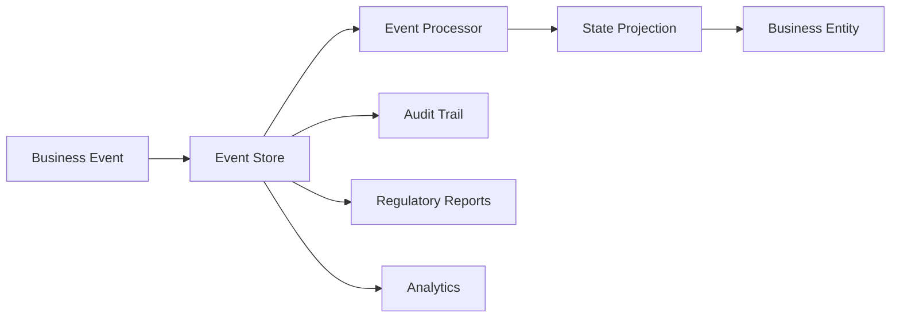

#### Key Benefits
- **Complete Audit Trail**: Every state change captured as immutable event
- **Temporal Queries**: Query system state at any point in time
- **Regulatory Compliance**: Full traceability for regulatory requirements
- **Data Recovery**: Rebuild system state from event history
- **Analytics Support**: Rich event history for business analytics

#### Implementation Guidelines
- **Event Immutability**: Events are never modified after creation
- **Event Ordering**: Maintain strict event ordering within aggregates
- **Snapshot Strategy**: Create periodic snapshots for performance
- **Event Versioning**: Support event schema evolution
- **Retention Policy**: Implement regulatory-compliant retention policies

### 2. CQRS (Command Query Responsibility Segregation) Pattern

#### Pattern Description
CQRS separates read and write operations, optimizing each for their specific use cases and enabling independent scaling.

#### DTCC System Implementation
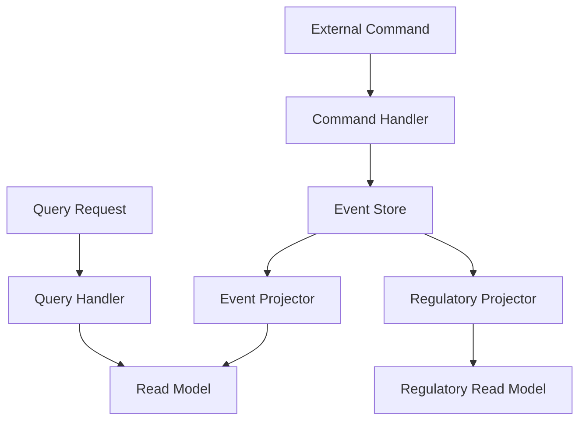

#### Benefits for Regulatory Reporting
- **Optimized Queries**: Read models optimized for regulatory reporting
- **Independent Scaling**: Scale read and write sides independently
- **Multiple Projections**: Different views for different regulatory requirements
- **Performance Isolation**: Query performance doesn't impact command processing

### 3. Saga Pattern for Distributed Transactions

#### Pattern Description
Saga pattern manages distributed transactions across multiple services using compensating actions for failure recovery.

#### Trade Processing Saga Example
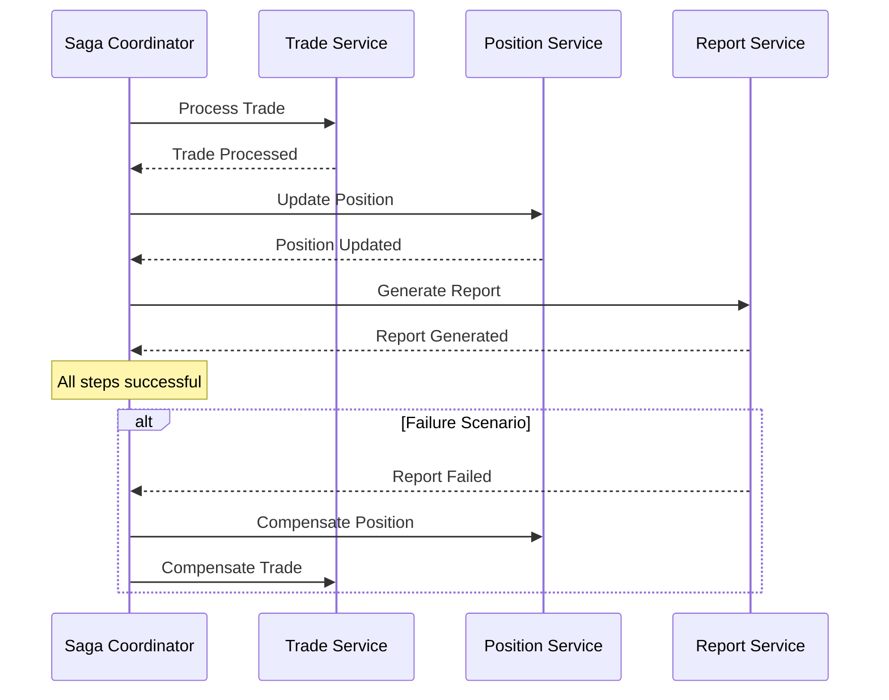

#### Saga Implementation Patterns
- **Orchestration**: Central coordinator manages saga execution
- **Choreography**: Services coordinate through events
- **Compensation**: Implement compensating actions for each step
- **Timeout Handling**: Handle timeouts and partial failures
- **Idempotency**: Ensure saga steps are idempotent

### 4. Event Streaming Pattern

#### Pattern Description
Event streaming provides real-time event processing and distribution across the system for immediate response to business events.

#### Streaming Architecture
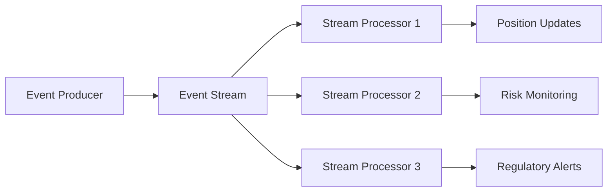

#### Streaming Use Cases
- **Real-time Position Calculation**: Immediate position updates from trade events
- **Risk Monitoring**: Real-time risk threshold monitoring
- **Regulatory Alerting**: Immediate alerts for compliance violations
- **Operational Monitoring**: Real-time system health monitoring

## Integration Patterns

### 1. Event-Driven Integration

#### External System Integration
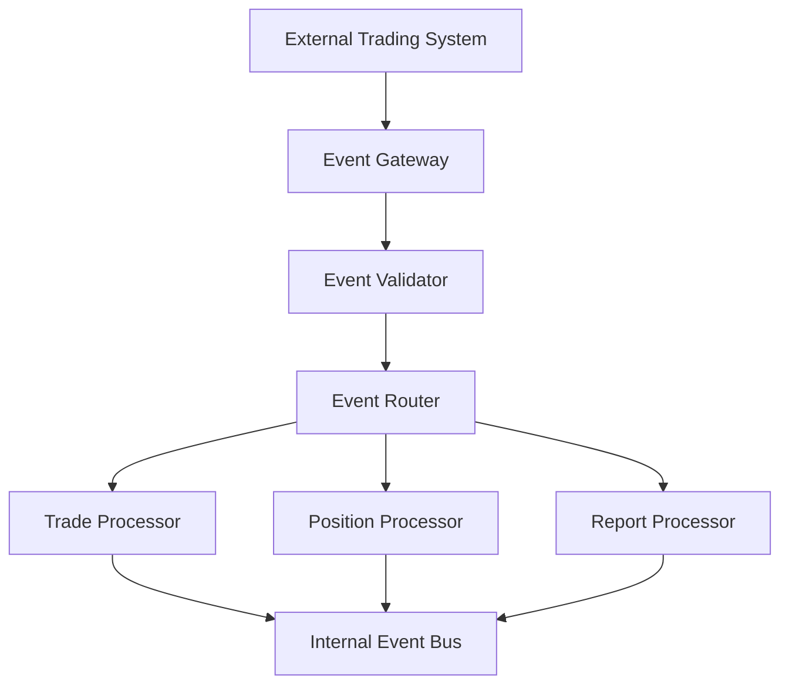

#### Integration Best Practices
- **Event Gateway**: Single entry point for external events
- **Event Validation**: Validate all external events at boundary
- **Event Transformation**: Transform external events to internal format
- **Error Handling**: Robust error handling for external system failures
- **Circuit Breaker**: Protect against external system failures

### 2. Publish-Subscribe Pattern

#### Event Distribution
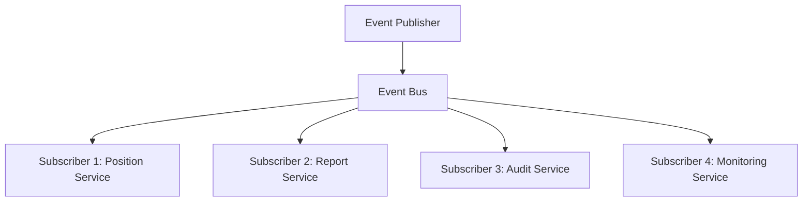

#### Subscription Management
- **Topic-based Subscription**: Subscribe to specific event types
- **Content-based Filtering**: Filter events based on content
- **Durable Subscriptions**: Ensure event delivery even if subscriber offline
- **Dead Letter Queues**: Handle undeliverable events
- **Backpressure Handling**: Manage subscriber overload

### 3. Event Choreography Pattern

#### Decentralized Event Coordination
```mermaid
sequenceDiagram
    participant T as Trade Service
    participant P as Position Service
    participant R as Report Service
    participant A as Audit Service
    
    T->>T: Process Trade
    T->>+: Publish TradeConfirmed
    
    P->>P: Calculate Position
    P->>+: Publish PositionUpdated
    
    R->>R: Generate Report
    R->>+: Publish ReportGenerated
    
    A->>A: Log All Events
```

#### Choreography Benefits
- **Loose Coupling**: Services don't directly depend on each other
- **Scalability**: Easy to add new services without changing existing ones
- **Resilience**: Failure of one service doesn't block others
- **Flexibility**: Easy to modify business processes

## Event Processing Patterns

### 1. Event Filtering and Routing

#### Content-Based Routing
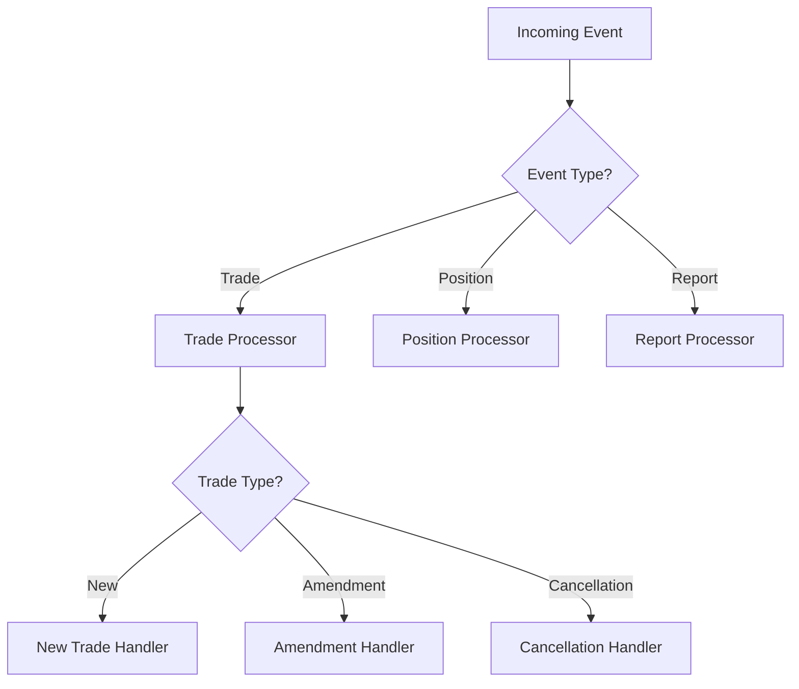

#### Filtering Strategies
- **Event Type Filtering**: Route based on event type
- **Content Filtering**: Route based on event content
- **Priority Filtering**: Route based on event priority
- **Temporal Filtering**: Route based on event timing
- **Business Rule Filtering**: Route based on business rules

### 2. Event Aggregation Pattern

#### Time-Window Aggregation
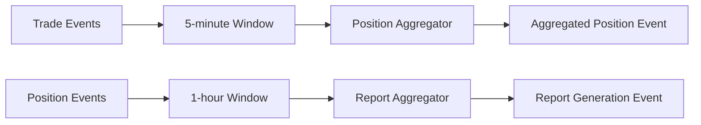

#### Aggregation Strategies
- **Time-based Aggregation**: Aggregate events within time windows
- **Count-based Aggregation**: Aggregate after specific event count
- **Content-based Aggregation**: Aggregate based on event content
- **Business Rule Aggregation**: Aggregate based on business rules

### 3. Event Transformation Pattern

#### Event Schema Evolution
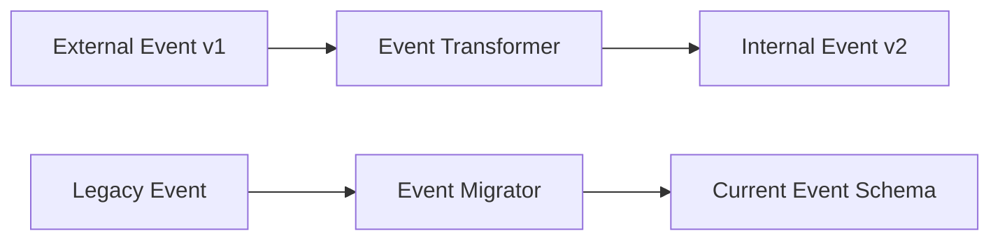

#### Transformation Strategies
- **Schema Mapping**: Map between different event schemas
- **Data Enrichment**: Add additional data to events
- **Format Conversion**: Convert between event formats
- **Version Migration**: Migrate events between schema versions

## Reliability and Resilience Patterns

### 1. Event Replay Pattern

#### Event Recovery Mechanism
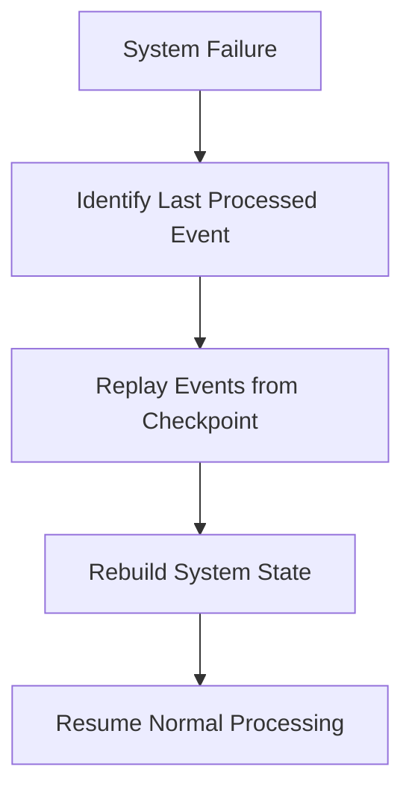

#### Replay Strategies
- **Full Replay**: Replay all events from beginning
- **Checkpoint Replay**: Replay from last known checkpoint
- **Selective Replay**: Replay specific event types or ranges
- **Parallel Replay**: Replay events in parallel for faster recovery

### 2. Circuit Breaker Pattern

#### External System Protection
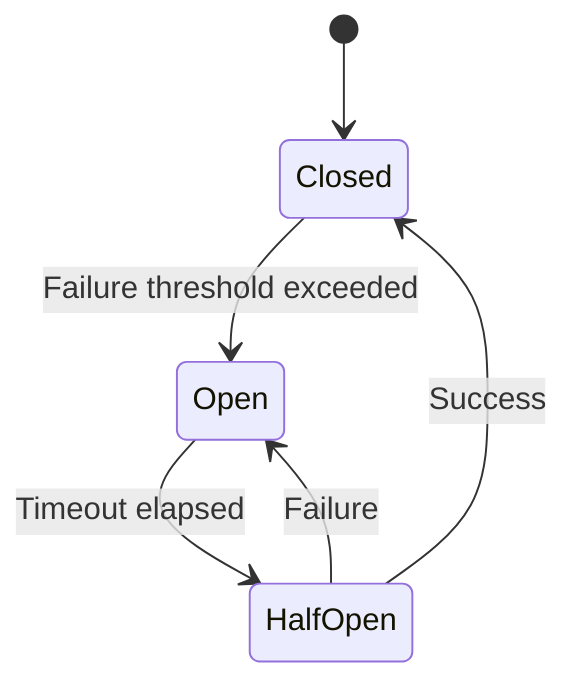

#### Circuit Breaker Implementation
- **Failure Detection**: Monitor external system failures
- **Threshold Management**: Configure failure thresholds
- **Fallback Mechanisms**: Implement fallback processing
- **Recovery Testing**: Test system recovery periodically

### 3. Bulkhead Pattern

#### Resource Isolation
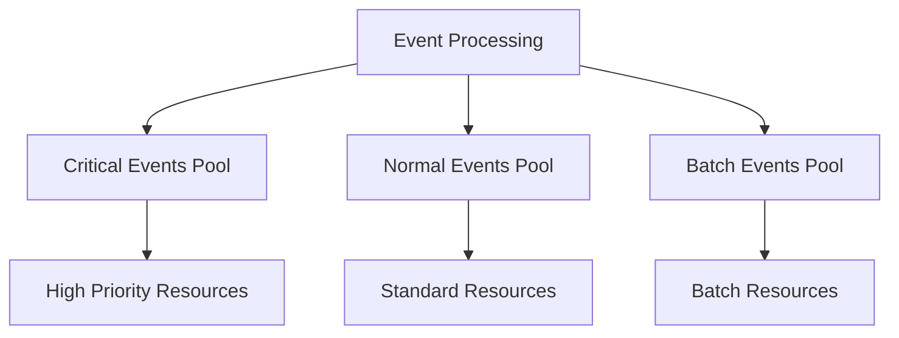

#### Isolation Strategies
- **Thread Pool Isolation**: Separate thread pools for different event types
- **Resource Isolation**: Separate resources for critical vs. non-critical events
- **Service Isolation**: Isolate services to prevent cascade failures
- **Data Isolation**: Separate data stores for different event categories

## Performance Optimization Patterns

### 1. Event Batching Pattern

#### Batch Processing Optimization
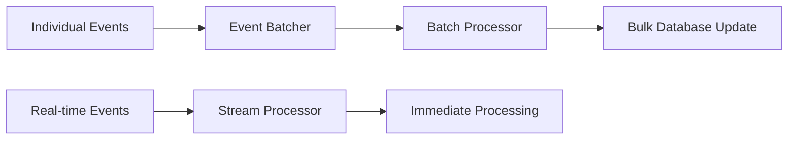

#### Batching Strategies
- **Size-based Batching**: Batch events based on count
- **Time-based Batching**: Batch events within time windows
- **Priority-based Batching**: Separate batching for different priorities
- **Resource-based Batching**: Batch based on resource availability

### 2. Event Caching Pattern

#### Performance Optimization
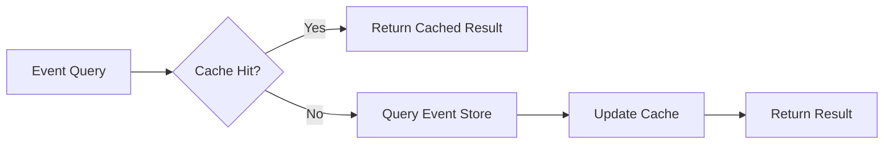

#### Caching Strategies
- **Event Result Caching**: Cache frequently accessed event results
- **Projection Caching**: Cache computed projections
- **Reference Data Caching**: Cache reference data for event processing
- **Query Result Caching**: Cache complex query results

## Monitoring and Observability Patterns

### 1. Event Tracing Pattern

#### Distributed Tracing
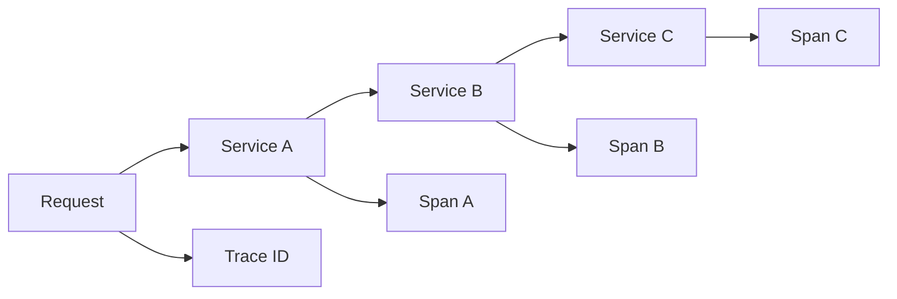

#### Tracing Implementation
- **Correlation IDs**: Unique identifiers for request tracing
- **Span Creation**: Create spans for each service interaction
- **Context Propagation**: Propagate trace context across services
- **Trace Aggregation**: Aggregate traces for analysis

### 2. Event Metrics Pattern

#### Performance Monitoring
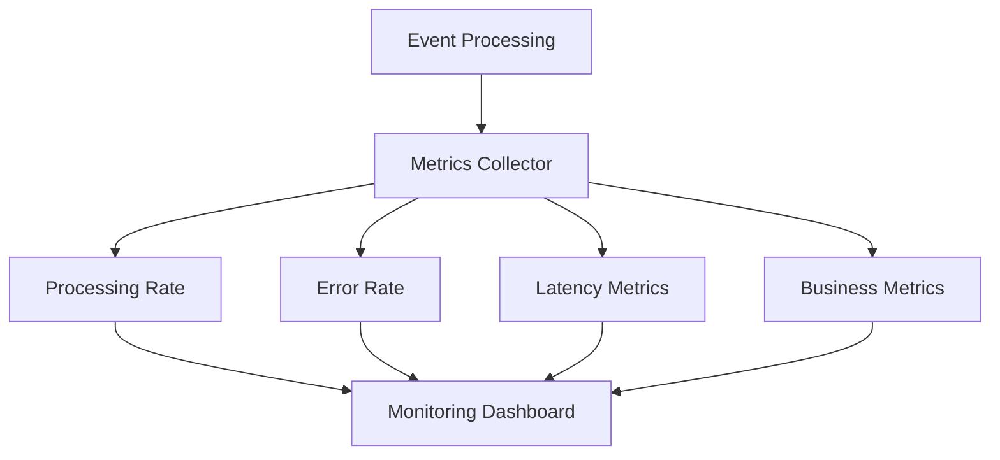

#### Key Metrics
- **Throughput Metrics**: Events processed per second
- **Latency Metrics**: Event processing time
- **Error Metrics**: Event processing errors
- **Business Metrics**: Business-specific event metrics

## Best Practices and Guidelines

### 1. Event Design Principles

#### Event Structure Best Practices
- **Immutable Events**: Events should never be modified
- **Self-Contained**: Events should contain all necessary information
- **Versioned**: Events should support schema evolution
- **Timestamped**: Events should include precise timestamps
- **Correlated**: Events should include correlation identifiers

#### Event Naming Conventions
- **Past Tense**: Use past tense for event names (e.g., TradeConfirmed)
- **Business Language**: Use business domain language
- **Specific**: Be specific about what happened
- **Consistent**: Follow consistent naming patterns

### 2. Error Handling Best Practices

#### Error Recovery Strategies
- **Retry Logic**: Implement exponential backoff retry
- **Dead Letter Queues**: Handle unprocessable events
- **Compensation**: Implement compensating actions
- **Circuit Breakers**: Protect against cascade failures
- **Monitoring**: Monitor and alert on errors

### 3. Testing Strategies

#### Event-Driven Testing
- **Event Replay Testing**: Test with replayed production events
- **Chaos Testing**: Test system resilience with failures
- **Load Testing**: Test system under high event volumes
- **Integration Testing**: Test event flows across services
- **Contract Testing**: Test event schema contracts

---

*These architecture patterns and best practices ensure robust, scalable, and compliant event-driven processing for the DTCC Regulatory Reporting System.*
