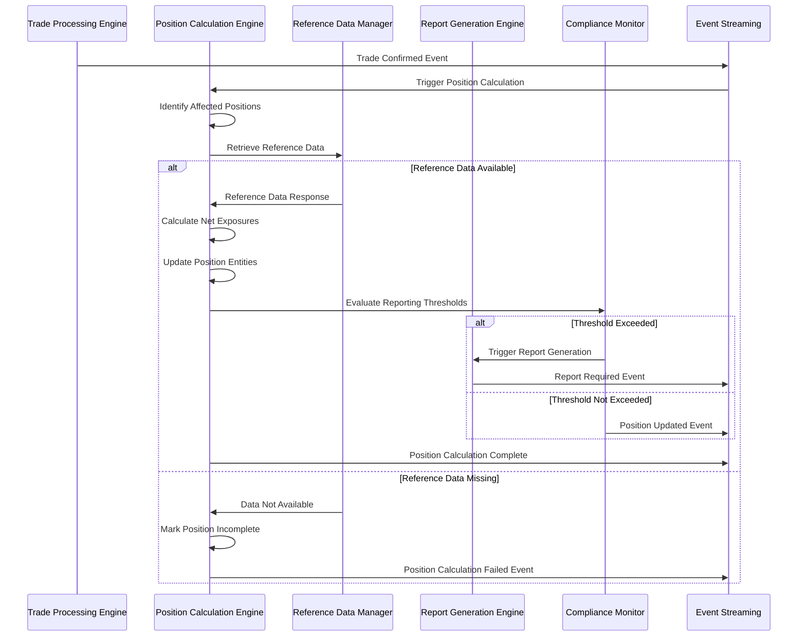
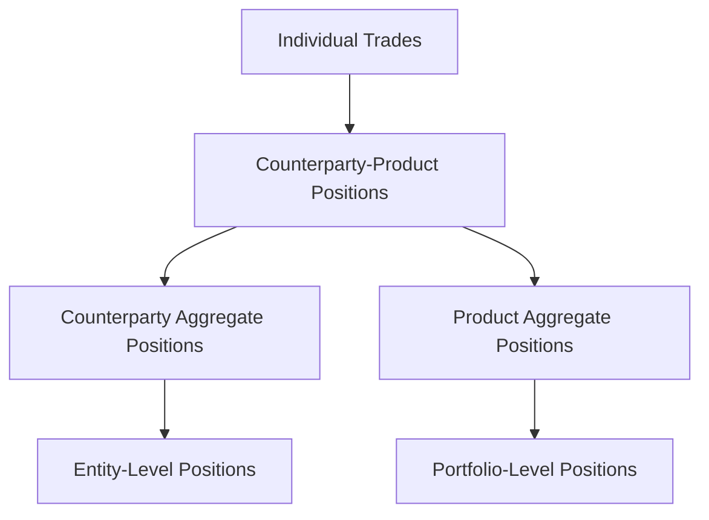
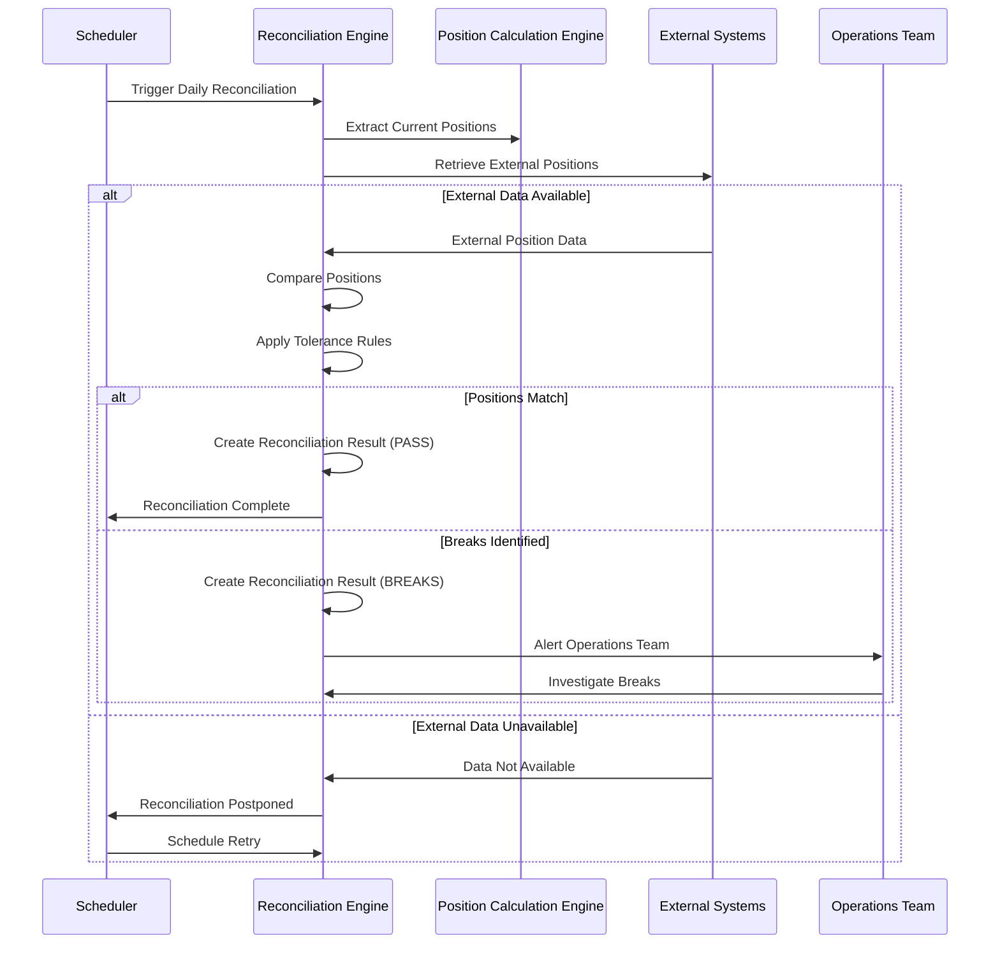
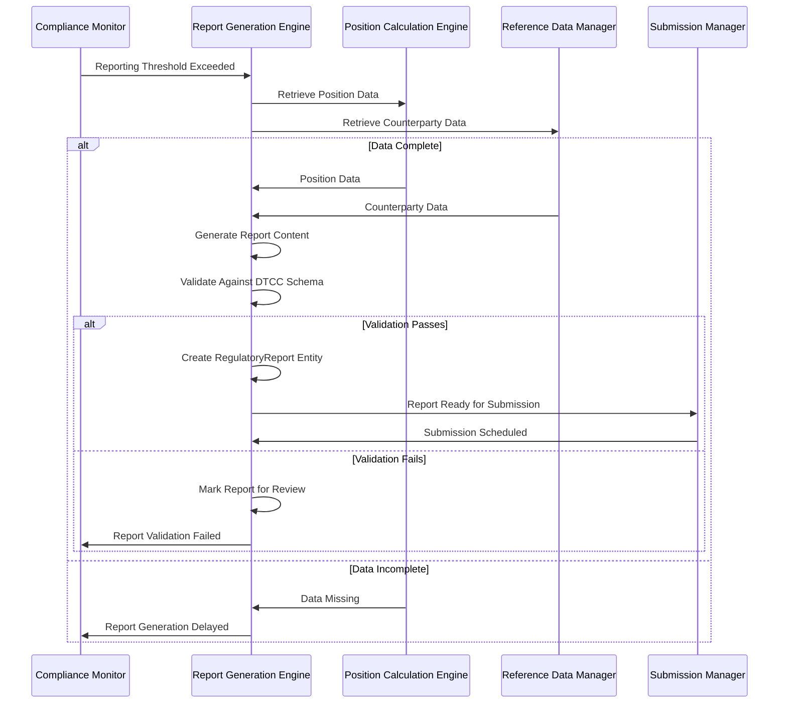
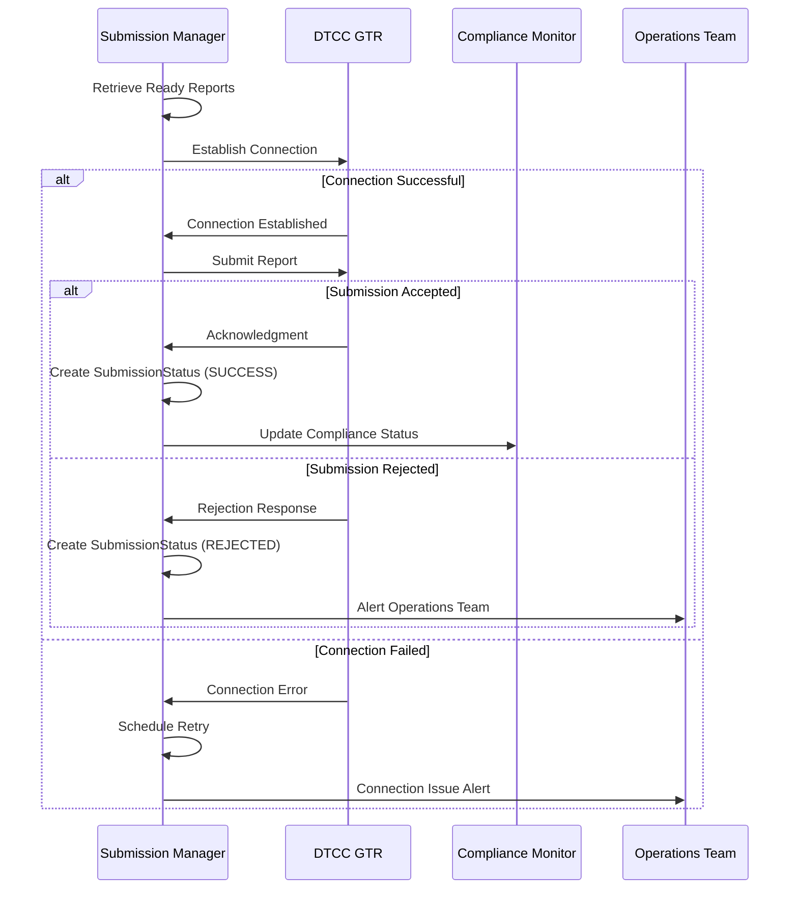
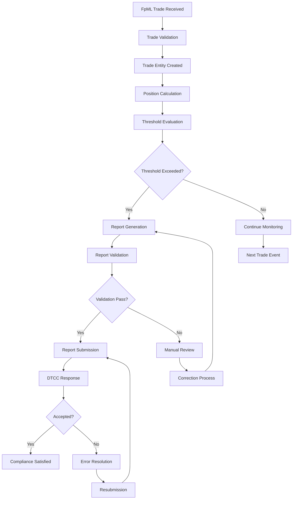

# Event Flows - Position Management and Regulatory Reporting Use Cases

## Overview

This document defines the detailed event flows for position management and regulatory reporting use cases, covering position calculation, reconciliation, report generation, and submission processes.

## UC-004: Calculate Real-Time Positions - Event Flow

### High-Level Event Flow Diagram

### Detailed Position Calculation Process

#### Phase 1: Position Identification
1. **Event**: `Trade_Confirmed_Received`
   - **Source**: Trade Processing Engine
   - **Trigger**: Position calculation workflow
   - **Payload**: Trade ID, counterparty, product, notional

2. **Event**: `Position_Identification_Started`
   - **Source**: Position Calculation Engine
   - **Process**: Identify all positions affected by trade
   - **Criteria**: Counterparty + Product + Currency combinations

3. **Event**: `Affected_Positions_Identified`
   - **Source**: Position Calculation Engine
   - **Payload**: List of position IDs requiring recalculation

#### Phase 2: Reference Data Retrieval
4. **Event**: `Reference_Data_Request`
   - **Source**: Position Calculation Engine
   - **Target**: Reference Data Manager
   - **Required Data**: Market rates, holiday calendars, product specifications

5. **Event**: `Reference_Data_Retrieved` / `Reference_Data_Missing`
   - **Success Path**: Continue with calculation
   - **Failure Path**: Mark position as incomplete, schedule retry

#### Phase 3: Position Calculation
6. **Event**: `Position_Calculation_Started`
   - **Source**: Position Calculation Engine
   - **Calculations**:
     - Net notional exposure
     - Market value (if applicable)
     - Risk metrics (duration, delta, etc.)

7. **Event**: `Position_Calculated`
   - **Source**: Position Calculation Engine
   - **Entity Updates**: Position entity with new values
   - **Timestamp**: Calculation completion time

#### Phase 4: Threshold Evaluation
8. **Event**: `Threshold_Evaluation_Started`
   - **Source**: Compliance Monitor
   - **Thresholds**: Regulatory reporting limits by jurisdiction

9. **Event**: `Threshold_Exceeded` / `Threshold_Not_Exceeded`
   - **Exceeded**: Trigger immediate report generation
   - **Not Exceeded**: Continue monitoring

### Position Aggregation Rules

#### Aggregation Hierarchy

#### Netting Rules
- **Same Counterparty + Product**: Net by currency
- **Cross-Currency**: Convert to base currency using market rates
- **Maturity Bucketing**: Group by maturity bands for risk calculation

---

## UC-005: Reconcile Position Data - Event Flow

### High-Level Event Flow Diagram

### Reconciliation Process Details

#### Reconciliation Types
- **Daily Position Reconciliation**: End-of-day position comparison
- **Trade-Level Reconciliation**: Individual trade verification
- **Reference Data Reconciliation**: Master data consistency checks

#### Tolerance Rules
- **Notional Amounts**: ±0.01% or absolute threshold
- **Market Values**: ±0.1% or currency-specific threshold
- **Trade Counts**: Exact match required

#### Break Resolution Process
1. **Automatic Resolution**: System attempts to resolve minor breaks
2. **Manual Investigation**: Operations team reviews significant breaks
3. **Escalation**: Unresolved breaks escalated to management

---

## UC-006: Generate DTCC GTR Reports - Event Flow

### High-Level Event Flow Diagram

### Report Generation Process

#### Report Types
- **Position Reports**: Aggregate position data by counterparty
- **Trade Reports**: Individual trade details for new confirmations
- **Lifecycle Reports**: Amendments, cancellations, and maturations

#### DTCC GTR Requirements
- **Reporting Frequency**: Daily for positions above thresholds
- **Data Elements**: Standardized fields per DTCC specification
- **Format**: XML format compliant with DTCC schema
- **Timing**: Submit by T+1 for trade reports, daily for position reports

#### Validation Rules
- **Schema Validation**: XML structure compliance
- **Business Validation**: Required fields populated
- **Cross-Reference Validation**: Counterparty LEI verification

---

## UC-007: Submit Reports to DTCC GTR - Event Flow

### High-Level Event Flow Diagram

### Submission Process Details

#### Submission Windows
- **Primary Window**: 6:00 AM - 6:00 PM EST
- **Backup Window**: 6:00 PM - 10:00 PM EST
- **Emergency Window**: 24/7 for critical submissions

#### Retry Logic
- **Transient Failures**: Exponential backoff (1, 2, 4, 8 minutes)
- **Business Rejections**: Manual review required
- **System Failures**: Circuit breaker with operations alert

#### Status Tracking
- **Submitted**: Report sent to DTCC
- **Acknowledged**: DTCC confirms receipt
- **Accepted**: DTCC validates and accepts report
- **Rejected**: DTCC rejects report with error details

---

## End-to-End Process Flow: Trade to Report

### Complete Process Sequence

### Timing Requirements Summary

| Process | Target Time | SLA |
|---------|-------------|-----|
| Trade Processing | 30 seconds | 95% |
| Position Calculation | 2 minutes | 99% |
| Report Generation | 1 hour | 98% |
| Report Submission | T+1 deadline | 100% |
| Error Resolution | 4 hours | 95% |

### Critical Success Factors

#### Data Quality
- **Complete Reference Data**: 99.9% availability
- **Accurate Position Calculation**: 100% accuracy
- **Valid Report Content**: 99.8% first-time validation success

#### System Performance
- **High Availability**: 99.9% uptime during business hours
- **Scalable Processing**: Handle 10x normal volume
- **Reliable Connectivity**: Redundant DTCC connections

#### Regulatory Compliance
- **Timely Submission**: 100% within deadlines
- **Complete Audit Trail**: All events logged and traceable
- **Error Transparency**: All failures documented and resolved

Paul Muadib, I have created complete event flows for position management and regulatory reporting use cases. This includes sequence diagrams, process flows, timing requirements, and success criteria.

Next, I should create documentation for the reference data management and exception handling use cases to complete the business use case event flows. Would you like me to proceed with those, or shall I move on to creating the decision points and business rules documentation as specified in the plan?
