# Event Timing Dependencies and Critical Path Analysis

## Overview

This document defines the complete timing dependencies, sequencing requirements, and critical path analysis for all events in the DTCC Regulatory Reporting System. It identifies time-sensitive event sequences that impact regulatory compliance deadlines and operational efficiency.

## Critical Path Analysis

### 1. Trade-to-Report Critical Path

#### Primary Critical Path (T+1 Regulatory Deadline)

```mermaid
gantt
    title Trade-to-Report Critical Path (T+1 Deadline)
    dateFormat HH:mm:ss
    axisFormat %H:%M:%S
    
    section Trade Processing
    FpML Received         :crit, t1, 00:00:00, 5s
    Message Validated     :crit, t2, after t1, 15s
    Trade Confirmed       :crit, t3, after t2, 10s
    
    section Position Processing
    Position Calculation  :crit, p1, after t3, 2m
    Position Updated      :crit, p2, after p1, 30s
    Threshold Evaluated   :crit, p3, after p2, 30s
    
    section Report Generation
    Report Generation     :crit, r1, after p3, 1h
    Report Validation     :crit, r2, after r1, 15m
    Report Submission     :crit, r3, after r2, 15m
    
    section Compliance
    DTCC Acknowledgment   :r4, after r3, 24h
```

**Critical Path Timing:**
- **Total Duration**: 2 hours 18 minutes 20 seconds (normal processing)
- **Critical Deadline**: T+1 by 11:59 PM EST
- **Buffer Time**: ~21 hours 42 minutes for normal trades
- **Emergency Processing**: Can be compressed to 45 minutes

#### Critical Path Dependencies

| Event | Depends On | Max Delay | Impact if Delayed |
|-------|------------|-----------|-------------------|
| `MessageValidated` | `FpMLMessageReceived` | 5s | Trade processing blocked |
| `TradeConfirmed` | `MessageValidated` | 15s | Position calculation blocked |
| `PositionUpdated` | `TradeConfirmed` | 2m 30s | Reporting evaluation blocked |
| `ReportGenerated` | `PositionUpdated` | 1h | Regulatory submission blocked |
| `ReportSubmitted` | `ReportGenerated` | 30m | Compliance deadline at risk |

### 2. Amendment Critical Path

#### Amendment Processing Timeline

```mermaid
gantt
    title Amendment Processing Critical Path
    dateFormat HH:mm:ss
    axisFormat %H:%M:%S
    
    section Amendment Processing
    Amendment Received    :crit, a1, 00:00:00, 10s
    Amendment Validated   :crit, a2, after a1, 30s
    Impact Assessment     :crit, a3, after a2, 20s
    
    section Position Recalculation
    Position Recalc       :crit, p1, after a3, 25s
    Position Updated      :crit, p2, after p1, 15s
    
    section Report Update
    Report Update         :crit, r1, after p2, 30m
    Report Resubmission   :crit, r2, after r1, 15m
```

**Amendment Critical Timing:**
- **Same-Day Amendment Cutoff**: 6:00 PM EST
- **Emergency Amendment**: 2:00 PM EST (requires approval)
- **Total Processing Time**: 46 minutes 40 seconds
- **Regulatory Impact**: Must complete before T+1 deadline

### 3. End-of-Day Critical Path

#### EOD Processing Dependencies

```mermaid
gantt
    title End-of-Day Critical Path
    dateFormat HH:mm
    axisFormat %H:%M
    
    section Data Cutoff
    Trading Cutoff        :crit, c1, 16:00, 1h
    Data Freeze           :crit, c2, after c1, 30m
    
    section Batch Processing
    Position Aggregation  :crit, b1, after c2, 1h
    Reconciliation        :crit, b2, after b1, 2h
    Report Generation     :crit, b3, after b2, 2h
    
    section Submission
    Report Validation     :crit, s1, after b3, 30m
    Bulk Submission       :crit, s2, after s1, 1h
    Compliance Check      :crit, s3, after s2, 30m
```

## Timing Dependency Categories

### 1. Hard Dependencies (Blocking)

#### Sequential Processing Dependencies
- **Message Validation → Trade Processing**: Cannot process trade without valid message
- **Trade Confirmation → Position Calculation**: Cannot calculate positions without confirmed trade
- **Position Update → Threshold Evaluation**: Cannot evaluate reporting without current positions
- **Report Generation → Report Submission**: Cannot submit without generated report

#### Resource Dependencies
- **Database Locks**: Position calculations require exclusive access to position entities
- **External System Availability**: LEI validation requires GLEIF system availability
- **Authentication Tokens**: DTCC submission requires valid authentication

### 2. Soft Dependencies (Performance)

#### Optimization Dependencies
- **Batch Processing Windows**: Optimal performance during low-traffic periods
- **Cache Warming**: Better performance with warmed reference data caches
- **Connection Pooling**: Improved throughput with established connections

#### Business Preference Dependencies
- **Business Hours Processing**: Preferred processing during business hours for support
- **Reconciliation Timing**: Preferred after market close for stable data
- **Report Submission**: Preferred early in submission window to allow for corrections

### 3. Regulatory Dependencies (Compliance)

#### Deadline Dependencies
- **T+1 Reporting**: Trade reports must be submitted by T+1 11:59 PM EST
- **Position Reporting**: Daily position reports by 11:59 PM EST
- **Amendment Reporting**: Amendment reports within 24 hours of amendment
- **Error Corrections**: Corrections within 24 hours of error identification

#### Sequencing Dependencies
- **Original Before Amendment**: Original trade must be reported before amendments
- **Cancellation After Confirmation**: Cannot cancel unreported trades
- **Correction After Submission**: Can only correct submitted reports

## Timing Constraint Matrix

### Event Processing SLAs

| Event Category | Event | Target Time | Maximum Time | Escalation Time |
|----------------|-------|-------------|--------------|-----------------|
| **Message Processing** | FpML Validation | 5s | 10s | 15s |
| **Trade Processing** | Business Validation | 15s | 30s | 45s |
| **Trade Processing** | Trade Confirmation | 10s | 20s | 30s |
| **Position Processing** | Position Calculation | 2m | 5m | 10m |
| **Position Processing** | Position Update | 30s | 1m | 2m |
| **Position Processing** | Threshold Evaluation | 30s | 1m | 2m |
| **Reporting** | Report Generation | 1h | 2h | 4h |
| **Reporting** | Report Validation | 15m | 30m | 1h |
| **Reporting** | Report Submission | 15m | 30m | 1h |
| **Amendment** | Amendment Validation | 30s | 1m | 2m |
| **Amendment** | Position Recalculation | 25s | 1m | 2m |
| **Amendment** | Report Update | 30m | 1h | 2h |

### Dependency Timing Rules

#### Immediate Dependencies (< 1 minute)
- Message validation must complete within 5 seconds of receipt
- Trade confirmation must complete within 30 seconds of validation
- Position calculation must start within 10 seconds of trade confirmation
- Threshold evaluation must complete within 30 seconds of position update

#### Short-term Dependencies (< 1 hour)
- Position calculation must complete within 5 minutes
- Report generation must start within 15 minutes of threshold breach
- Report validation must complete within 30 minutes
- Report submission must complete within 30 minutes of validation

#### Long-term Dependencies (< 24 hours)
- All T+1 reports must be submitted by regulatory deadline
- Amendment reports must be submitted within 24 hours
- Error corrections must be completed within 24 hours
- DTCC acknowledgments expected within 24 hours

## Critical Path Monitoring

### 1. Real-time Monitoring

#### Critical Path Metrics
- **Path Completion Time**: End-to-end duration of critical paths
- **Bottleneck Identification**: Events causing delays in critical paths
- **SLA Compliance**: Percentage of events meeting timing SLAs
- **Deadline Risk**: Events at risk of missing regulatory deadlines

#### Alert Thresholds
- **Warning**: 50% of SLA time consumed
- **Critical**: 80% of SLA time consumed
- **Emergency**: 95% of SLA time consumed or deadline risk

### 2. Predictive Monitoring

#### Trend Analysis
- **Processing Time Trends**: Historical analysis of event processing times
- **Capacity Planning**: Prediction of resource needs based on volume trends
- **Bottleneck Prediction**: Early identification of potential bottlenecks

#### Risk Assessment
- **Deadline Risk Scoring**: Probability of missing regulatory deadlines
- **Cascade Risk Analysis**: Impact of delays on downstream events
- **Recovery Time Estimation**: Time required to recover from delays

## Timing Optimization Strategies

### 1. Performance Optimization

#### Processing Acceleration
- **Parallel Processing**: Execute independent events concurrently
- **Batch Optimization**: Group related events for efficient processing
- **Cache Utilization**: Pre-load frequently accessed reference data
- **Connection Pooling**: Maintain persistent connections to external systems

#### Resource Optimization
- **Priority Queuing**: Process critical path events with higher priority
- **Resource Scaling**: Dynamically scale resources based on demand
- **Load Balancing**: Distribute processing across multiple instances

### 2. Business Process Optimization

#### Early Processing
- **Pre-validation**: Validate reference data before trade processing
- **Speculative Processing**: Begin position calculations before trade confirmation
- **Batch Preparation**: Prepare batch processes before cutoff times

#### Deadline Management
- **Early Submission**: Submit reports well before deadlines
- **Deadline Monitoring**: Continuous monitoring of deadline proximity
- **Emergency Procedures**: Fast-track processing for deadline-critical events

## Recovery and Contingency

### 1. Timing Recovery Procedures

#### Delay Recovery
- **Fast-track Processing**: Expedited processing for delayed events
- **Resource Reallocation**: Redirect resources to critical path events
- **Parallel Execution**: Execute normally sequential events in parallel
- **Manual Intervention**: Manual processing for critical deadline events

#### Deadline Recovery
- **Emergency Processing**: 24/7 processing for deadline-critical events
- **Regulatory Communication**: Proactive communication with regulators
- **Extension Requests**: Formal requests for deadline extensions
- **Compliance Documentation**: Document all recovery actions for audit

### 2. Contingency Planning

#### System Failure Contingency
- **Backup Systems**: Automatic failover to backup processing systems
- **Manual Processing**: Manual procedures for critical events
- **Data Recovery**: Rapid recovery of processing state and data
- **Communication Plans**: Stakeholder notification of delays and recovery

#### Regulatory Contingency
- **Deadline Extensions**: Procedures for requesting regulatory extensions
- **Alternative Submission**: Backup submission methods and formats
- **Compliance Reporting**: Documentation of delays and mitigation actions
- **Audit Preparation**: Maintain complete records for regulatory review

---

*This timing dependency analysis ensures reliable, compliant, and efficient event processing within all regulatory deadlines and business requirements.*
