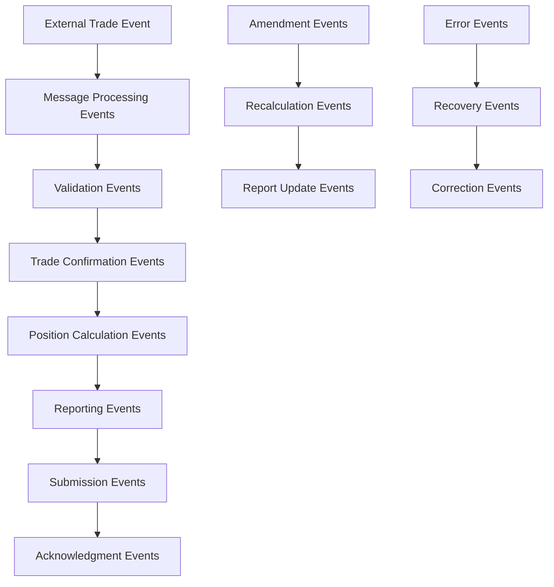
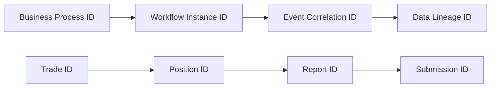
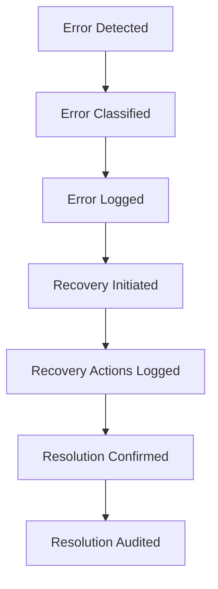

# Event Traceability and Audit Documentation

## Overview

This document defines the complete event traceability framework and audit requirements for the DTCC Regulatory Reporting System. It establishes end-to-end traceability for regulatory audit purposes, compliance monitoring, and operational transparency.

## Audit Traceability Framework

### 1. Regulatory Audit Requirements

#### DTCC GTR Audit Standards
- **Complete Event History**: Full audit trail from trade receipt to regulatory submission
- **Immutable Records**: Tamper-proof event logging with cryptographic integrity
- **Temporal Accuracy**: Precise timestamps for all events with microsecond precision
- **Causal Relationships**: Clear linkage between cause and effect events
- **Data Lineage**: Complete tracking of data transformations and calculations

#### Compliance Audit Scope


### 2. Event Audit Trail Structure

#### Audit Event Schema
```json
{
  "auditEventId": "uuid",
  "businessEventId": "uuid",
  "correlationId": "uuid",
  "traceId": "uuid",
  "eventType": "string",
  "eventCategory": "string",
  "timestamp": "ISO8601 with microseconds",
  "source": {
    "system": "string",
    "component": "string",
    "instance": "string",
    "version": "string"
  },
  "actor": {
    "type": "system|user|external",
    "identifier": "string",
    "authentication": "string"
  },
  "payload": {
    "before": "object",
    "after": "object",
    "delta": "object"
  },
  "context": {
    "businessContext": "object",
    "technicalContext": "object",
    "regulatoryContext": "object"
  },
  "integrity": {
    "hash": "sha256",
    "signature": "digital signature",
    "previousHash": "sha256"
  }
}
```

#### Audit Trail Hierarchy
- **Business Process Level**: Complete business process from start to finish
- **Workflow Level**: Individual workflow execution within business process
- **Event Level**: Individual event processing and state transitions
- **Data Level**: Data transformations and calculations within events

### 3. Traceability Correlation Mechanisms

#### Multi-Level Correlation


#### Correlation ID Strategy
- **Business Process ID**: Links all events in end-to-end business process
- **Trade Correlation ID**: Links all events related to specific trade
- **Position Correlation ID**: Links all events affecting position calculations
- **Report Correlation ID**: Links all events in report generation and submission
- **Error Correlation ID**: Links all events in error handling and recovery

## Audit Event Categories

### 1. Business Event Auditing

#### Trade Processing Audit Events
| Event Type | Audit Requirement | Retention Period | Regulatory Significance |
|------------|-------------------|------------------|------------------------|
| `FpMLMessageReceived` | Full message content | 7 years | Critical - Trade evidence |
| `MessageValidated` | Validation results | 7 years | High - Compliance evidence |
| `TradeConfirmed` | Trade details | 7 years | Critical - Regulatory reporting |
| `TradeAmended` | Amendment details | 7 years | Critical - Lifecycle tracking |
| `TradeCancelled` | Cancellation reason | 7 years | Critical - Audit trail |

#### Position Management Audit Events
| Event Type | Audit Requirement | Retention Period | Regulatory Significance |
|------------|-------------------|------------------|------------------------|
| `PositionCalculated` | Calculation details | 7 years | High - Risk management |
| `PositionReconciled` | Reconciliation results | 7 years | High - Data integrity |
| `ThresholdBreached` | Threshold details | 7 years | Critical - Reporting trigger |
| `PositionAggregated` | Aggregation rules | 7 years | Medium - Portfolio view |

#### Regulatory Reporting Audit Events
| Event Type | Audit Requirement | Retention Period | Regulatory Significance |
|------------|-------------------|------------------|------------------------|
| `ReportGenerated` | Complete report content | 7 years | Critical - Regulatory submission |
| `ReportValidated` | Validation results | 7 years | High - Quality assurance |
| `ReportSubmitted` | Submission details | 7 years | Critical - Compliance evidence |
| `ReportAcknowledged` | DTCC response | 7 years | Critical - Regulatory confirmation |
| `ReportRejected` | Rejection reasons | 7 years | Critical - Error resolution |

### 2. System Event Auditing

#### Technical Audit Events
- **Authentication Events**: User and system authentication attempts
- **Authorization Events**: Access control decisions and violations
- **Configuration Changes**: System configuration modifications
- **Data Access Events**: Database queries and data retrieval
- **Integration Events**: External system interactions and API calls

#### Security Audit Events
- **Security Violations**: Unauthorized access attempts
- **Data Encryption**: Encryption and decryption operations
- **Certificate Management**: SSL/TLS certificate operations
- **Audit Log Access**: Access to audit logs themselves

### 3. Error and Recovery Auditing

#### Error Event Auditing


#### Recovery Audit Requirements
- **Error Root Cause**: Complete analysis of error conditions
- **Recovery Actions**: All manual and automated recovery steps
- **Data Corrections**: Any data modifications during recovery
- **Timeline Documentation**: Complete timeline of error and recovery
- **Impact Assessment**: Business and regulatory impact of errors

## Audit Data Aggregation and Reporting

### 1. Audit Data Aggregation Patterns

#### Time-Based Aggregation
- **Real-time Aggregation**: Continuous aggregation for monitoring
- **Daily Aggregation**: End-of-day summary reports
- **Monthly Aggregation**: Compliance reporting summaries
- **Annual Aggregation**: Regulatory audit preparation

#### Business Process Aggregation
- **Trade Lifecycle Aggregation**: Complete trade processing audit trail
- **Position Management Aggregation**: Position calculation and reconciliation audit
- **Regulatory Reporting Aggregation**: Report generation and submission audit
- **Error Resolution Aggregation**: Error handling and recovery audit

### 2. Regulatory Audit Reports

#### Standard Audit Reports
- **Trade Processing Audit Report**: Complete trade lifecycle audit trail
- **Position Accuracy Audit Report**: Position calculation verification
- **Regulatory Submission Audit Report**: Compliance with submission requirements
- **Data Quality Audit Report**: Data validation and integrity verification
- **System Performance Audit Report**: SLA compliance and performance metrics

#### Ad-hoc Audit Queries
- **Trade Investigation**: Detailed audit trail for specific trades
- **Error Analysis**: Root cause analysis for specific errors
- **Compliance Verification**: Verification of regulatory compliance
- **Data Lineage Tracking**: Complete data transformation audit trail

## Audit Trail Integrity and Security

### 1. Integrity Protection

#### Cryptographic Integrity
- **Event Hashing**: SHA-256 hash of each audit event
- **Chain Integrity**: Cryptographic linking of sequential events
- **Digital Signatures**: Digital signatures for critical audit events
- **Tamper Detection**: Automatic detection of audit log modifications

#### Immutability Guarantees
- **Write-Once Storage**: Audit events cannot be modified after creation
- **Append-Only Logs**: Audit logs support only append operations
- **Backup Integrity**: Regular integrity verification of audit backups
- **Archive Protection**: Long-term archive integrity protection

### 2. Access Control and Security

#### Audit Access Control
- **Role-Based Access**: Audit access based on business roles
- **Segregation of Duties**: Separation of audit access and business operations
- **Audit Trail Protection**: Protection of audit logs from unauthorized access
- **Privileged Access Monitoring**: Monitoring of privileged audit access

#### Audit Security Monitoring
- **Access Monitoring**: Monitoring of all audit log access
- **Anomaly Detection**: Detection of unusual audit access patterns
- **Security Alerts**: Real-time alerts for security violations
- **Incident Response**: Procedures for audit security incidents

## Operational Audit Procedures

### 1. Continuous Audit Monitoring

#### Real-time Audit Monitoring
- **Event Completeness**: Verification that all events are audited
- **Correlation Integrity**: Verification of event correlation relationships
- **Timing Accuracy**: Verification of event timing and sequencing
- **Data Consistency**: Verification of audit data consistency

#### Automated Audit Validation
- **Audit Trail Completeness**: Automated verification of audit trails
- **Regulatory Compliance**: Automated compliance checking against regulations
- **Data Quality Validation**: Automated validation of audit data quality
- **Performance Monitoring**: Automated monitoring of audit system performance

### 2. Audit Investigation Procedures

#### Trade Investigation Process
1. **Trade Identification**: Identify trade requiring investigation
2. **Audit Trail Retrieval**: Retrieve audit trail for trade
3. **Event Sequence Analysis**: Analyze sequence and timing of events
4. **Data Lineage Tracking**: Track data transformations and calculations
5. **Compliance Verification**: Verify compliance with regulations
6. **Investigation Documentation**: Document investigation findings

#### Error Investigation Process
1. **Error Event Identification**: Identify error events requiring investigation
2. **Root Cause Analysis**: Analyze audit trail to determine root cause
3. **Impact Assessment**: Assess business and regulatory impact
4. **Recovery Verification**: Verify effectiveness of recovery actions
5. **Prevention Analysis**: Analyze prevention measures
6. **Investigation Report**: Generate complete investigation report

## Audit Compliance and Reporting

### 1. Regulatory Audit Compliance

#### DTCC Audit Requirements
- **Complete Audit Trail**: Maintain audit trail for all regulatory events
- **Audit Data Retention**: Retain audit data for required regulatory periods
- **Audit Report Generation**: Generate audit reports for regulatory review
- **Audit Data Access**: Provide audit data access to regulators on request

#### Internal Audit Compliance
- **Audit Policy Compliance**: Compliance with internal audit policies
- **Audit Procedure Compliance**: Compliance with audit procedures
- **Audit Quality Assurance**: Quality assurance of audit processes
- **Audit Training**: Training of personnel on audit requirements

### 2. Audit Reporting and Analytics

#### Executive Audit Dashboards
- **Audit Coverage Metrics**: Percentage of events with audit trails
- **Compliance Metrics**: Compliance with audit and regulatory requirements
- **Quality Metrics**: Audit data quality and integrity metrics
- **Performance Metrics**: Audit system performance and availability

#### Operational Audit Reports
- **Daily Audit Summary**: Summary of daily audit activities
- **Exception Reports**: Reports of audit exceptions and anomalies
- **Compliance Reports**: Reports of regulatory compliance status
- **Performance Reports**: Reports of audit system performance

---

*This traceability and audit framework ensures complete regulatory compliance, operational transparency, and audit readiness for the DTCC Regulatory Reporting System.*
