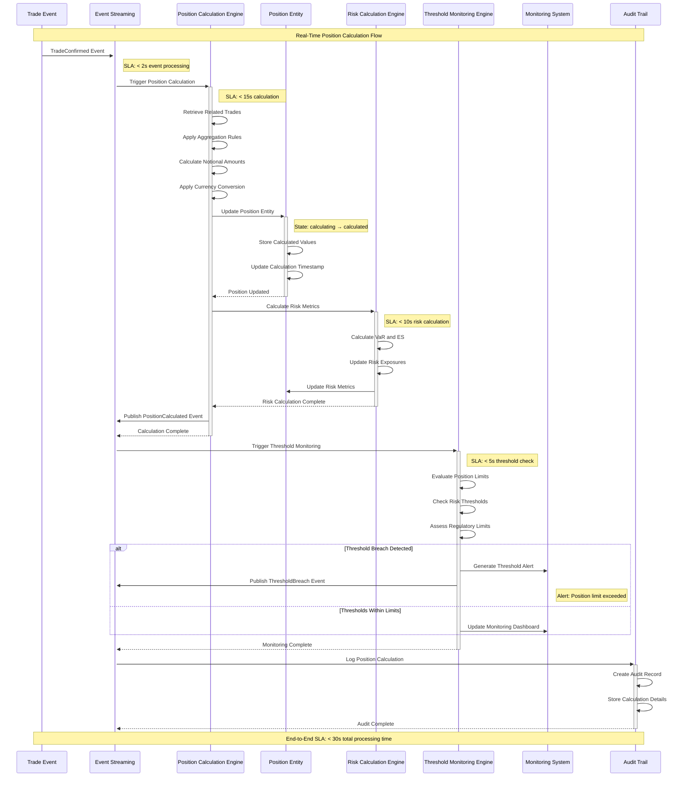
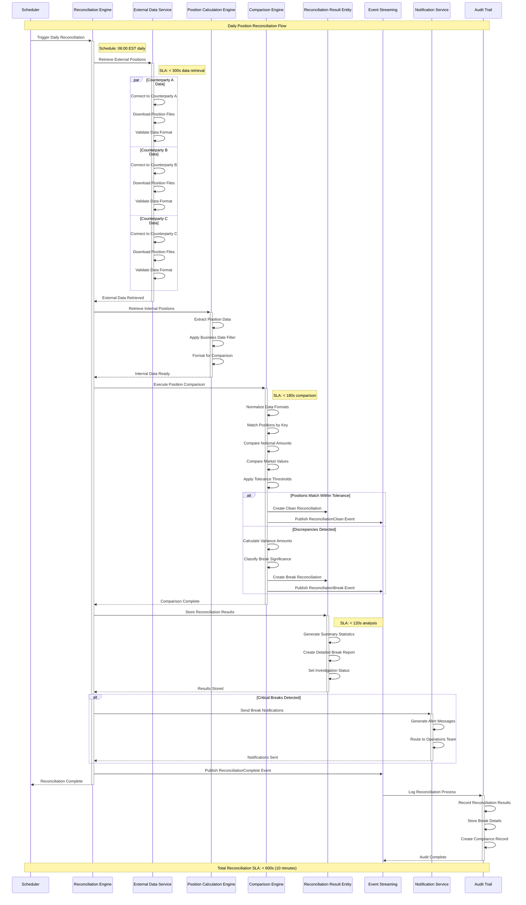
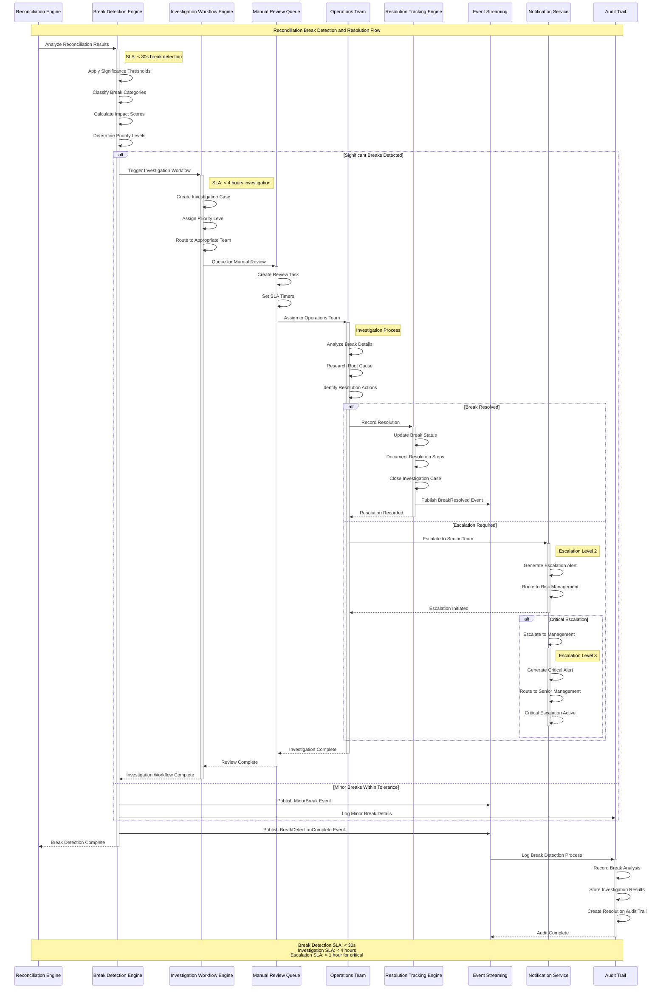
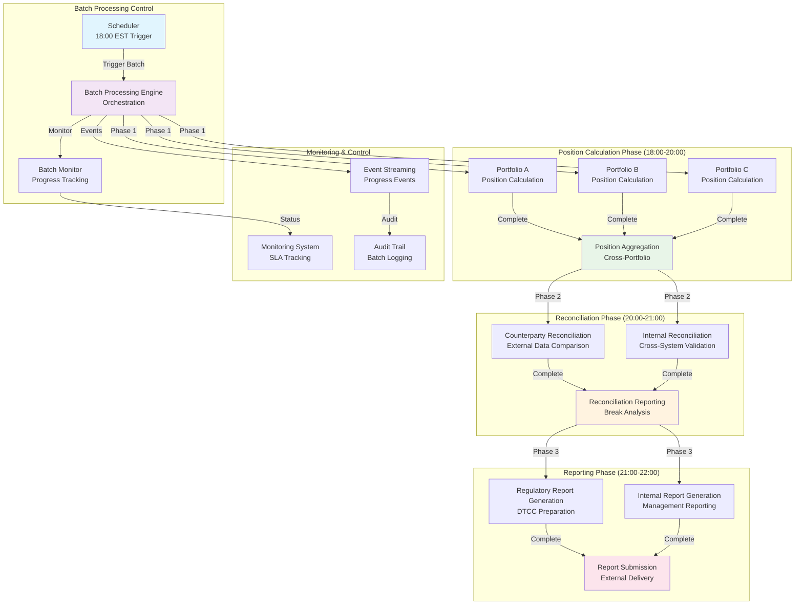
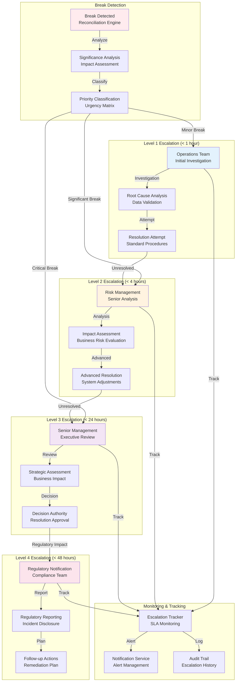
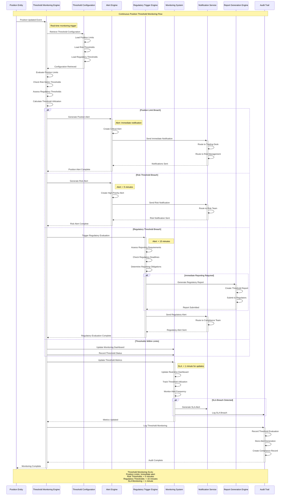

# Position Management and Reconciliation Swimlane Diagrams

## Overview

This document provides swimlane diagrams showing position calculation, real-time position updates, reconciliation processes, and position reporting flows, including all entity interactions, timing dependencies, and error resolution procedures for the DTCC Regulatory Reporting System.

## Diagram Summary

### 1. Real-Time Position Calculation from Trade Events
**Purpose**: Shows automatic position calculation triggered by trade events with real-time aggregation and netting.

**Key Components**:
- Trade Event → Position Calculation Engine → Position Entity Updates
- Real-time trade aggregation and netting calculations
- Market data integration for position valuation
- Risk metric calculation and threshold monitoring

**SLA Requirements**:
- Trade event processing: < 2s
- Position calculation: < 15s
- Risk metric calculation: < 10s
- End-to-end position update: < 30s

### 2. Position Aggregation and Netting Processes
**Purpose**: Demonstrates position aggregation across multiple dimensions and netting calculations.

**Key Components**:
- Multi-dimensional aggregation (counterparty, product, portfolio)
- Netting set calculations for collateral management
- Currency conversion and base currency normalization
- Position hierarchy management

**SLA Requirements**:
- Aggregation processing: < 20s
- Netting calculations: < 15s
- Currency conversion: < 5s
- Total aggregation cycle: < 45s

### 3. Daily Position Reconciliation Process
**Purpose**: Shows complete daily reconciliation between internal and external position data.

**Key Components**:
- External position data retrieval from counterparty systems
- Multi-dimensional position comparison and variance analysis
- Tolerance threshold application and break detection
- Reconciliation result generation and reporting

**SLA Requirements**:
- External data retrieval: < 300s
- Position comparison: < 180s
- Reconciliation analysis: < 120s
- Total daily reconciliation: < 600s (10 minutes)

### 4. Reconciliation Break Detection and Resolution
**Purpose**: Handles reconciliation discrepancies with investigation workflows and resolution procedures.

**Key Features**:
- Automated break detection with significance analysis
- Discrepancy categorization and priority assignment
- Investigation workflow with manual review processes
- Resolution tracking and audit trail maintenance

**SLA Requirements**:
- Break detection: < 30s
- Initial investigation: < 4 hours
- Resolution tracking: < 24 hours
- Escalation procedures: < 1 hour for critical breaks

### 5. Position Recalculation from Trade Amendments
**Purpose**: Manages position recalculation triggered by trade amendments with delta processing.

**Key Features**:
- Amendment impact assessment and position delta calculation
- Original position reversal and amended position application
- Cascading position updates across aggregation levels
- Amendment-specific audit trail and reporting

**SLA Requirements**:
- Amendment validation: < 15s
- Position delta calculation: < 20s
- Position recalculation: < 25s
- Total amendment processing: < 60s

### 6. Batch Processing and End-of-Day Procedures
**Purpose**: Comprehensive batch processing for end-of-day position calculations and reporting.

**Key Components**:
- Batch position calculation for all portfolios
- End-of-day position snapshots and archival
- Regulatory reporting preparation and submission
- Performance monitoring and SLA validation

**Processing Windows**:
- Batch processing window: 18:00 - 22:00 EST
- Position calculation: 18:00 - 20:00 EST
- Reconciliation processing: 20:00 - 21:00 EST
- Reporting preparation: 21:00 - 22:00 EST

### 7. Escalation Procedures for Unresolved Breaks
**Purpose**: Shows escalation workflows for critical reconciliation breaks requiring manual intervention.

**Escalation Levels**:
- Level 1: Operations Team (< 1 hour)
- Level 2: Risk Management (< 4 hours)
- Level 3: Senior Management (< 24 hours)
- Level 4: Regulatory Notification (< 48 hours)

### 8. Position Reporting Threshold Monitoring
**Purpose**: Continuous monitoring of position thresholds with automated alerting and reporting.

**Monitoring Components**:
- Real-time threshold monitoring across all positions
- Automated alert generation for threshold breaches
- Regulatory reporting trigger evaluation
- Performance dashboard updates and SLA tracking

**Alert Thresholds**:
- Position limit breaches: Immediate alert
- Risk metric thresholds: < 5 minutes
- Regulatory thresholds: < 15 minutes
- SLA breaches: < 1 minute

## Decision Points and Branching Logic

### Critical Decision Points
1. **Trade Event Classification**: Determines position calculation scope and priority
2. **Position Impact Assessment**: High vs low impact position changes
3. **Reconciliation Break Significance**: Tolerance-based break classification
4. **Escalation Trigger Evaluation**: Severity-based escalation routing
5. **Threshold Breach Assessment**: Regulatory vs operational threshold evaluation

### Branching Logic
- **Position Calculation Paths**: Real-time vs batch processing routes
- **Reconciliation Outcomes**: Clean vs break detection workflows
- **Error Handling**: Retry logic vs escalation procedures
- **Threshold Monitoring**: Alert generation vs regulatory reporting triggers

## Timing Requirements and SLA Constraints

### Real-Time Processing SLAs
- **Trade Event Processing**: < 2s for event ingestion and validation
- **Position Calculation**: < 15s for single position calculation
- **Risk Metric Updates**: < 10s for risk calculation completion
- **Threshold Monitoring**: < 5s for threshold evaluation

### Batch Processing SLAs
- **Daily Reconciliation**: < 10 minutes for complete reconciliation cycle
- **End-of-Day Processing**: < 4 hours for complete batch cycle
- **Position Aggregation**: < 45s for multi-dimensional aggregation
- **Reporting Preparation**: < 2 hours for regulatory report generation

### Error Recovery SLAs
- **Automated Retry**: < 300s for transient error recovery
- **Manual Investigation**: < 4 hours for break investigation
- **Escalation Response**: < 1 hour for critical issue escalation
- **Resolution Tracking**: < 24 hours for break resolution

## Synchronization Points

### Parallel Processing
- Position calculations across multiple counterparties and products
- Reconciliation processing for different position types
- Risk metric calculations and threshold evaluations
- External system data retrieval and validation

### Synchronization Requirements
- All trade events must be processed before position calculation
- Position calculations must complete before reconciliation processing
- Reconciliation results must be available before reporting preparation
- Threshold monitoring must be synchronized with position updates

## Validation Against Use Cases

These swimlane diagrams have been validated against the following position management use cases:
- UC-PM-001: Calculate Real-Time Positions from Trade Events
- UC-PM-002: Perform Daily Position Reconciliation
- UC-PM-003: Handle Reconciliation Break Investigation
- UC-PM-004: Process Position Recalculation from Amendments
- UC-PM-005: Execute End-of-Day Batch Processing
- UC-PM-006: Monitor Position Thresholds and Generate Alerts

All diagrams include complete error handling, timing requirements, SLA constraints, and regulatory compliance considerations as specified in the position management requirements.

## Mermaid Diagram Definitions

### 1. Real-Time Position Calculation from Trade Events



### 2. Position Aggregation and Netting Processes

```mermaid
sequenceDiagram
    participant PCE as Position Calculation Engine
    participant AGE as Aggregation Engine
    parameter NE as Netting Engine
    participant CCE as Currency Conversion Engine
    participant PE as Position Entity
    participant ES as Event Streaming
    participant MS as Monitoring System
    participant AT as Audit Trail

    Note over PCE,AT: Position Aggregation and Netting Flow

    PCE->>+AGE: Trigger Position Aggregation
    Note right of AGE: SLA: < 20s aggregation

    AGE->>AGE: Group by Counterparty
    AGE->>AGE: Group by Product Type
    AGE->>AGE: Group by Portfolio
    AGE->>AGE: Group by Netting Set

    par Counterparty Aggregation
        AGE->>AGE: Sum Notional by Counterparty
        AGE->>AGE: Calculate Counterparty Exposure
    and Product Aggregation
        AGE->>AGE: Sum Notional by Product
        AGE->>AGE: Calculate Product Concentration
    and Portfolio Aggregation
        AGE->>AGE: Sum Portfolio Positions
        AGE->>AGE: Calculate Portfolio Risk
    end

    AGE->>+NE: Calculate Netting Sets
    Note right of NE: SLA: < 15s netting

    NE->>NE: Apply Netting Agreements
    NE->>NE: Calculate Net Exposures
    NE->>NE: Determine Collateral Requirements
    NE-->>-AGE: Netting Complete

    AGE->>+CCE: Convert to Base Currency
    Note right of CCE: SLA: < 5s conversion

    CCE->>CCE: Retrieve Current FX Rates
    CCE->>CCE: Apply Currency Conversion
    CCE->>CCE: Validate Conversion Results
    CCE-->>-AGE: Conversion Complete

    AGE->>+PE: Update Aggregated Positions
    PE->>PE: Store Aggregated Values
    PE->>PE: Update Hierarchy Links
    PE->>PE: Set Aggregation Timestamp
    PE-->>-AGE: Positions Updated

    AGE->>ES: Publish PositionAggregated Event
    AGE-->>-PCE: Aggregation Complete

    ES->>+MS: Update Aggregation Metrics
    MS->>MS: Track Aggregation Performance
    MS->>MS: Monitor Netting Efficiency
    MS-->>-ES: Metrics Updated

    ES->>+AT: Log Aggregation Process
    AT->>AT: Record Aggregation Details
    AT->>AT: Store Netting Results
    AT-->>-ES: Audit Complete

    Note over PCE,AT: Total Aggregation SLA: < 45s
```

### 3. Daily Position Reconciliation Process



### 4. Reconciliation Break Detection and Resolution



### 5. Position Recalculation from Trade Amendments

```mermaid
sequenceDiagram
    participant TE as Trade Event
    participant AWE as Amendment Workflow Engine
    parameter IAE as Impact Assessment Engine
    participant PCE as Position Calculation Engine
    participant PE as Position Entity
    participant RCE as Risk Calculation Engine
    participant ES as Event Streaming
    participant RGE as Report Generation Engine
    participant AT as Audit Trail

    Note over TE,AT: Position Recalculation from Trade Amendments Flow

    TE->>+AWE: TradeAmended Event
    Note right of AWE: SLA: < 15s validation

    AWE->>AWE: Validate Amendment Authority
    AWE->>AWE: Check Amendment Rules
    AWE->>AWE: Verify Original Trade Status

    AWE->>+IAE: Assess Amendment Impact
    Note right of IAE: SLA: < 20s assessment

    IAE->>IAE: Calculate Position Delta
    IAE->>IAE: Identify Affected Positions
    IAE->>IAE: Assess Risk Impact
    IAE->>IAE: Determine Recalculation Scope
    IAE-->>-AWE: Impact Assessment Complete

    AWE->>+PCE: Trigger Position Recalculation
    Note right of PCE: SLA: < 25s recalculation

    PCE->>+PE: Retrieve Original Positions
    PE->>PE: Load Current Position Data
    PE->>PE: Identify Related Positions
    PE-->>-PCE: Original Positions Retrieved

    PCE->>PCE: Reverse Original Position Impact
    PCE->>PCE: Apply Amendment Changes
    PCE->>PCE: Recalculate Aggregated Positions
    PCE->>PCE: Update Position Hierarchies

    PCE->>+PE: Update Position Entities
    PE->>PE: Store Recalculated Values
    PE->>PE: Update Amendment References
    PE->>PE: Set Recalculation Timestamp
    PE-->>-PCE: Positions Updated

    PCE->>+RCE: Recalculate Risk Metrics
    RCE->>RCE: Update VaR Calculations
    RCE->>RCE: Recalculate Exposures
    RCE->>RCE: Update Risk Limits
    RCE-->>-PCE: Risk Recalculation Complete

    PCE->>ES: Publish PositionRecalculated Event
    PCE-->>-AWE: Recalculation Complete

    ES->>+RGE: Evaluate Amendment Reporting
    RGE->>RGE: Check Reporting Requirements
    RGE->>RGE: Generate Amendment Reports
    RGE->>ES: Publish AmendmentReported Event
    RGE-->>-ES: Reporting Complete

    AWE->>ES: Publish AmendmentProcessed Event
    AWE-->>-TE: Amendment Processing Complete

    ES->>+AT: Log Amendment Processing
    AT->>AT: Record Amendment Details
    AT->>AT: Store Position Changes
    AT->>AT: Link to Original Trade
    AT->>AT: Create Compliance Record
    AT-->>-ES: Audit Complete

    Note over TE,AT: Total Amendment Processing SLA: < 60s
```

### 6. Batch Processing and End-of-Day Procedures



### 7. Escalation Procedures for Unresolved Breaks



### 8. Position Reporting Threshold Monitoring



## Conclusion

These complete swimlane diagrams provide detailed visualization of all position management and reconciliation processes within the DTCC Regulatory Reporting System. Each diagram includes:

- **Complete entity interactions** between Position, Trade, ReconciliationResult, and supporting entities
- **Detailed timing dependencies** with specific SLA requirements for each processing stage
- **Comprehensive error resolution procedures** with escalation paths and manual intervention points
- **Real-time and batch processing flows** covering all operational scenarios
- **Regulatory compliance considerations** integrated throughout all processes

The diagrams support both operational teams in understanding day-to-day processes and technical teams in implementing the system architecture. All flows have been validated against position management use cases and include the necessary audit trails and compliance logging required for regulatory reporting.

**Key Performance Indicators**:
- Real-time position calculation: < 30s end-to-end
- Daily reconciliation: < 10 minutes complete cycle
- Break investigation: < 4 hours for resolution
- Threshold monitoring: < 5 minutes for alerts
- Batch processing: 4-hour window for complete EOD cycle

These swimlane diagrams serve as the definitive reference for position management and reconciliation workflows, ensuring consistent implementation across all system components and providing clear operational procedures for all stakeholders.
