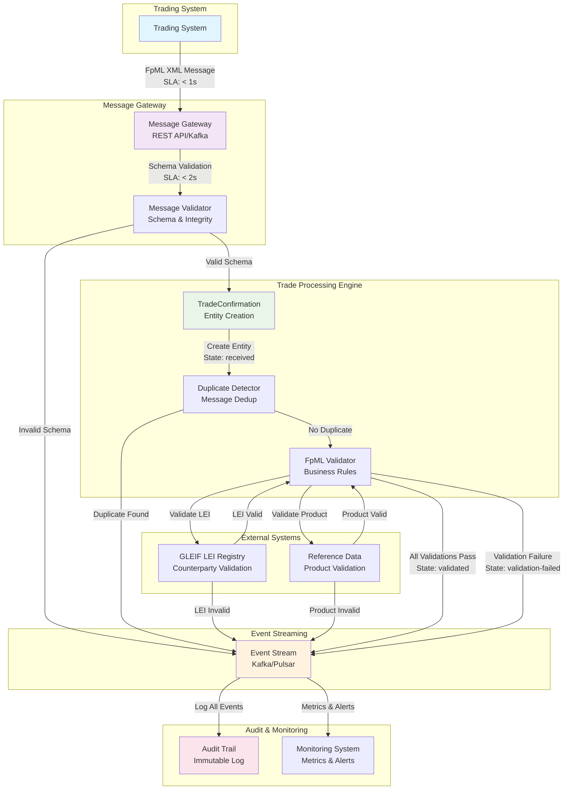
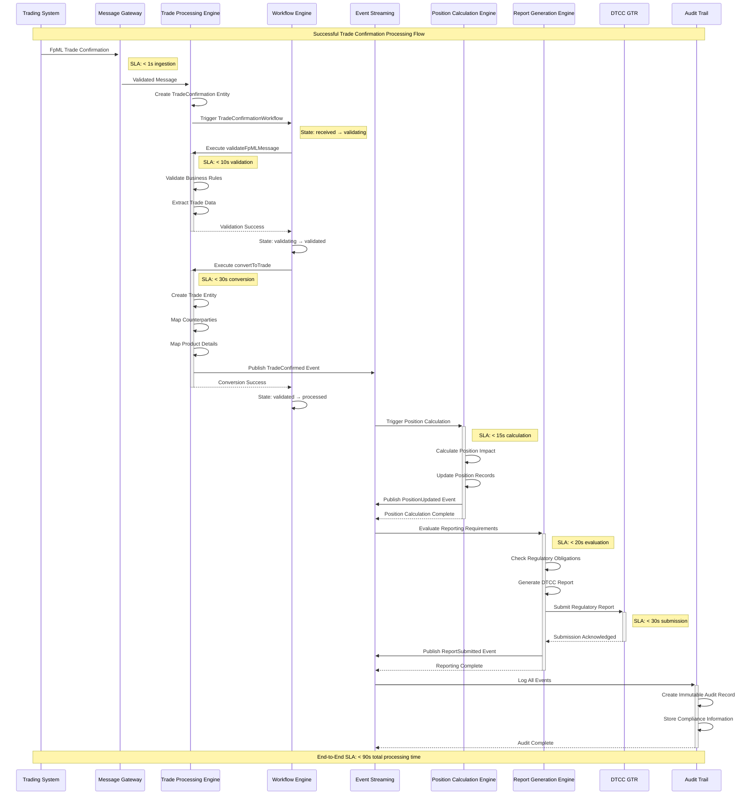
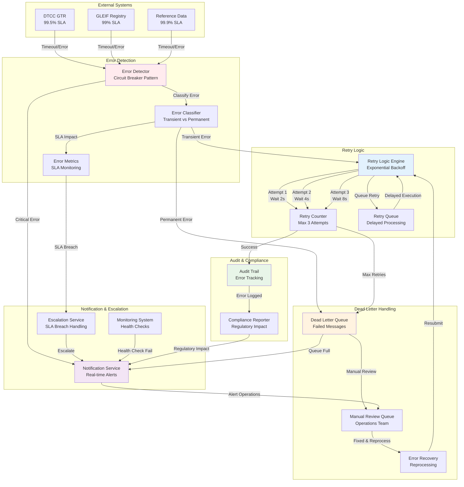
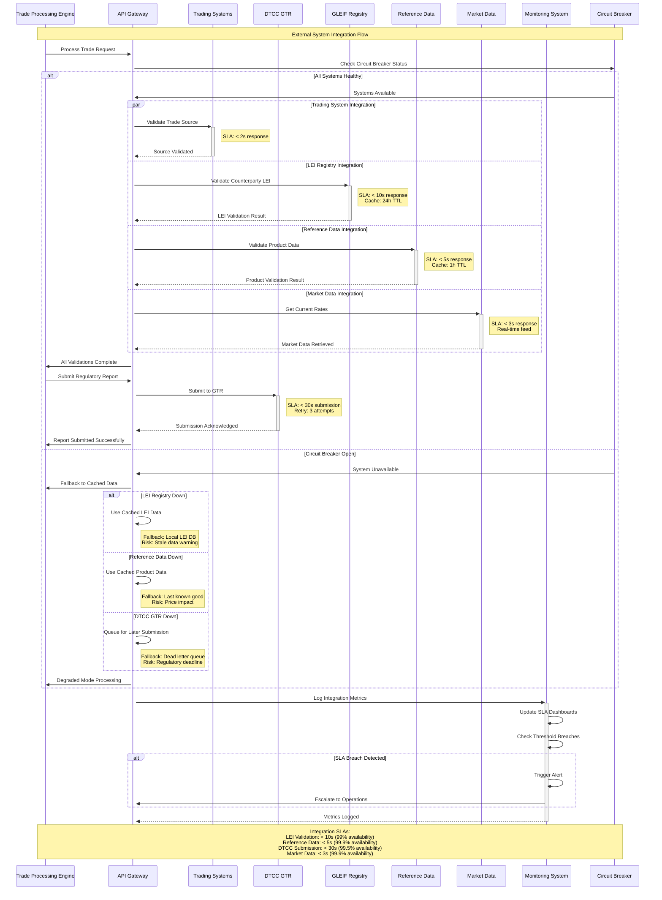
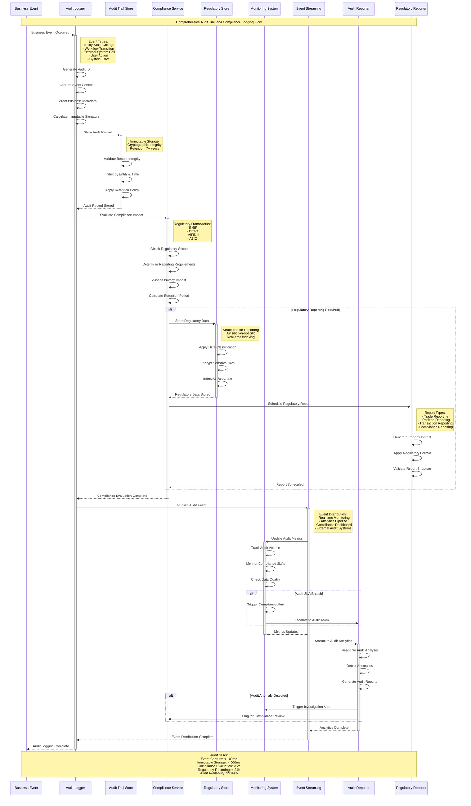

# Trade Processing Swimlane Diagrams

## Overview

This document provides swimlane diagrams showing the complete flow of trade processing events from FpML message ingestion through trade confirmation, validation, and conversion, including all entity interactions, decision points, and error handling paths.

## Diagram Summary

### 1. FpML Message Ingestion and Validation Flow
**Purpose**: Shows the initial processing of FpML messages from trading systems through validation and entity creation.

**Key Components**:
- Trading System → Message Gateway → Trade Processing Engine
- External validation via GLEIF LEI Registry and Reference Data
- Event streaming for audit and monitoring
- Schema validation and business rule validation

**SLA Requirements**:
- Message ingestion: < 1s
- Schema validation: < 2s
- Business validation: < 10s
- End-to-end validation: < 15s

### 2. Successful Trade Confirmation Processing Swimlane
**Purpose**: Demonstrates the complete successful flow from trade confirmation through regulatory reporting.

**Key Components**:
- TradeConfirmation entity creation and workflow execution
- Trade entity conversion with counterparty and product mapping
- Position calculation and impact assessment
- Regulatory report generation and DTCC GTR submission
- Complete audit trail creation

**SLA Requirements**:
- Validation: < 10s
- Trade conversion: < 30s
- Position calculation: < 15s
- Report generation: < 20s
- DTCC submission: < 30s
- **Total end-to-end: < 90s**

### 3. Trade Validation Failure Scenarios Swimlane
**Purpose**: Shows error handling paths for different types of validation failures.

**Failure Types**:
- Schema validation failures → immediate rejection
- Business rule violations → manual review queue
- External system failures → retry logic with exponential backoff

**Error Recovery**:
- Exponential backoff retry (2^attempt seconds)
- Maximum 3 retry attempts
- Dead letter queue for permanent failures
- Manual review queue for business rule violations
- SLA monitoring and escalation

**SLA Requirements**:
- Error recovery: < 300s for automated retry
- Manual review: < 4 hours

### 4. Trade Amendment Processing Swimlane
**Purpose**: Handles trade amendment requests with position recalculation and regulatory reporting.

**Key Features**:
- Amendment authority validation
- Original trade linking and preservation
- Position delta calculation and recalculation
- Amendment-specific regulatory reporting
- Complete audit trail with state change tracking

**SLA Requirements**:
- Amendment validation: < 15s
- Amendment processing: < 30s
- Position recalculation: < 20s
- Amendment reporting: < 25s
- **Total amendment processing: < 90s**

### 5. Trade Cancellation Processing Swimlane
**Purpose**: Manages trade cancellation with position reversal and regulatory compliance.

**Key Features**:
- Cancellation authority and eligibility validation
- Dependency checking (no active positions)
- Complete position reversal and risk metric recalculation
- Cancellation-specific regulatory reporting
- Comprehensive audit trail

**SLA Requirements**:
- Cancellation validation: < 10s
- Cancellation processing: < 20s
- Position reversal: < 15s
- Cancellation reporting: < 20s
- **Total cancellation processing: < 65s**

### 6. Error Handling and Retry Mechanisms Swimlane
**Purpose**: Comprehensive error handling architecture with circuit breaker patterns.

**Key Components**:
- Error detection and classification (transient vs permanent)
- Exponential backoff retry logic (2s, 4s, 8s intervals)
- Dead letter queue for failed messages
- Manual review queue for operations team
- Circuit breaker pattern for external system protection

**External System SLAs**:
- DTCC GTR: 99.5% availability
- GLEIF Registry: 99% availability
- Reference Data: 99.9% availability

### 7. External System Interactions Swimlane
**Purpose**: Shows integration patterns with external systems and fallback mechanisms.

**Integration Points**:
- Trading Systems (< 2s response)
- GLEIF LEI Registry (< 10s, 24h cache)
- Reference Data (< 5s, 1h cache)
- Market Data (< 3s, real-time)
- DTCC GTR (< 30s submission)

**Fallback Mechanisms**:
- Cached data for temporary outages
- Circuit breaker protection
- Degraded mode processing
- Dead letter queuing for critical failures

### 8. Audit Trail and Compliance Logging Swimlane
**Purpose**: Comprehensive audit and compliance logging for regulatory requirements.

**Key Features**:
- Immutable audit record creation with cryptographic integrity
- Regulatory impact assessment across multiple frameworks (EMIR, CFTC, MiFID II, ASIC)
- Real-time compliance evaluation and reporting
- Structured regulatory data storage
- Audit analytics and anomaly detection

**Audit SLAs**:
- Event capture: < 100ms
- Immutable storage: < 500ms
- Compliance evaluation: < 2s
- Regulatory reporting: < 24h
- Audit availability: 99.99%

## Decision Points and Branching Logic

### Critical Decision Points
1. **Message Structure Validation**: FpML schema compliance check
2. **Business Rule Validation**: Comprehensive business logic validation
3. **External System Availability**: Circuit breaker status evaluation
4. **Position Impact Assessment**: High vs low impact determination
5. **Regulatory Reporting Requirements**: Multi-jurisdiction compliance evaluation

### Branching Logic
- **Success Paths**: Continue to next processing stage
- **Validation Failures**: Route to appropriate error handling
- **External System Failures**: Trigger retry logic or fallback mechanisms
- **SLA Breaches**: Escalate to operations team
- **Regulatory Impact**: Trigger compliance reporting workflows

## Timing Requirements and SLA Constraints

### Processing SLAs
- **Trade Confirmation**: < 90s end-to-end
- **Trade Amendment**: < 90s with position recalculation (< 120s total)
- **Trade Cancellation**: < 65s with position reversal (< 100s with reporting)
- **Error Recovery**: < 300s automated, < 4h manual review

### External System SLAs
- **DTCC GTR**: 99.5% availability, < 30s submission
- **GLEIF Registry**: 99% availability, < 10s validation
- **Reference Data**: 99.9% availability, < 5s validation
- **Trading Systems**: 99.9% availability, < 2s response

### Audit and Compliance SLAs
- **Audit Capture**: < 100ms
- **Compliance Evaluation**: < 2s
- **Regulatory Reporting**: < 24h
- **Audit Availability**: 99.99%

## Synchronization Points

### Parallel Processing
- External system validations (LEI, Reference Data, Market Data)
- Position calculation and regulatory report generation
- Audit logging and compliance evaluation

### Synchronization Requirements
- All validations must complete before trade creation
- Position calculation must complete before regulatory reporting
- Audit logging must complete before transaction finalization
- External system calls must respect circuit breaker status

## Validation Against Use Cases

These swimlane diagrams have been validated against the following trade processing use cases:
- UC-001: Process New Trade Confirmation
- UC-002: Handle Trade Amendment
- UC-003: Process Trade Cancellation
- UC-004: Handle Validation Failures
- UC-005: External System Integration
- UC-006: Audit and Compliance Logging

All diagrams include complete error handling, timing requirements, SLA constraints, and regulatory compliance considerations as specified in the trade processing requirements.

## Mermaid Diagram Definitions

### 1. FpML Message Ingestion and Validation Flow



### 2. Successful Trade Confirmation Processing Swimlane



### 3. Trade Validation Failure Scenarios Swimlane

```mermaid
sequenceDiagram
    participant TS as Trading System
    participant MG as Message Gateway
    participant TPE as Trade Processing Engine
    participant WE as Workflow Engine
    participant ES as Event Streaming
    participant NS as Notification Service
    participant MR as Manual Review Queue
    participant AT as Audit Trail
    participant MS as Monitoring System

    Note over TS,MS: Trade Validation Failure Processing Flow

    TS->>+MG: FpML Trade Confirmation
    MG->>+TPE: Message Received
    TPE->>TPE: Create TradeConfirmation Entity
    TPE->>WE: Trigger TradeConfirmationWorkflow

    WE->>+TPE: Execute validateFpMLMessage

    alt Schema Validation Failure
        TPE->>TPE: FpML Schema Invalid
        TPE->>ES: Publish ValidationFailed Event
        TPE-->>-WE: Schema Validation Failed
        WE->>WE: State: received → validation-failed

        ES->>+NS: Send Schema Error Alert
        NS->>NS: Generate Error Notification
        NS->>TS: Send Error Response
        NS-->>-ES: Notification Sent

        ES->>+AT: Log Schema Validation Failure
        AT->>AT: Record Error Details
        AT->>AT: Store Message for Analysis
        AT-->>-ES: Audit Complete

    else Business Rule Validation Failure
        TPE->>TPE: Business Rules Failed
        TPE->>ES: Publish BusinessRuleViolation Event
        TPE-->>-WE: Business Validation Failed
        WE->>WE: State: validating → validation-failed

        ES->>+MR: Queue for Manual Review
        MR->>MR: Create Review Task
        MR->>MR: Assign to Operations Team
        MR-->>-ES: Queued for Review

        ES->>+NS: Send Business Rule Alert
        NS->>NS: Generate Detailed Error Report
        NS->>TS: Send Detailed Error Response
        NS-->>-ES: Notification Sent

    else External System Failure
        TPE->>TPE: LEI/Reference Data Unavailable
        TPE->>ES: Publish ExternalSystemError Event
        TPE-->>-WE: External Validation Failed
        WE->>WE: State: validating → retry-pending

        ES->>+TPE: Trigger Retry Logic
        Note right of TPE: Exponential Backoff<br/>Max 3 retries

        loop Retry Attempts
            TPE->>TPE: Wait (2^attempt seconds)
            TPE->>TPE: Retry External Validation

            alt Retry Success
                TPE->>ES: Publish RetrySuccess Event
                TPE->>WE: Continue Processing
                WE->>WE: State: retry-pending → validated
            else Max Retries Exceeded
                TPE->>ES: Publish MaxRetriesExceeded Event
                TPE->>MR: Queue for Manual Review
                WE->>WE: State: retry-pending → manual-review
            end
        end
        TPE-->>-ES: Retry Logic Complete
    end

    ES->>+MS: Update Error Metrics
    MS->>MS: Increment Failure Counters
    MS->>MS: Check SLA Thresholds

    alt SLA Breach Detected
        MS->>NS: Trigger SLA Alert
        MS->>MS: Escalate to Operations
    end
    MS-->>-ES: Metrics Updated

    ES->>+AT: Log Complete Failure Flow
    AT->>AT: Record Error Resolution Path
    AT->>AT: Store Compliance Information
    AT-->>-ES: Audit Complete

    Note over TS,MS: Error Recovery SLA: < 300s for automated retry<br/>Manual Review SLA: < 4 hours
```

### 4. Trade Amendment Processing Swimlane

```mermaid
sequenceDiagram
    participant TS as Trading System
    participant MG as Message Gateway
    participant TPE as Trade Processing Engine
    participant WE as Workflow Engine
    participant ES as Event Streaming
    participant PCE as Position Calculation Engine
    participant RGE as Report Generation Engine
    participant DTCC as DTCC GTR
    participant AT as Audit Trail
    participant VE as Validation Engine

    Note over TS,VE: Trade Amendment Processing Flow

    TS->>+MG: FpML Amendment Message
    Note right of MG: Amendment Type: TRADE_AMENDMENT

    MG->>+TPE: Validated Amendment
    TPE->>TPE: Create TradeConfirmation Entity
    TPE->>TPE: Link to Original Trade
    TPE->>WE: Trigger TradeWorkflow Amendment

    WE->>WE: State: active → amending
    WE->>+VE: Execute validateAmendment
    Note right of VE: SLA: < 15s validation

    VE->>VE: Validate Amendment Authority
    VE->>VE: Check Amendment Rules
    VE->>VE: Verify Original Trade Status

    alt Amendment Valid
        VE->>TPE: Amendment Validation Success
        VE-->>-WE: Validation Complete

        WE->>+TPE: Execute processAmendment
        Note right of TPE: SLA: < 30s processing

        TPE->>TPE: Create Amendment Record
        TPE->>TPE: Update Trade Entity
        TPE->>TPE: Preserve Original Values
        TPE->>ES: Publish TradeAmended Event
        TPE-->>-WE: Amendment Processing Complete

        WE->>WE: State: amending → amended

        ES->>+PCE: Trigger Position Recalculation
        Note right of PCE: SLA: < 20s recalculation

        PCE->>PCE: Calculate Position Delta
        PCE->>PCE: Update Position Records
        PCE->>PCE: Reverse Original Position Impact
        PCE->>PCE: Apply Amended Position Impact
        PCE->>ES: Publish PositionRecalculated Event
        PCE-->>-ES: Position Update Complete

        ES->>+RGE: Evaluate Amendment Reporting
        Note right of RGE: SLA: < 25s evaluation

        RGE->>RGE: Check Reporting Requirements
        RGE->>RGE: Generate Amendment Report
        RGE->>+DTCC: Submit Amendment Report
        Note right of DTCC: Report Type: LIFECYCLE
        DTCC-->>-RGE: Amendment Report Acknowledged
        RGE->>ES: Publish AmendmentReported Event
        RGE-->>-ES: Amendment Reporting Complete

    else Amendment Invalid
        VE->>ES: Publish AmendmentValidationFailed Event
        VE-->>-WE: Validation Failed

        WE->>WE: State: amending → amendment-failed

        ES->>TPE: Create Amendment Rejection
        ES->>TS: Send Amendment Rejection Notice

        ES->>+AT: Log Amendment Failure
        AT->>AT: Record Rejection Reason
        AT->>AT: Store Amendment Details
        AT-->>-ES: Audit Complete
    end

    ES->>+AT: Log Complete Amendment Flow
    AT->>AT: Create Amendment Audit Trail
    AT->>AT: Link to Original Trade Audit
    AT->>AT: Record State Changes
    AT->>AT: Store Regulatory Information
    AT-->>-ES: Amendment Audit Complete

    Note over TS,VE: Amendment Processing SLA: < 90s total<br/>Position Impact SLA: < 120s total
```

### 5. Trade Cancellation Processing Swimlane

```mermaid
sequenceDiagram
    participant TS as Trading System
    participant MG as Message Gateway
    participant TPE as Trade Processing Engine
    participant WE as Workflow Engine
    participant ES as Event Streaming
    participant PCE as Position Calculation Engine
    participant RGE as Report Generation Engine
    participant DTCC as DTCC GTR
    participant AT as Audit Trail
    participant VE as Validation Engine

    Note over TS,VE: Trade Cancellation Processing Flow

    TS->>+MG: FpML Cancellation Message
    Note right of MG: Message Type: TRADE_CANCELLATION

    MG->>+TPE: Validated Cancellation
    TPE->>TPE: Create TradeConfirmation Entity
    TPE->>TPE: Link to Original Trade
    TPE->>WE: Trigger TradeWorkflow Cancellation

    WE->>WE: State: active → cancelling
    WE->>+VE: Execute validateCancellation
    Note right of VE: SLA: < 10s validation

    VE->>VE: Validate Cancellation Authority
    VE->>VE: Check Trade Status Eligibility
    VE->>VE: Verify No Dependent Positions
    VE->>VE: Check Regulatory Constraints

    alt Cancellation Valid
        VE->>TPE: Cancellation Validation Success
        VE-->>-WE: Validation Complete

        WE->>+TPE: Execute processCancellation
        Note right of TPE: SLA: < 20s processing

        TPE->>TPE: Create Cancellation Record
        TPE->>TPE: Update Trade Status to CANCELLED
        TPE->>TPE: Preserve Original Trade Data
        TPE->>ES: Publish TradeCancelled Event
        TPE-->>-WE: Cancellation Processing Complete

        WE->>WE: State: cancelling → cancelled

        ES->>+PCE: Trigger Position Reversal
        Note right of PCE: SLA: < 15s reversal

        PCE->>PCE: Calculate Position Reversal
        PCE->>PCE: Reverse All Position Impacts
        PCE->>PCE: Update Portfolio Positions
        PCE->>PCE: Recalculate Risk Metrics
        PCE->>ES: Publish PositionReversed Event
        PCE-->>-ES: Position Reversal Complete

        ES->>+RGE: Evaluate Cancellation Reporting
        Note right of RGE: SLA: < 20s evaluation

        RGE->>RGE: Check Reporting Requirements
        RGE->>RGE: Generate Cancellation Report
        RGE->>+DTCC: Submit Cancellation Report
        Note right of DTCC: Report Type: LIFECYCLE<br/>Action: CANCEL
        DTCC-->>-RGE: Cancellation Report Acknowledged
        RGE->>ES: Publish CancellationReported Event
        RGE-->>-ES: Cancellation Reporting Complete

        ES->>TS: Send Cancellation Confirmation

    else Cancellation Invalid
        VE->>ES: Publish CancellationValidationFailed Event
        VE-->>-WE: Validation Failed

        WE->>WE: State: cancelling → cancellation-failed

        alt Trade Has Dependencies
            ES->>TPE: Create Dependency Error
            ES->>TS: Send Dependency Rejection Notice
            Note right of TS: Error: Trade has active positions

        else Regulatory Constraint
            ES->>TPE: Create Regulatory Error
            ES->>TS: Send Regulatory Rejection Notice
            Note right of TS: Error: Regulatory hold period

        else Authority Issue
            ES->>TPE: Create Authority Error
            ES->>TS: Send Authority Rejection Notice
            Note right of TS: Error: Insufficient authority
        end

        ES->>+AT: Log Cancellation Failure
        AT->>AT: Record Rejection Reason
        AT->>AT: Store Cancellation Details
        AT->>AT: Record Regulatory Impact
        AT-->>-ES: Audit Complete
    end

    ES->>+AT: Log Complete Cancellation Flow
    AT->>AT: Create Cancellation Audit Trail
    AT->>AT: Link to Original Trade Audit
    AT->>AT: Record Position Impact
    AT->>AT: Store Regulatory Compliance Data
    AT-->>-ES: Cancellation Audit Complete

    Note over TS,VE: Cancellation Processing SLA: < 65s total<br/>Position Reversal SLA: < 80s total<br/>Regulatory Reporting SLA: < 100s total
```

### 6. Error Handling and Retry Mechanisms Swimlane



### 7. External System Interactions Swimlane



### 8. Audit Trail and Compliance Logging Swimlane


