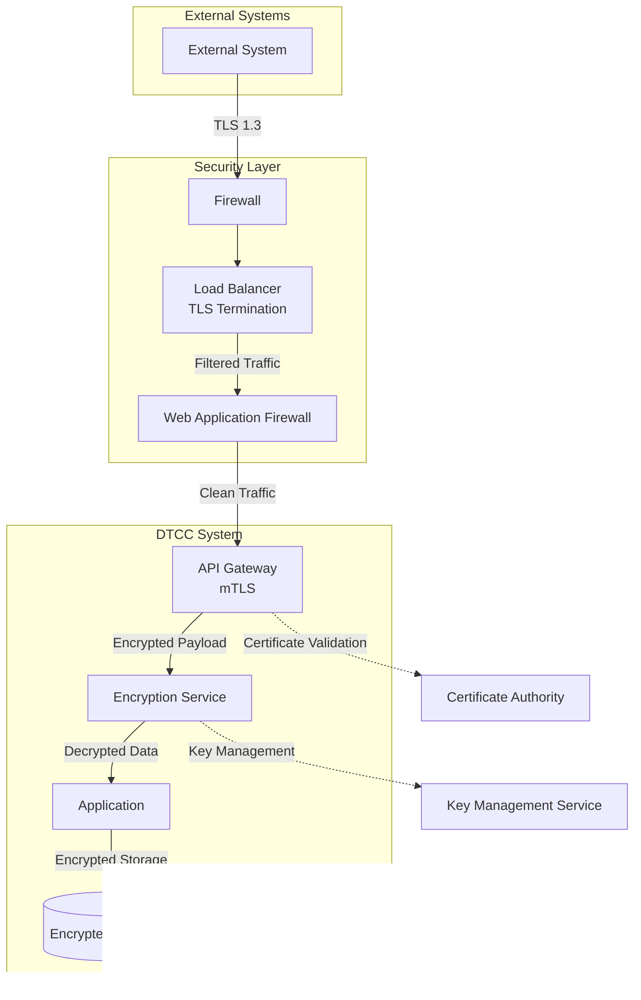

# DTCC Regulatory Reporting System - Interface Interaction Diagrams

## Overview

This document provides visual representations of the data flow patterns and interactions between the DTCC Regulatory Reporting System and external systems. These diagrams illustrate the technical integration points, data exchange patterns, and system dependencies.

---

## 1. High-Level External Interface Architecture

This diagram shows the overall architecture and external system connections:

---

## 2. Trade Processing Data Flow

This diagram illustrates the complete flow from trade confirmation receipt to regulatory reporting:

---

## 3. Reference Data Synchronization Flow

This diagram shows how reference data is synchronized from external providers:

---

## 4. Authentication and Authorization Flow

This diagram shows the authentication and authorization patterns for different types of access:

---

## 5. Error Handling and Monitoring Flow

This diagram illustrates the error handling and monitoring integration patterns:

---

## 6. Regulatory Reporting Submission Flow

This detailed diagram shows the complete regulatory reporting submission process:

---

## 7. Data Security and Encryption Flow

This diagram shows the security measures and encryption patterns used across interfaces:

---

## Integration Testing Scenarios

### Test Flow Diagrams

The following scenarios should be tested for each external interface:

1. **Happy Path Testing**: Normal operation flow
2. **Error Condition Testing**: Various failure scenarios
3. **Performance Testing**: Load and stress testing
4. **Security Testing**: Authentication and authorization validation
5. **Disaster Recovery Testing**: Failover and recovery procedures

### Monitoring and Validation

Each interface requires continuous monitoring with the following metrics:
- **Connectivity**: Network connectivity and protocol compliance
- **Performance**: Response times and throughput
- **Reliability**: Error rates and availability
- **Security**: Authentication success rates and security violations

---

## Conclusion

These interaction diagrams provide a complete view of how the DTCC Regulatory Reporting System integrates with external systems. They serve as a reference for:

- **Development Teams**: Understanding integration requirements
- **Operations Teams**: Monitoring and troubleshooting
- **Security Teams**: Validating security controls
- **Business Teams**: Understanding data flow and dependencies

Regular updates to these diagrams are required as the system evolves and new integrations are added.
