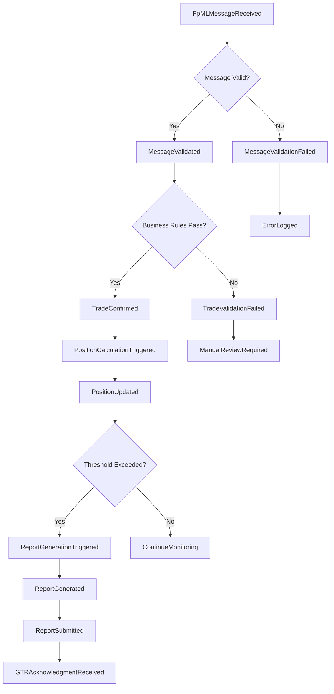
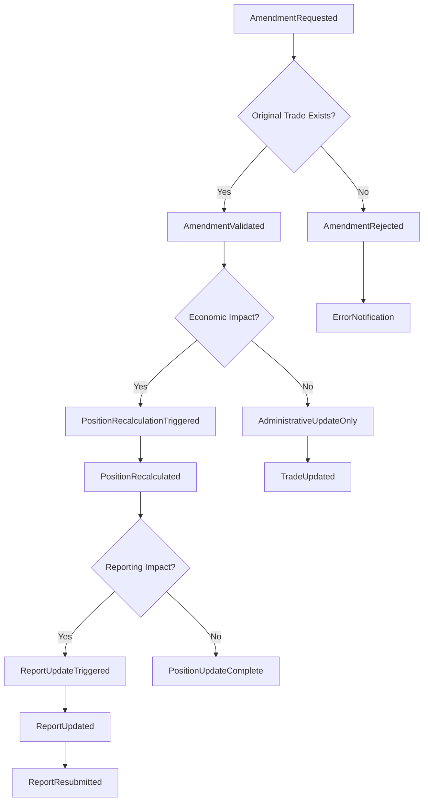
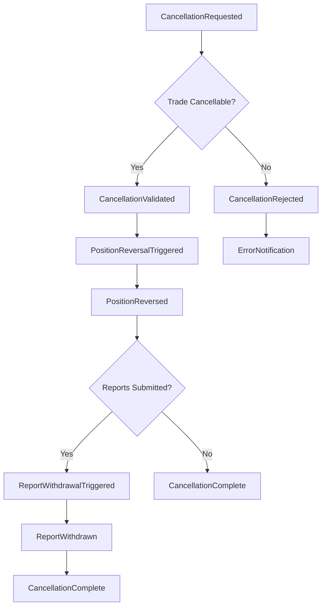
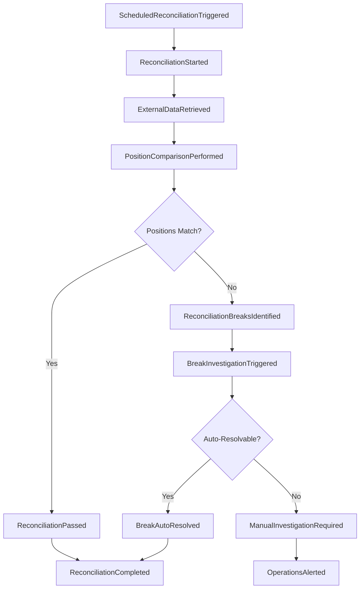
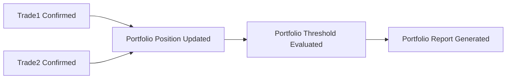
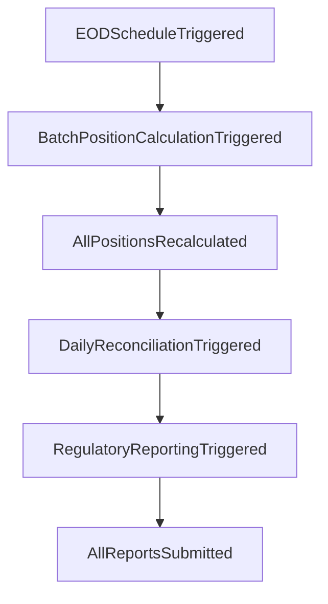
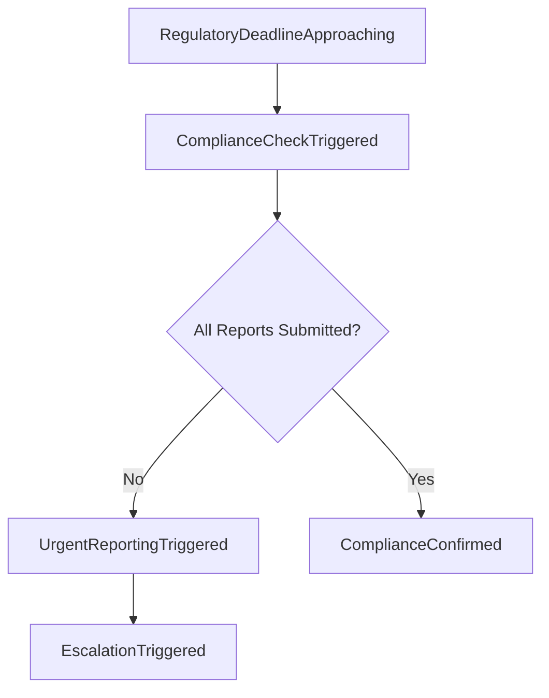

# Event Causality Chains and Trigger Relationships

## Overview

This document defines the detailed causality chains showing how events trigger subsequent events throughout the DTCC Regulatory Reporting System. These chains establish the cause-and-effect relationships that drive business processes from initial external triggers through final regulatory compliance outcomes.

## Primary Causality Chains

### 1. Trade Confirmation Causality Chain

#### Complete Chain Flow

#### Detailed Causality Steps

**Step 1: External Trigger → Message Processing**
- **Cause**: `FpMLMessageReceived` from external trading system
- **Effect**: `MessageValidationStarted` in FpML Message Processor
- **Timing**: Immediate (< 1 second)
- **Conditions**: Message format recognizable, system available

**Step 2: Message Validation → Business Processing**
- **Cause**: `MessageValidated` (successful schema validation)
- **Effect**: `BusinessRuleValidationStarted` in Trade Processing Engine
- **Timing**: < 5 seconds
- **Conditions**: Valid FpML schema, required fields present

**Step 3: Business Validation → Trade Creation**
- **Cause**: `BusinessRulesValidated` (all validation checks pass)
- **Effect**: `TradeConfirmed` with trade entity creation
- **Timing**: < 15 seconds
- **Conditions**: Counterparty valid, product authorized, limits satisfied

**Step 4: Trade Confirmation → Position Processing**
- **Cause**: `TradeConfirmed` event published
- **Effect**: `PositionCalculationTriggered` in Position Calculation Engine
- **Timing**: < 10 seconds
- **Conditions**: Trade affects existing positions, calculation engine available

**Step 5: Position Update → Reporting Evaluation**
- **Cause**: `PositionUpdated` with new position values
- **Effect**: `ThresholdEvaluated` for reporting obligations
- **Timing**: < 30 seconds
- **Conditions**: Position changes exceed monitoring thresholds

**Step 6: Threshold Breach → Report Generation**
- **Cause**: `ThresholdExceeded` for regulatory reporting
- **Effect**: `ReportGenerationTriggered` in Report Generation Engine
- **Timing**: < 15 minutes
- **Conditions**: Reporting threshold breached, within reporting window

### 2. Amendment Processing Causality Chain

#### Amendment Chain Flow

#### Amendment Causality Details

**Economic Amendment Chain:**
1. `AmendmentRequested` → `PositionRecalculationTriggered` (< 60 seconds)
2. `PositionRecalculated` → `ReportUpdateTriggered` (< 30 seconds)
3. `ReportUpdated` → `ReportResubmitted` (< 1 hour)

**Administrative Amendment Chain:**
1. `AmendmentRequested` → `TradeUpdated` (< 30 seconds)
2. `TradeUpdated` → `AuditTrailUpdated` (< 5 seconds)

### 3. Cancellation Processing Causality Chain

#### Cancellation Chain Flow

### 4. Position Reconciliation Causality Chain

#### Reconciliation Chain Flow

## Cross-Chain Causality Relationships

### 1. Multi-Trade Impact Chains

#### Portfolio-Level Causality

**Aggregation Causality:**
- Multiple `TradeConfirmed` events → Single `PortfolioPositionUpdated`
- Multiple `PositionUpdated` events → Single `PortfolioReportGenerated`
- Multiple `AmendmentRequested` events → Single `PortfolioRecalculationTriggered`

### 2. Temporal Causality Chains

#### End-of-Day Processing Chain

#### Regulatory Deadline Chain

## Causality Validation Rules

### 1. Mandatory Causality Rules

#### Trade Processing Rules
- **Rule TC-1**: Every `FpMLMessageReceived` MUST cause either `TradeConfirmed` or `TradeValidationFailed`
- **Rule TC-2**: Every `TradeConfirmed` MUST cause `PositionCalculationTriggered`
- **Rule TC-3**: Every `PositionUpdated` MUST cause `ThresholdEvaluated`

#### Amendment Processing Rules
- **Rule AM-1**: Every `AmendmentRequested` MUST cause either `AmendmentValidated` or `AmendmentRejected`
- **Rule AM-2**: Every economic `AmendmentValidated` MUST cause `PositionRecalculationTriggered`
- **Rule AM-3**: Every `PositionRecalculated` MUST cause impact assessment

#### Reporting Rules
- **Rule RP-1**: Every threshold breach MUST cause `ReportGenerationTriggered`
- **Rule RP-2**: Every `ReportGenerated` MUST cause `ReportValidated`
- **Rule RP-3**: Every `ReportValidated` MUST cause `ReportSubmitted` within deadline

### 2. Conditional Causality Rules

#### Business Condition Rules
- **Rule BC-1**: `ReportGenerationTriggered` only if position threshold exceeded
- **Rule BC-2**: `PositionRecalculationTriggered` only if amendment has economic impact
- **Rule BC-3**: `ManualReviewRequired` only if automated validation fails

#### Timing Condition Rules
- **Rule TC-1**: `UrgentReportingTriggered` only if within 24 hours of deadline
- **Rule TC-2**: `BatchProcessingTriggered` only during designated batch windows
- **Rule TC-3**: `EmergencyProcessingTriggered` only outside business hours

## Causality Monitoring and Alerting

### 1. Broken Causality Detection

#### Missing Effect Events
- **Alert**: Expected effect event not triggered within SLA timeframe
- **Escalation**: Automatic retry, then manual intervention
- **Recovery**: Manual trigger of missing effect event

#### Orphaned Events
- **Alert**: Effect event triggered without corresponding cause event
- **Investigation**: Trace event source and validate causality
- **Resolution**: Establish proper causality or mark as exception

### 2. Causality Performance Monitoring

#### Timing Metrics
- **Causality Latency**: Time between cause and effect events
- **Chain Completion Time**: End-to-end causality chain duration
- **SLA Compliance**: Percentage of causality chains meeting timing requirements

#### Quality Metrics
- **Causality Completeness**: Percentage of complete causality chains
- **Error Rate**: Percentage of broken or incomplete causality chains
- **Recovery Success**: Percentage of successfully recovered broken chains

## Troubleshooting Causality Issues

### 1. Common Causality Problems

#### Broken Chains
- **Symptom**: Effect event not triggered by cause event
- **Diagnosis**: Check event processing status, system availability
- **Resolution**: Manual trigger, system restart, data recovery

#### Timing Violations
- **Symptom**: Effect event triggered outside SLA timeframe
- **Diagnosis**: Check system performance, resource utilization
- **Resolution**: Performance tuning, resource scaling, priority adjustment

#### Duplicate Effects
- **Symptom**: Multiple effect events triggered by single cause
- **Diagnosis**: Check event deduplication, idempotency controls
- **Resolution**: Event cleanup, idempotency enhancement

### 2. Causality Recovery Procedures

#### Manual Causality Restoration
1. **Identify Break Point**: Determine where causality chain broke
2. **Assess Impact**: Evaluate downstream effects of broken chain
3. **Manual Trigger**: Manually trigger missing effect events
4. **Validate Recovery**: Confirm causality chain completion
5. **Update Audit Trail**: Document manual intervention

#### Automated Recovery
1. **Detection**: Automated monitoring identifies broken causality
2. **Retry Logic**: Automatic retry of failed causality triggers
3. **Escalation**: Escalate to manual intervention if retry fails
4. **Notification**: Alert operations team of recovery actions

---

*These causality chains ensure reliable, traceable, and compliant event processing throughout the DTCC Regulatory Reporting System.*
