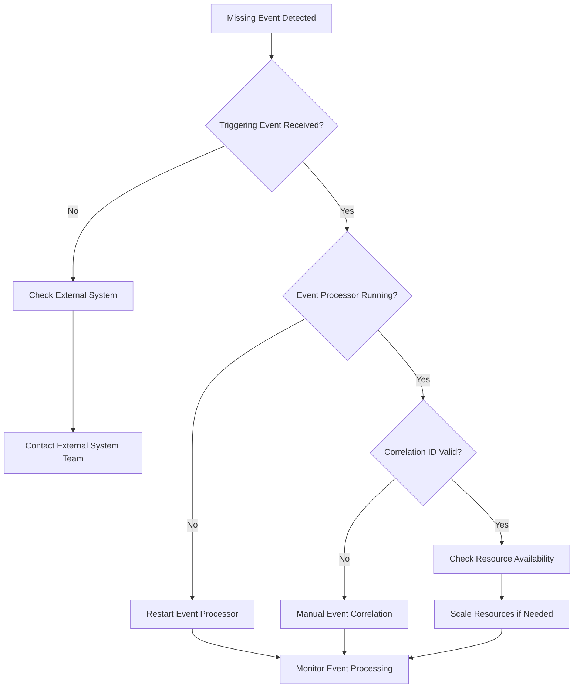
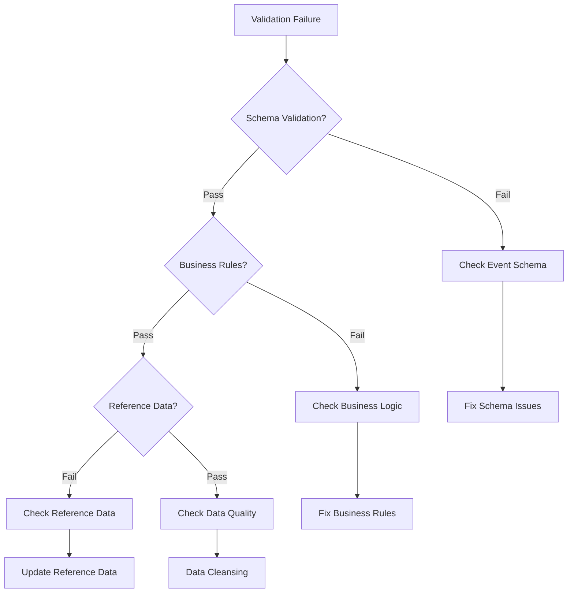

# Event Troubleshooting Guide for Operational Support

## Overview

This guide provides comprehensive troubleshooting procedures for event-related issues in the DTCC Regulatory Reporting System. It enables operations teams to quickly diagnose, resolve, and prevent event processing problems that could impact regulatory compliance.

## Event Processing Issue Categories

### 1. Event Flow Disruptions

#### Missing Events
**Symptoms:**
- Expected downstream events not triggered
- Incomplete business process flows
- SLA violations for event processing
- Regulatory deadline risks

**Diagnostic Steps:**
1. **Check Event Logs**: Verify if triggering event was received
2. **Validate Event Processing**: Check event processor status and health
3. **Review Correlation IDs**: Ensure proper event correlation
4. **Check System Resources**: Verify adequate system capacity
5. **Validate Dependencies**: Ensure all dependent services are available

**Resolution Procedures:**


#### Duplicate Events
**Symptoms:**
- Multiple identical events processed
- Duplicate position calculations
- Duplicate report submissions
- Data inconsistency issues

**Diagnostic Steps:**
1. **Check Event Deduplication**: Verify deduplication mechanisms
2. **Review Event IDs**: Check for unique event identifiers
3. **Validate Idempotency**: Ensure idempotent event processing
4. **Check Retry Logic**: Review retry mechanisms for failures
5. **Analyze Event Sources**: Identify source of duplicate events

**Resolution Procedures:**
1. **Immediate**: Stop duplicate processing, quarantine duplicate events
2. **Short-term**: Implement deduplication filters, validate data consistency
3. **Long-term**: Enhance idempotency controls, improve retry logic

### 2. Event Timing Issues

#### SLA Violations
**Symptoms:**
- Events processing beyond SLA timeframes
- Regulatory deadline risks
- Performance degradation alerts
- Cascade delays in downstream processing

**Diagnostic Checklist:**
- [ ] Check system resource utilization (CPU, memory, disk)
- [ ] Verify database performance and connection pools
- [ ] Review external system response times
- [ ] Check event queue depths and processing rates
- [ ] Validate network connectivity and latency

**Resolution Matrix:**

| Issue Type | Immediate Action | Short-term Fix | Long-term Solution |
|------------|------------------|----------------|-------------------|
| **Resource Constraint** | Scale resources | Optimize queries | Capacity planning |
| **External Dependency** | Use cached data | Implement circuit breaker | SLA agreements |
| **Database Performance** | Restart connections | Optimize indexes | Database tuning |
| **Network Issues** | Check connectivity | Implement retry | Network optimization |
| **Queue Backlog** | Increase workers | Optimize processing | Load balancing |

#### Event Sequencing Errors
**Symptoms:**
- Events processed out of order
- Business rule violations
- Data consistency issues
- Audit trail gaps

**Diagnostic Process:**
1. **Check Event Timestamps**: Verify event timing and sequence
2. **Review Processing Order**: Ensure events processed in correct order
3. **Validate Dependencies**: Check event dependency requirements
4. **Check Concurrency**: Review concurrent processing impacts
5. **Analyze Queue Behavior**: Verify queue ordering guarantees

### 3. Event Data Issues

#### Data Validation Failures
**Symptoms:**
- Events failing validation checks
- Business rule violations
- Data quality alerts
- Processing errors

**Troubleshooting Steps:**


#### Correlation Failures
**Symptoms:**
- Events not properly correlated
- Broken business process chains
- Audit trail gaps
- Orphaned events

**Resolution Steps:**
1. **Identify Break Point**: Determine where correlation broke
2. **Check Correlation IDs**: Verify correlation ID consistency
3. **Review Event Metadata**: Check event correlation metadata
4. **Manual Correlation**: Establish manual correlation if needed
5. **Update Audit Trail**: Document correlation recovery

## Event Monitoring and Alerting

### 1. Real-time Event Monitoring

#### Key Performance Indicators (KPIs)
- **Event Processing Rate**: Events processed per minute
- **Event Processing Latency**: Average time from event receipt to processing
- **Event Success Rate**: Percentage of successfully processed events
- **SLA Compliance Rate**: Percentage of events meeting SLA requirements
- **Error Rate**: Percentage of events resulting in errors

#### Alert Thresholds
| Metric | Warning Threshold | Critical Threshold | Emergency Threshold |
|--------|-------------------|-------------------|-------------------|
| **Processing Latency** | > 50% of SLA | > 80% of SLA | > 95% of SLA |
| **Error Rate** | > 1% | > 5% | > 10% |
| **Queue Depth** | > 1000 events | > 5000 events | > 10000 events |
| **Success Rate** | < 99% | < 95% | < 90% |
| **Resource Utilization** | > 70% | > 85% | > 95% |

### 2. Event Health Checks

#### Automated Health Checks
- **Event Processor Health**: Verify all event processors are running
- **Queue Health**: Check event queue depths and processing rates
- **Correlation Health**: Verify event correlation integrity
- **Data Quality Health**: Check event data validation rates
- **Integration Health**: Verify external system connectivity

#### Health Check Procedures
```bash
# Event Processor Health Check
curl -f http://event-processor:8080/health || echo "Event processor unhealthy"

# Queue Depth Check
rabbitmq-admin list queues | awk '$2 > 1000 {print "Queue " $1 " depth: " $2}'

# Correlation Integrity Check
SELECT COUNT(*) FROM events WHERE correlation_id IS NULL;

# Data Quality Check
SELECT (valid_events / total_events) * 100 as validation_rate FROM event_metrics;
```

## Common Event Issues and Solutions

### 1. Trade Processing Event Issues

#### Issue: FpML Message Processing Failures
**Common Causes:**
- Invalid FpML schema
- Missing required fields
- Corrupted message content
- External system unavailability

**Resolution Steps:**
1. **Validate Message Format**: Check FpML schema compliance
2. **Check Required Fields**: Verify all mandatory fields present
3. **Test Message Processing**: Process message in test environment
4. **Contact Trading System**: Coordinate with external trading system
5. **Manual Processing**: Process valid trades manually if needed

#### Issue: Trade Confirmation Delays
**Common Causes:**
- Business rule validation failures
- Reference data unavailability
- System resource constraints
- Database performance issues

**Resolution Steps:**
1. **Check Business Rules**: Verify all validation rules pass
2. **Validate Reference Data**: Ensure reference data is current
3. **Monitor Resources**: Check system resource utilization
4. **Optimize Database**: Review and optimize database queries
5. **Escalate if Needed**: Escalate to technical team if unresolved

### 2. Position Management Event Issues

#### Issue: Position Calculation Delays
**Common Causes:**
- Complex position hierarchies
- Large data volumes
- Calculation engine performance
- Database locking issues

**Resolution Steps:**
1. **Check Calculation Load**: Monitor position calculation queue
2. **Review Data Volume**: Assess impact of data volume on performance
3. **Optimize Calculations**: Review calculation algorithms for efficiency
4. **Check Database Locks**: Identify and resolve database locking issues
5. **Scale Resources**: Add calculation capacity if needed

#### Issue: Reconciliation Failures
**Common Causes:**
- External data unavailability
- Data format mismatches
- Tolerance threshold breaches
- System connectivity issues

**Resolution Steps:**
1. **Check External Systems**: Verify external system availability
2. **Validate Data Formats**: Ensure data format compatibility
3. **Review Tolerances**: Check if tolerance thresholds are appropriate
4. **Test Connectivity**: Verify network connectivity to external systems
5. **Manual Reconciliation**: Perform manual reconciliation if needed

### 3. Regulatory Reporting Event Issues

#### Issue: Report Generation Failures
**Common Causes:**
- Incomplete position data
- Reference data issues
- Report template problems
- Data quality failures

**Resolution Steps:**
1. **Validate Position Data**: Ensure all required position data available
2. **Check Reference Data**: Verify reference data completeness
3. **Test Report Templates**: Validate report template functionality
4. **Review Data Quality**: Check data quality validation results
5. **Generate Manual Reports**: Create reports manually if needed

#### Issue: DTCC Submission Failures
**Common Causes:**
- Authentication failures
- Network connectivity issues
- Report format errors
- DTCC system unavailability

**Resolution Steps:**
1. **Check Authentication**: Verify DTCC authentication credentials
2. **Test Connectivity**: Check network connectivity to DTCC
3. **Validate Report Format**: Ensure report meets DTCC requirements
4. **Check DTCC Status**: Verify DTCC system availability
5. **Retry Submission**: Retry submission after resolving issues

## Emergency Procedures

### 1. Critical Event Processing Failures

#### Emergency Response Checklist
- [ ] **Assess Impact**: Determine business and regulatory impact
- [ ] **Notify Stakeholders**: Alert management and compliance teams
- [ ] **Activate Emergency Team**: Engage emergency response team
- [ ] **Implement Workarounds**: Deploy emergency processing procedures
- [ ] **Document Actions**: Record all emergency response actions
- [ ] **Monitor Recovery**: Continuously monitor recovery progress

#### Emergency Escalation Matrix
| Severity | Response Time | Escalation Level | Notification |
|----------|---------------|------------------|--------------|
| **Critical** | 15 minutes | Executive team | Immediate |
| **High** | 1 hour | Management team | Within 30 minutes |
| **Medium** | 4 hours | Technical team | Within 2 hours |
| **Low** | 24 hours | Operations team | Next business day |

### 2. Regulatory Deadline Emergencies

#### Deadline Risk Mitigation
1. **Immediate Assessment**: Assess likelihood of meeting deadline
2. **Resource Mobilization**: Deploy all available resources
3. **Process Acceleration**: Implement emergency processing procedures
4. **Stakeholder Communication**: Notify regulators if deadline at risk
5. **Documentation**: Document all emergency actions for audit

#### Emergency Processing Procedures
- **24/7 Processing**: Enable round-the-clock processing
- **Manual Processing**: Deploy manual processing procedures
- **Priority Processing**: Process critical events first
- **Resource Scaling**: Scale all available system resources
- **Parallel Processing**: Enable parallel processing where possible

## Preventive Measures

### 1. Proactive Monitoring

#### Early Warning Systems
- **Trend Analysis**: Monitor event processing trends
- **Capacity Planning**: Predict resource needs based on trends
- **Performance Baselines**: Establish performance baselines
- **Anomaly Detection**: Detect unusual event patterns
- **Predictive Alerts**: Alert before issues become critical

### 2. System Optimization

#### Regular Maintenance
- **Database Optimization**: Regular database maintenance and tuning
- **Cache Management**: Optimize caching strategies
- **Connection Pool Tuning**: Optimize database connection pools
- **Queue Management**: Regular queue maintenance and optimization
- **Performance Testing**: Regular performance testing and validation

#### Capacity Management
- **Resource Monitoring**: Continuous monitoring of system resources
- **Scaling Procedures**: Automated scaling based on demand
- **Load Testing**: Regular load testing to validate capacity
- **Capacity Planning**: Proactive capacity planning based on growth
- **Resource Optimization**: Continuous optimization of resource utilization

---

*This troubleshooting guide enables rapid diagnosis and resolution of event processing issues to maintain regulatory compliance and operational efficiency.*
