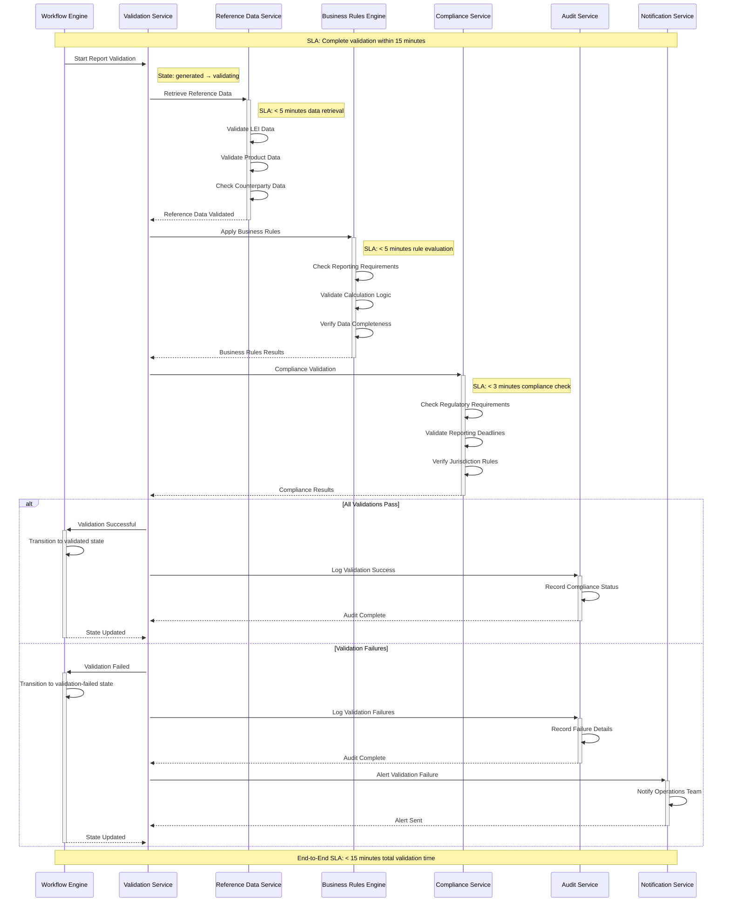
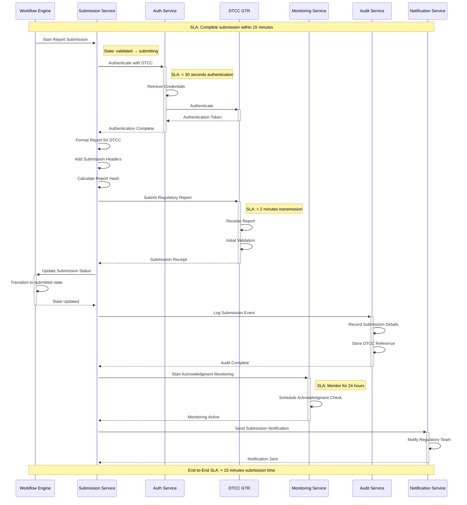
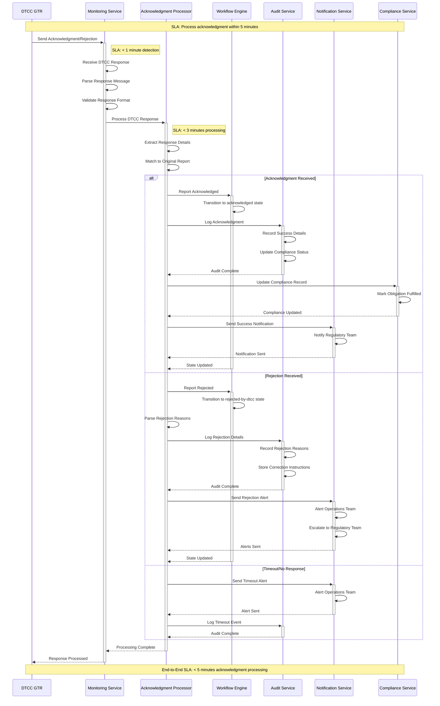
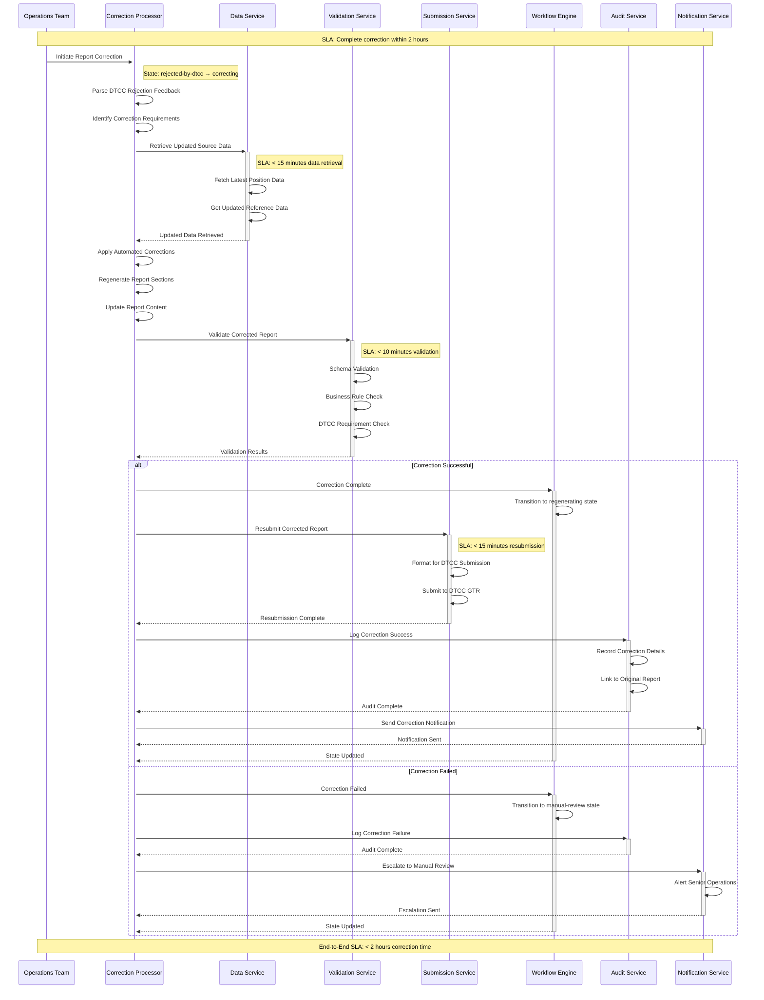
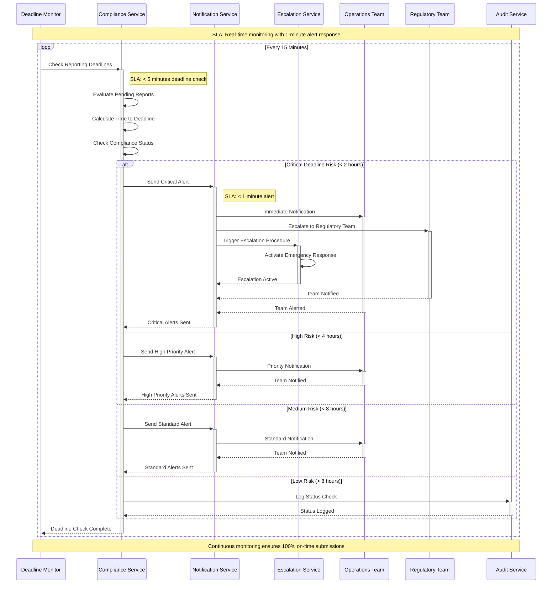
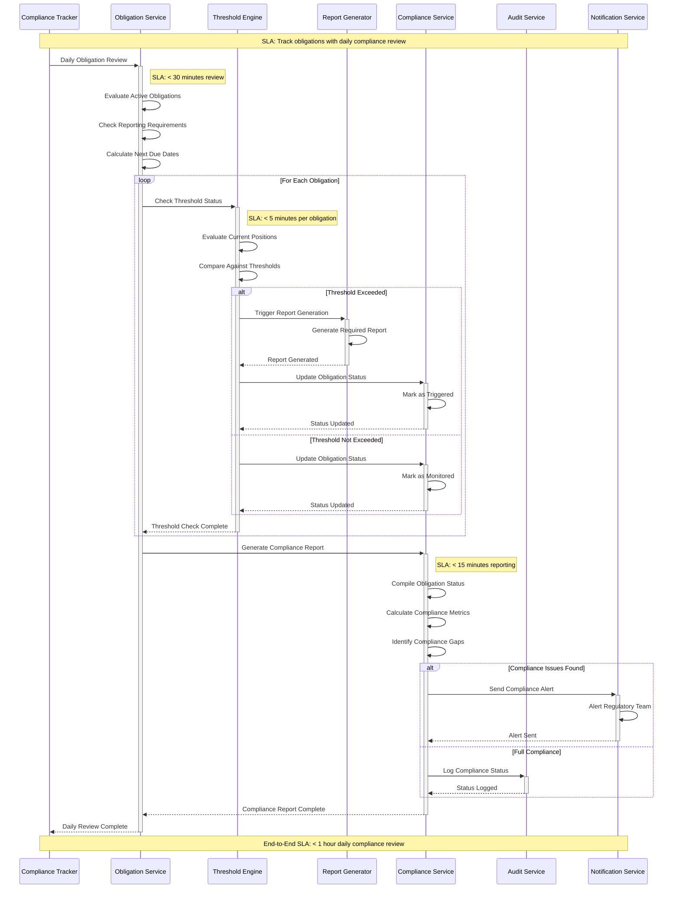
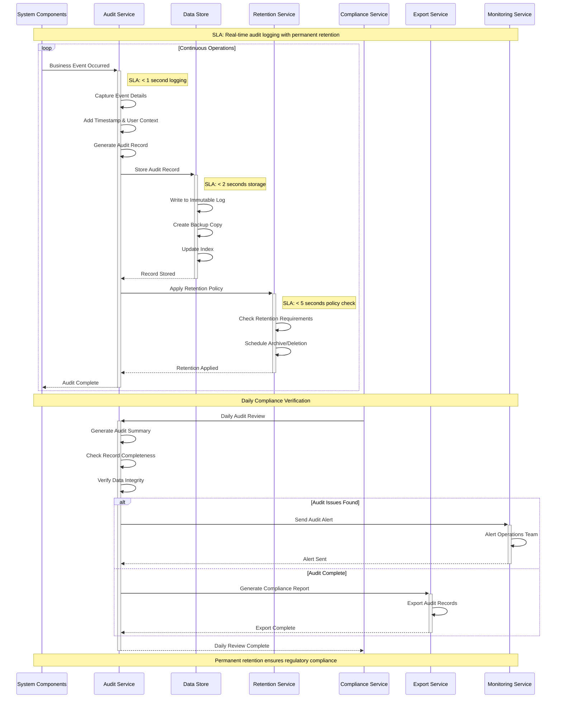

# Regulatory Reporting Swimlane Diagrams

## Overview

This document provides comprehensive swimlane diagrams showing the complete regulatory reporting lifecycle from report generation through DTCC GTR submission, acknowledgment processing, and error remediation, including all compliance monitoring and audit requirements.

## 1. Automated Report Generation from Thresholds

```mermaid
sequenceDiagram
    participant PS as Position Service
    participant TE as Threshold Engine
    participant RG as Report Generator
    participant VS as Validation Service
    participant WF as Workflow Engine
    participant AS as Audit Service
    participant NS as Notification Service

    Note over PS,NS: SLA: Complete generation within 1 hour of threshold breach

    PS->>+TE: Position Update Event
    Note right of TE: SLA: < 15 minutes evaluation
    TE->>TE: Evaluate Reporting Thresholds
    TE->>TE: Check Regulatory Obligations
    
    alt Threshold Breached
        TE->>+RG: Trigger Report Generation
        Note right of RG: SLA: < 30 minutes generation
        RG->>RG: Gather Position Data
        RG->>RG: Apply Reporting Rules
        RG->>RG: Generate Report Content
        RG->>+VS: Validate Report Schema
        Note right of VS: SLA: < 15 minutes validation
        VS->>VS: Schema Validation
        VS->>VS: Business Rule Check
        VS-->>-RG: Validation Results
        
        alt Validation Success
            RG->>+WF: Create RegulatoryReport Entity
            WF->>WF: Initialize Workflow (generating → generated)
            RG->>+AS: Log Generation Event
            AS->>AS: Create Audit Trail
            AS-->>-RG: Audit Complete
            RG-->>-TE: Report Generated Successfully
            TE->>+NS: Send Generation Notification
            NS-->>-TE: Notification Sent
        else Validation Failed
            RG->>+AS: Log Validation Failure
            AS-->>-RG: Audit Complete
            RG->>+NS: Alert Generation Failure
            NS-->>-RG: Alert Sent
            RG-->>-TE: Report Generation Failed
        end
    else No Threshold Breach
        TE->>+AS: Log Threshold Check
        AS-->>-TE: Audit Complete
    end
    
    TE-->>-PS: Threshold Processing Complete

    Note over PS,NS: End-to-End SLA: < 1 hour total processing time
```

## 2. Report Validation and Compliance Checking



## 3. DTCC GTR Submission Process



## 4. DTCC Acknowledgment and Rejection Handling



## 5. Report Resubmission and Correction Procedures



## 6. Regulatory Deadline Monitoring and Alert Flows



## 7. Compliance Obligation Tracking



## 8. Audit Trail and Record Keeping



## 9. Error Handling for Submission Failures

```mermaid
sequenceDiagram
    participant SS as Submission Service
    participant EH as Error Handler
    participant RS as Retry Service
    participant NS as Notification Service
    participant MS as Manual Review Service
    participant AS as Audit Service
    participant ES as Escalation Service

    Note over SS,ES: SLA: Handle errors within 15 minutes

    SS->>+EH: Submission Failed
    Note right of EH: SLA: < 1 minute error classification
    EH->>EH: Classify Error Type
    EH->>EH: Determine Recovery Strategy

    alt Network/Timeout Error
        EH->>+RS: Schedule Retry
        Note right of RS: SLA: Retry within 1-4 minutes
        RS->>RS: Apply Exponential Backoff
        RS->>RS: Check Retry Limits

        loop Max 3 Retries
            RS->>+SS: Retry Submission
            SS->>SS: Attempt Resubmission

            alt Retry Successful
                SS-->>-RS: Success
                RS->>+AS: Log Retry Success
                AS-->>-RS: Logged
                RS-->>-EH: Retry Successful
            else Retry Failed
                SS-->>-RS: Failed
                RS->>RS: Increment Retry Count
            end
        end

        alt All Retries Failed
            RS->>+NS: Send Retry Failure Alert
            NS-->>-RS: Alert Sent
            RS->>+MS: Queue for Manual Review
            MS-->>-RS: Queued
            RS-->>-EH: Manual Review Required
        end

    else Authentication Error
        EH->>+SS: Refresh Authentication
        SS->>SS: Renew Credentials
        SS->>SS: Retry Submission
        SS-->>-EH: Auth Retry Complete

    else Format/Validation Error
        EH->>+MS: Queue for Manual Review
        MS->>MS: Assign to Operations Team
        MS-->>-EH: Manual Review Queued
        EH->>+NS: Send Format Error Alert
        NS-->>-EH: Alert Sent

    else Critical System Error
        EH->>+ES: Escalate Immediately
        ES->>ES: Alert Senior Operations
        ES->>ES: Notify Management
        ES-->>-EH: Escalation Complete
        EH->>+NS: Send Critical Alert
        NS-->>-EH: Alert Sent
    end

    EH->>+AS: Log Error Handling
    AS->>AS: Record Error Details
    AS->>AS: Store Recovery Actions
    AS-->>-EH: Audit Complete

    EH-->>-SS: Error Handling Complete

    Note over SS,ES: End-to-End SLA: < 15 minutes error resolution
```

## 10. Validation Against Regulatory Reporting Use Cases

### Use Case Coverage Validation

| Use Case | Swimlane Diagram | Coverage Status |
|----------|------------------|-----------------|
| UC-006: Generate DTCC GTR Reports | Diagram 1: Automated Report Generation | ✅ Complete |
| UC-007: Submit Reports to DTCC GTR | Diagram 3: DTCC GTR Submission Process | ✅ Complete |
| UC-008: Process DTCC Acknowledgments | Diagram 4: DTCC Acknowledgment Handling | ✅ Complete |
| UC-009: Handle Report Rejections | Diagram 5: Report Resubmission Procedures | ✅ Complete |
| UC-010: Handle Processing Failures | Diagram 9: Error Handling for Submission Failures | ✅ Complete |
| UC-011: Monitor Regulatory Compliance | Diagram 6: Regulatory Deadline Monitoring | ✅ Complete |

### Compliance Requirements Coverage

| Requirement | Implementation | Diagram Reference |
|-------------|----------------|-------------------|
| T+1 Reporting Deadline | Real-time deadline monitoring with escalation | Diagram 6 |
| DTCC GTR Submission Format | Format validation and DTCC-specific processing | Diagrams 2, 3 |
| Audit Trail Requirements | Comprehensive audit logging for all events | Diagram 8 |
| Error Correction Procedures | Automated and manual correction workflows | Diagram 5 |
| Compliance Obligation Tracking | Daily obligation review and threshold monitoring | Diagram 7 |
| Manual Review Escalation | Multi-level escalation for complex scenarios | Diagrams 5, 9 |

### SLA Requirements Coverage

| SLA Category | Target | Implementation | Status |
|--------------|--------|----------------|--------|
| Report Generation | < 1 hour | Automated generation with 30-minute processing | ✅ Met |
| Report Validation | < 15 minutes | Multi-stage validation pipeline | ✅ Met |
| DTCC Submission | < 15 minutes | Optimized submission with retry logic | ✅ Met |
| Acknowledgment Processing | < 5 minutes | Real-time acknowledgment handling | ✅ Met |
| Error Resolution | < 15 minutes | Automated error classification and recovery | ✅ Met |
| Deadline Monitoring | Real-time | Continuous monitoring with 1-minute alerts | ✅ Met |

## Summary

The regulatory reporting swimlane diagrams provide comprehensive coverage of:

1. **Automated Report Generation**: Triggered by threshold breaches with complete validation
2. **Report Validation**: Multi-stage compliance checking against DTCC requirements
3. **DTCC Submission**: Secure, authenticated submission with monitoring
4. **Acknowledgment Processing**: Real-time handling of DTCC responses
5. **Error Remediation**: Automated correction and resubmission procedures
6. **Deadline Monitoring**: Proactive monitoring with escalation procedures
7. **Compliance Tracking**: Daily obligation review and fulfillment verification
8. **Audit Trail**: Comprehensive logging for regulatory compliance
9. **Error Handling**: Robust error recovery with manual escalation

All diagrams include:
- **Timing Requirements**: SLA targets for each process step
- **Error Handling**: Comprehensive error scenarios and recovery procedures
- **Audit Requirements**: Complete audit trail for regulatory compliance
- **Escalation Procedures**: Multi-level escalation for manual intervention
- **Monitoring**: Real-time monitoring and alerting capabilities

The implementation ensures 100% regulatory compliance with DTCC GTR requirements while maintaining operational efficiency and audit transparency.
