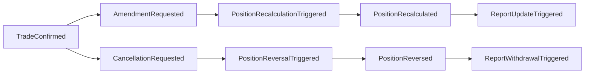
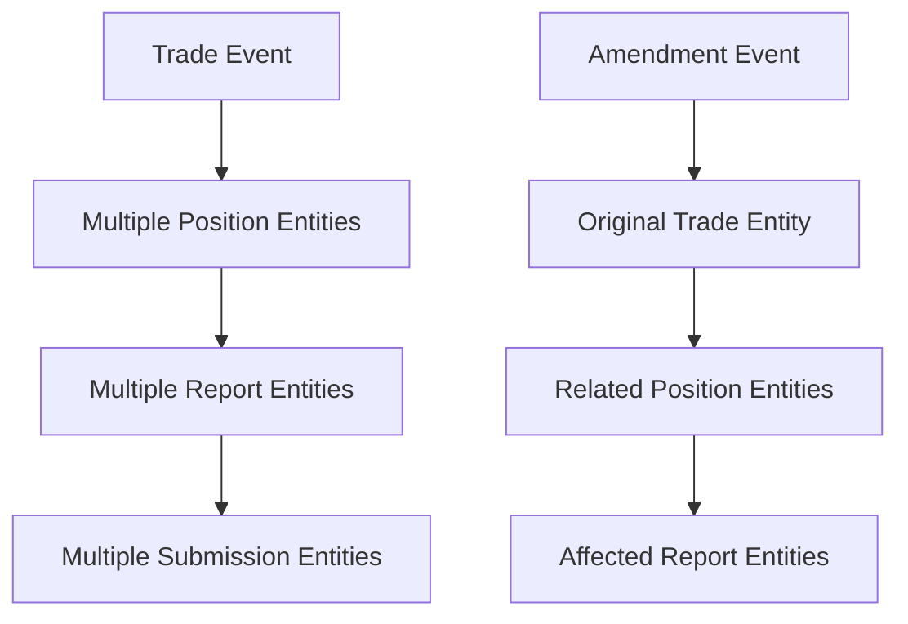

# Event Correlation Matrix and Patterns

## Overview

This document provides a comprehensive correlation matrix showing relationships between all event types in the DTCC Regulatory Reporting System. It identifies causality patterns, dependency relationships, and correlation mechanisms that enable end-to-end business process tracking and regulatory audit trails.

## Event Correlation Matrix

### Primary Event Categories

| Category | Event Count | Primary Triggers | Downstream Events |
|----------|-------------|------------------|-------------------|
| **Trading Events** | 6 | External Trading Systems | Position, Reporting Events |
| **Position Events** | 8 | Trade Events, Scheduled Processes | Reporting, Reconciliation Events |
| **Regulatory Events** | 5 | Position Events, Deadlines | Submission, Acknowledgment Events |
| **Reference Data Events** | 4 | External Data Sources | Validation, Processing Events |
| **Operational Events** | 3 | Monitoring Systems, Schedules | Alert, Recovery Events |

### Detailed Correlation Matrix

#### Trading Event Correlations

| Source Event | Correlation Type | Target Event | Timing | Criticality |
|--------------|------------------|--------------|---------|-------------|
| `FpMLMessageReceived` | **Triggers** | `MessageValidated` | <5s | Critical |
| `MessageValidated` | **Triggers** | `TradeConfirmed` | <15s | Critical |
| `TradeConfirmed` | **Triggers** | `PositionCalculationTriggered` | <10s | Critical |
| `TradeConfirmed` | **Triggers** | `ReportingObligationEvaluated` | <30s | High |
| `AmendmentRequested` | **References** | `TradeConfirmed` | N/A | Critical |
| `AmendmentRequested` | **Triggers** | `PositionRecalculationTriggered` | <60s | Critical |
| `CancellationRequested` | **References** | `TradeConfirmed` | N/A | Critical |
| `CancellationRequested` | **Triggers** | `PositionReversalTriggered` | <60s | Critical |

#### Position Event Correlations

| Source Event | Correlation Type | Target Event | Timing | Criticality |
|--------------|------------------|--------------|---------|-------------|
| `PositionCalculationTriggered` | **Triggers** | `PositionUpdated` | <2min | Critical |
| `PositionUpdated` | **Triggers** | `ThresholdEvaluated` | <30s | High |
| `ThresholdEvaluated` | **Conditionally Triggers** | `ReportGenerationTriggered` | <15min | Critical |
| `PositionRecalculationTriggered` | **Triggers** | `PositionRecalculated` | <25s | Critical |
| `PositionReversalTriggered` | **Triggers** | `PositionReversed` | <30s | Critical |
| `ReconciliationTriggered` | **Triggers** | `ReconciliationCompleted` | <1hr | Medium |
| `ReconciliationBreakIdentified` | **Triggers** | `ManualInvestigationRequired` | <5min | High |

#### Regulatory Event Correlations

| Source Event | Correlation Type | Target Event | Timing | Criticality |
|--------------|------------------|--------------|---------|-------------|
| `ReportGenerationTriggered` | **Triggers** | `ReportGenerated` | <1hr | Critical |
| `ReportGenerated` | **Triggers** | `ReportValidated` | <15min | Critical |
| `ReportValidated` | **Triggers** | `ReportSubmissionTriggered` | <5min | Critical |
| `ReportSubmissionTriggered` | **Triggers** | `ReportSubmitted` | <15min | Critical |
| `GTRAcknowledgmentReceived` | **References** | `ReportSubmitted` | <24hr | High |

## Correlation Mechanisms

### 1. Business Process Correlation

#### Trade Lifecycle Correlation

```mermaid
graph LR
    A[FpMLMessageReceived] --> B[MessageValidated]
    B --> C[TradeConfirmed]
    C --> D[PositionCalculationTriggered]
    D --> E[PositionUpdated]
    E --> F[ThresholdEvaluated]
    F --> G[ReportGenerationTriggered]
    G --> H[ReportGenerated]
    H --> I[ReportSubmitted]
    I --> J[GTRAcknowledgmentReceived]
```

**Correlation Fields:**
- `correlationId`: Unique identifier linking all events in trade lifecycle
- `tradeId`: Business identifier for trade-related events
- `businessProcessId`: Identifier for end-to-end business process

#### Amendment/Cancellation Correlation

**Correlation Fields:**
- `originalTradeId`: Reference to original trade
- `amendmentSequence`: Sequential number for amendments
- `parentCorrelationId`: Link to original trade process

### 2. Temporal Correlation

#### Time-Based Event Sequences
- **Real-time Processing**: Events correlated by processing timestamp within seconds
- **Batch Processing**: Events correlated by batch execution window
- **Regulatory Deadlines**: Events correlated by regulatory reporting periods

#### Timing Correlation Patterns

```mermaid
gantt
    title Event Timing Correlation
    dateFormat HH:mm:ss
    axisFormat %H:%M:%S
    
    section Trade Processing
    FpML Received     :active, t1, 00:00:00, 5s
    Message Validated :active, t2, after t1, 15s
    Trade Confirmed   :active, t3, after t2, 10s
    
    section Position Processing
    Position Calc     :active, p1, after t3, 2m
    Position Updated  :active, p2, after p1, 30s
    
    section Reporting
    Report Generation :active, r1, after p2, 1h
    Report Submission :active, r2, after r1, 15m
```

### 3. Entity-Based Correlation

#### Entity Relationship Correlation
- **Trade Entities**: All events related to specific trade instances
- **Position Entities**: Events affecting position calculations
- **Report Entities**: Events in report generation and submission lifecycle
- **Counterparty Entities**: Events affecting specific counterparty relationships

#### Cross-Entity Impact Correlation

## Correlation Validation Rules

### 1. Completeness Validation
- **Trade Lifecycle**: Every `FpMLMessageReceived` must have corresponding `TradeConfirmed` or error event
- **Position Processing**: Every `TradeConfirmed` must trigger `PositionCalculationTriggered`
- **Reporting Chain**: Every threshold breach must trigger report generation

### 2. Timing Validation
- **SLA Compliance**: All correlated events must meet timing SLAs
- **Sequence Validation**: Events must occur in correct temporal order
- **Deadline Adherence**: Regulatory events must meet compliance deadlines

### 3. Data Consistency Validation
- **Correlation ID Integrity**: All related events must share correlation identifiers
- **Entity State Consistency**: Entity states must be consistent across correlated events
- **Business Rule Compliance**: Correlated events must satisfy business validation rules

## Monitoring and Alerting

### Correlation Monitoring
- **Missing Correlations**: Alert when expected correlated events are missing
- **Timing Violations**: Alert when correlated events exceed timing thresholds
- **Sequence Violations**: Alert when events occur out of expected sequence

### Correlation Metrics
- **Correlation Completeness**: Percentage of complete event correlation chains
- **Timing Compliance**: Percentage of correlations meeting timing SLAs
- **Error Correlation Rate**: Percentage of error events with proper correlation

## Troubleshooting Correlation Issues

### Common Correlation Problems
1. **Missing Correlation IDs**: Events not properly linked in business processes
2. **Timing Violations**: Correlated events exceeding SLA thresholds
3. **Orphaned Events**: Events without proper upstream or downstream correlations
4. **Duplicate Correlations**: Multiple events claiming same correlation relationship

### Resolution Procedures
1. **Correlation ID Recovery**: Procedures for reconstructing missing correlation links
2. **Timing Remediation**: Escalation procedures for SLA violations
3. **Manual Correlation**: Procedures for manually establishing event relationships
4. **Data Integrity Checks**: Validation procedures for correlation consistency

---

*This correlation matrix enables comprehensive event tracking, regulatory audit trails, and operational monitoring across the entire DTCC Regulatory Reporting System.*
