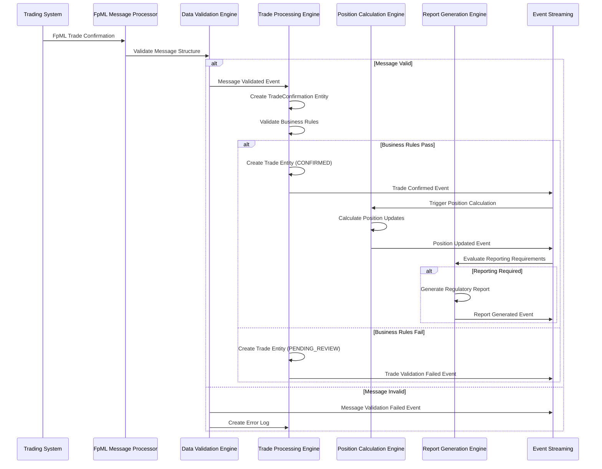
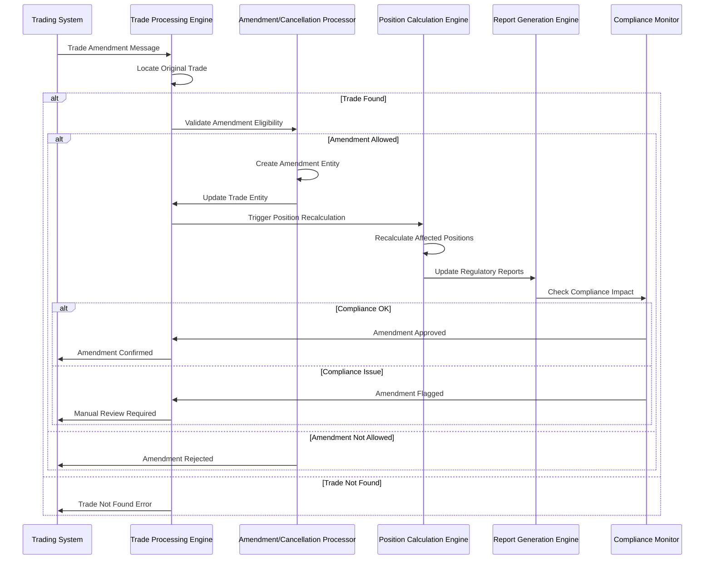
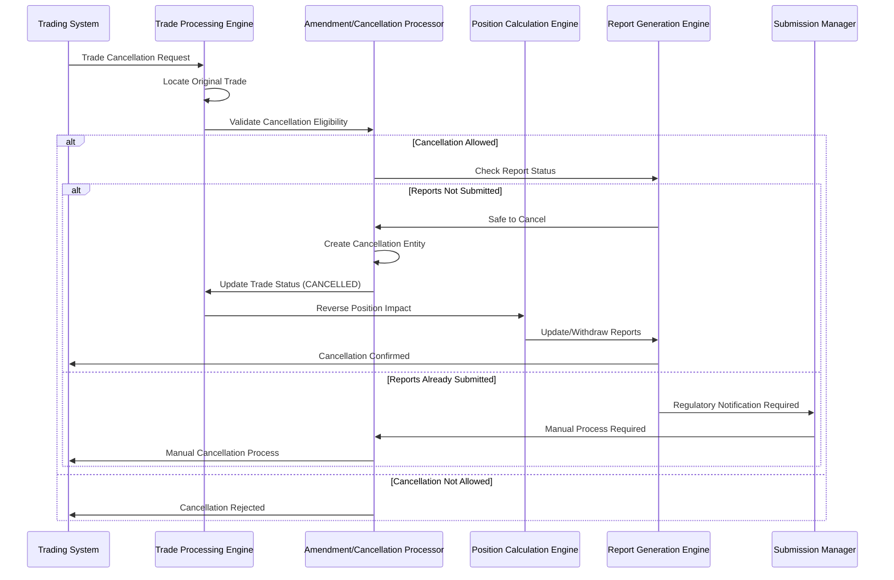
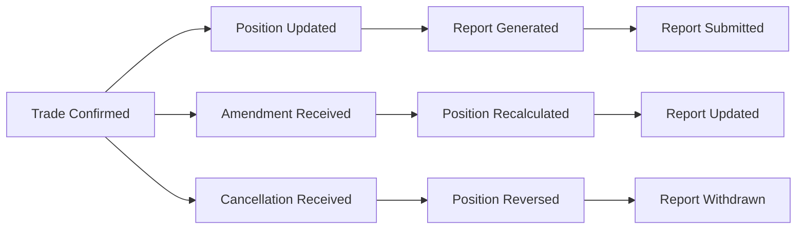

# Event Flows - Trade Processing Use Cases

## Overview

This document defines the detailed event flows for trade processing use cases, showing the sequence of events, decision points, and system interactions from trade confirmation through position calculation and regulatory reporting.

## UC-001: Process New Trade Confirmation - Event Flow

### High-Level Event Flow Diagram

### Detailed Event Sequence

#### Phase 1: Message Reception and Validation
1. **Event**: `FpML_Message_Received`
   - **Source**: Trading System
   - **Target**: FpML Message Processor
   - **Payload**: Raw FpML message content
   - **Timing**: Real-time

2. **Event**: `Message_Structure_Validation_Started`
   - **Source**: FpML Message Processor
   - **Target**: Data Validation Engine
   - **Decision Point**: Schema validation
   - **Success Path**: Continue to business validation
   - **Failure Path**: Generate validation error event

3. **Event**: `Message_Structure_Validated` / `Message_Structure_Invalid`
   - **Source**: Data Validation Engine
   - **Success Criteria**: Valid FpML schema, required fields present
   - **Failure Criteria**: Schema violations, missing mandatory fields

#### Phase 2: Business Rule Validation
4. **Event**: `Business_Rule_Validation_Started`
   - **Source**: Trade Processing Engine
   - **Validation Checks**:
     - Counterparty exists and is active
     - Product reference data available
     - Trade date within acceptable range
     - Notional amount within limits

5. **Event**: `Business_Rules_Validated` / `Business_Rules_Failed`
   - **Success Path**: Create confirmed trade entity
   - **Failure Path**: Create pending review trade entity

#### Phase 3: Entity Creation and Event Generation
6. **Event**: `TradeConfirmation_Entity_Created`
   - **Source**: Trade Processing Engine
   - **Entity State**: RECEIVED
   - **Audit Trail**: Message receipt timestamp, source system

7. **Event**: `Trade_Entity_Created`
   - **Source**: Trade Processing Engine
   - **Entity State**: CONFIRMED or PENDING_REVIEW
   - **Triggers**: Position calculation workflow

8. **Event**: `Trade_Confirmed`
   - **Source**: Trade Processing Engine
   - **Subscribers**: Position Calculation Engine, Audit Trail Manager
   - **Payload**: Trade ID, counterparty, product, notional

### Decision Points and Branching Logic

#### Decision Point 1: Message Structure Validation
- **Condition**: FpML schema compliance
- **Success Branch**: Continue to business validation
- **Failure Branch**: Reject message, log error, notify operations

#### Decision Point 2: Business Rule Validation
- **Condition**: All business rules pass
- **Success Branch**: Create confirmed trade, trigger position calculation
- **Failure Branch**: Create pending trade, require manual review

#### Decision Point 3: Position Calculation Impact
- **Condition**: Trade affects existing positions
- **High Impact**: Immediate position recalculation required
- **Low Impact**: Batch position update acceptable

#### Decision Point 4: Regulatory Reporting Threshold
- **Condition**: Position exceeds reporting thresholds
- **Above Threshold**: Immediate report generation required
- **Below Threshold**: Monitor for future threshold breaches

---

## UC-002: Process Trade Amendment - Event Flow

### High-Level Event Flow Diagram

### Amendment Validation Rules

#### Timing Constraints
- **Same Day Amendments**: Allowed until position calculation cutoff
- **Next Day Amendments**: Require compliance approval
- **Historical Amendments**: Require regulatory notification

#### Amendment Types
- **Economic Terms**: Notional, rate, maturity changes
- **Administrative**: Counterparty details, reference updates
- **Structural**: Product type changes (restricted)

#### Impact Assessment
- **Position Impact**: Recalculation required if economic terms change
- **Reporting Impact**: Report updates required if above thresholds
- **Compliance Impact**: Regulatory notification if material changes

---

## UC-003: Process Trade Cancellation - Event Flow

### High-Level Event Flow Diagram

### Cancellation Validation Rules

#### Eligibility Criteria
- **Trade Status**: Must be CONFIRMED or PENDING_REVIEW
- **Timing**: Within cancellation window (typically same day)
- **Authorization**: Proper authorization from trading desk
- **Regulatory**: No submitted reports or manual notification process

#### Reversal Process
- **Position Reversal**: Remove trade impact from positions
- **Report Updates**: Withdraw or amend regulatory reports
- **Audit Trail**: Maintain complete cancellation history

---

## Cross-Use Case Event Interactions

### Event Correlation Patterns

#### Trade Lifecycle Events

#### Event Timing Dependencies
- **Trade Confirmation** → **Position Calculation**: Within 30 seconds
- **Position Update** → **Report Generation**: Within 1 hour
- **Report Generation** → **Report Submission**: Within regulatory deadline
- **Amendment/Cancellation** → **Position Recalculation**: Within 60 seconds

### Error Handling and Recovery Patterns

#### Retry Mechanisms
- **Transient Failures**: Automatic retry with exponential backoff
- **Business Rule Failures**: Manual review queue
- **System Failures**: Circuit breaker pattern with fallback

#### Compensation Patterns
- **Failed Position Calculation**: Retry with last known good state
- **Failed Report Generation**: Use previous report template
- **Failed Submission**: Queue for next submission window

### Performance and Scalability Considerations

#### Event Processing Patterns
- **High-Frequency Events**: Batch processing for position updates
- **Critical Events**: Real-time processing for regulatory deadlines
- **Background Events**: Scheduled processing for reconciliation

#### Load Balancing
- **Trade Processing**: Partition by counterparty
- **Position Calculation**: Partition by product type
- **Report Generation**: Partition by regulatory regime

Paul Muadib, I have created the detailed event flows for the trade processing use cases. This includes sequence diagrams, decision points, validation rules, and cross-use case interactions.

Next, I should create similar event flow documentation for the position management and regulatory reporting use cases. Would you like me to continue with those, or would you prefer to review the trade processing flows first?
