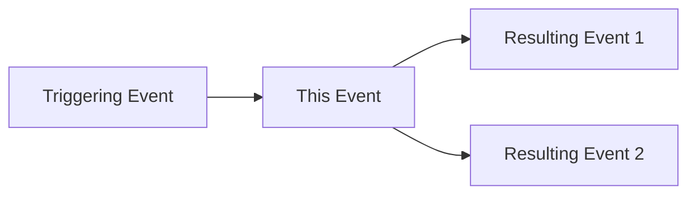

# Event Specification Template

This template provides the standardized format for documenting all events in the DTCC Regulatory Reporting System.

## Event Specification Format

### Event: [EventName]

**Event ID**: `[unique-event-identifier]`  
**Event Type**: `[BusinessEvent|SystemEvent|ErrorEvent|AuditEvent]`  
**Category**: `[specific-category]`  
**Version**: `[semantic-version]`  
**Status**: `[Active|Deprecated|Draft]`

---

## 1. Overview

**Purpose**: [Brief description of what this event represents and why it occurs]

**Business Context**: [Business scenario or process that triggers this event]

**Frequency**: `[Real-time|Batch|Scheduled|On-demand]`

**Criticality**: `[Critical|High|Medium|Low]`

---

## 2. Event Structure

### 2.1 Event Envelope
```json
{
  "eventId": "uuid",
  "eventType": "string",
  "entityType": "string",
  "entityId": "string", 
  "timestamp": "iso8601",
  "version": "semver",
  "correlationId": "uuid",
  "causationId": "uuid",
  "actorId": "string",
  "source": "string",
  "payload": {
    // Event-specific payload structure
  },
  "metadata": {
    "traceId": "string",
    "businessContext": {},
    "securityContext": {},
    "processingHints": {}
  }
}
```

### 2.2 Payload Schema
```json
{
  "$schema": "https://json-schema.org/draft/2020-12/schema",
  "$id": "https://cyoda.com/cloud/event/[category]/[EventName].json",
  "title": "[EventName]",
  "description": "[Detailed description of the event payload]",
  "type": "object",
  "properties": {
    // Specific payload properties
  },
  "required": [
    // Required fields
  ],
  "additionalProperties": false
}
```

### 2.3 Example Payload
```json
{
  // Complete example of actual event payload
}
```

---

## 3. Event Triggers

### 3.1 Triggering Conditions
- **Condition 1**: [Description of when this event is triggered]
- **Condition 2**: [Additional triggering conditions]

### 3.2 Triggering Sources
- **Source System**: [System or component that generates this event]
- **Actor Types**: [User|System|External|Scheduled]
- **Prerequisites**: [Required conditions or prior events]

---

## 4. Event Processing

### 4.1 Event Handlers
- **Primary Handlers**: [List of components that process this event]
- **Secondary Handlers**: [Optional or conditional handlers]

### 4.2 Processing Guarantees
- **Delivery**: `[At-least-once|Exactly-once|At-most-once]`
- **Ordering**: `[Strict|Partial|None]`
- **Durability**: `[Persistent|Transient]`
- **Consistency**: `[Strong|Eventual]`

### 4.3 Processing Timeouts
- **Processing SLA**: [Maximum processing time]
- **Retry Policy**: [Retry strategy and limits]
- **Dead Letter**: [Dead letter queue configuration]

---

## 5. Event Correlation

### 5.1 Correlation Patterns
- **Correlation ID**: [How correlation IDs are used]
- **Causation Chain**: [Events that cause this event]
- **Downstream Events**: [Events triggered by this event]

### 5.2 Event Relationships


### 5.3 Business Process Context
- **Workflow**: [Associated business workflow]
- **Process Stage**: [Stage in the business process]
- **Decision Points**: [Business decisions influenced by this event]

---

## 6. Data Requirements

### 6.1 Required Data Elements
| Field | Type | Description | Source | Validation |
|-------|------|-------------|---------|------------|
| [field] | [type] | [description] | [source] | [rules] |

### 6.2 Data Quality Requirements
- **Completeness**: [Required field completion rates]
- **Accuracy**: [Data accuracy requirements]
- **Timeliness**: [Data freshness requirements]
- **Consistency**: [Cross-system consistency requirements]

---

## 7. Security and Compliance

### 7.1 Security Requirements
- **Access Control**: [Who can generate/consume this event]
- **Data Classification**: [Data sensitivity level]
- **Encryption**: [Encryption requirements]
- **Audit Requirements**: [Audit logging requirements]

### 7.2 Regulatory Compliance
- **Regulatory Framework**: [Applicable regulations]
- **Retention Requirements**: [Data retention periods]
- **Reporting Requirements**: [Regulatory reporting obligations]

---

## 8. Error Handling

### 8.1 Error Scenarios
- **Validation Errors**: [Data validation failures]
- **Processing Errors**: [Processing logic failures]
- **System Errors**: [Infrastructure failures]
- **Business Errors**: [Business rule violations]

### 8.2 Error Recovery
- **Retry Strategy**: [Automatic retry configuration]
- **Fallback Actions**: [Alternative processing paths]
- **Manual Intervention**: [When manual intervention is required]
- **Escalation**: [Error escalation procedures]

---

## 9. Monitoring and Alerting

### 9.1 Key Metrics
- **Volume Metrics**: [Event volume thresholds]
- **Latency Metrics**: [Processing time thresholds]
- **Error Metrics**: [Error rate thresholds]
- **Business Metrics**: [Business KPI impacts]

### 9.2 Alerting Rules
- **Critical Alerts**: [Conditions requiring immediate attention]
- **Warning Alerts**: [Conditions requiring monitoring]
- **Information Alerts**: [Informational notifications]

---

## 10. Testing and Validation

### 10.1 Test Scenarios
- **Happy Path**: [Normal processing scenarios]
- **Error Conditions**: [Error handling scenarios]
- **Edge Cases**: [Boundary condition testing]
- **Load Testing**: [Performance testing scenarios]

### 10.2 Validation Criteria
- **Functional Validation**: [Functional correctness criteria]
- **Performance Validation**: [Performance acceptance criteria]
- **Security Validation**: [Security testing requirements]

---

## 11. Version History

| Version | Date | Changes | Author |
|---------|------|---------|--------|
| 1.0.0 | [date] | Initial specification | [author] |

---

## 12. References

- **Related Events**: [Links to related event specifications]
- **Workflow Documentation**: [Links to workflow documentation]
- **Schema Definitions**: [Links to JSON schema files]
- **API Documentation**: [Links to API specifications]
