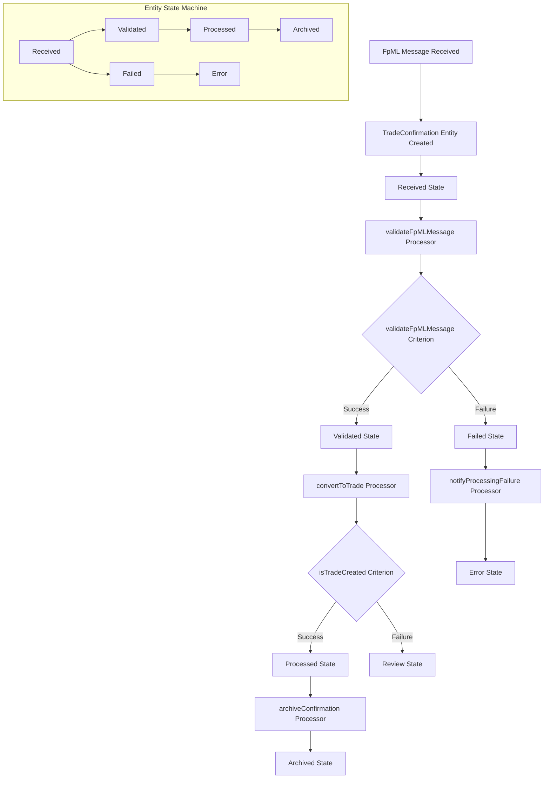
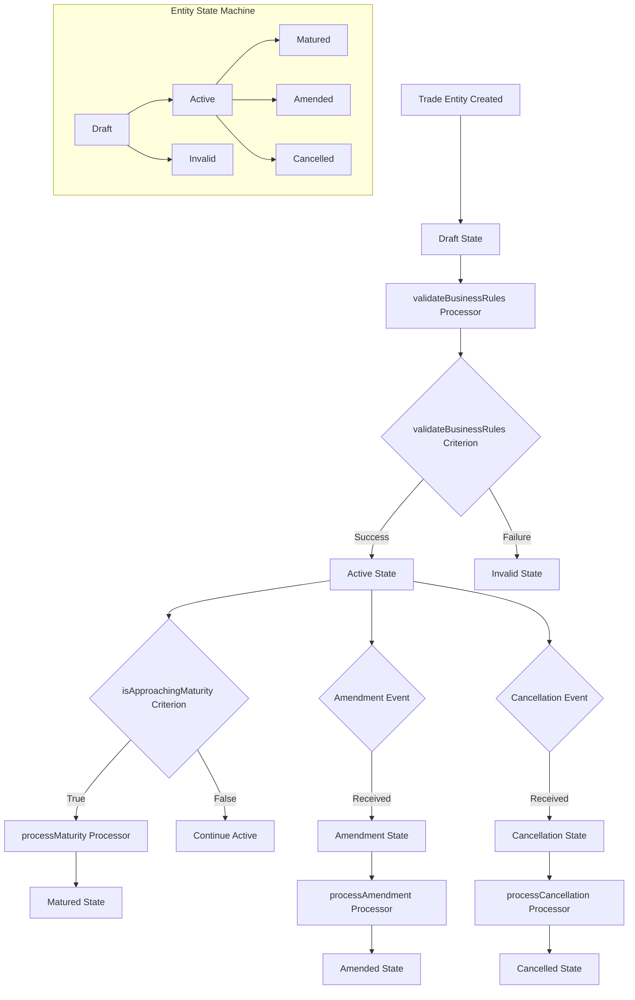
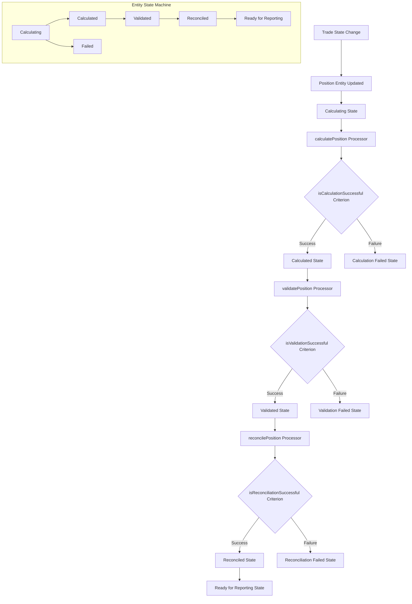
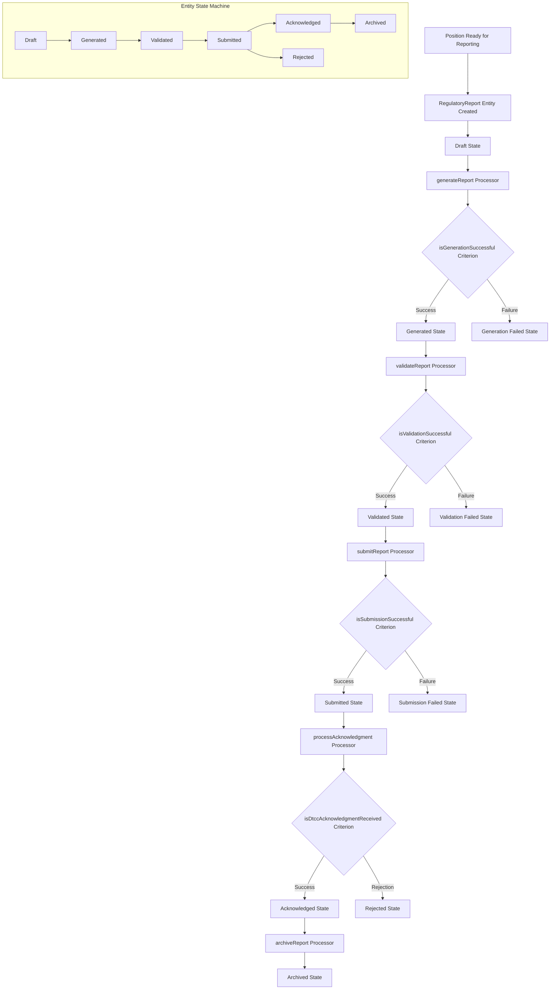
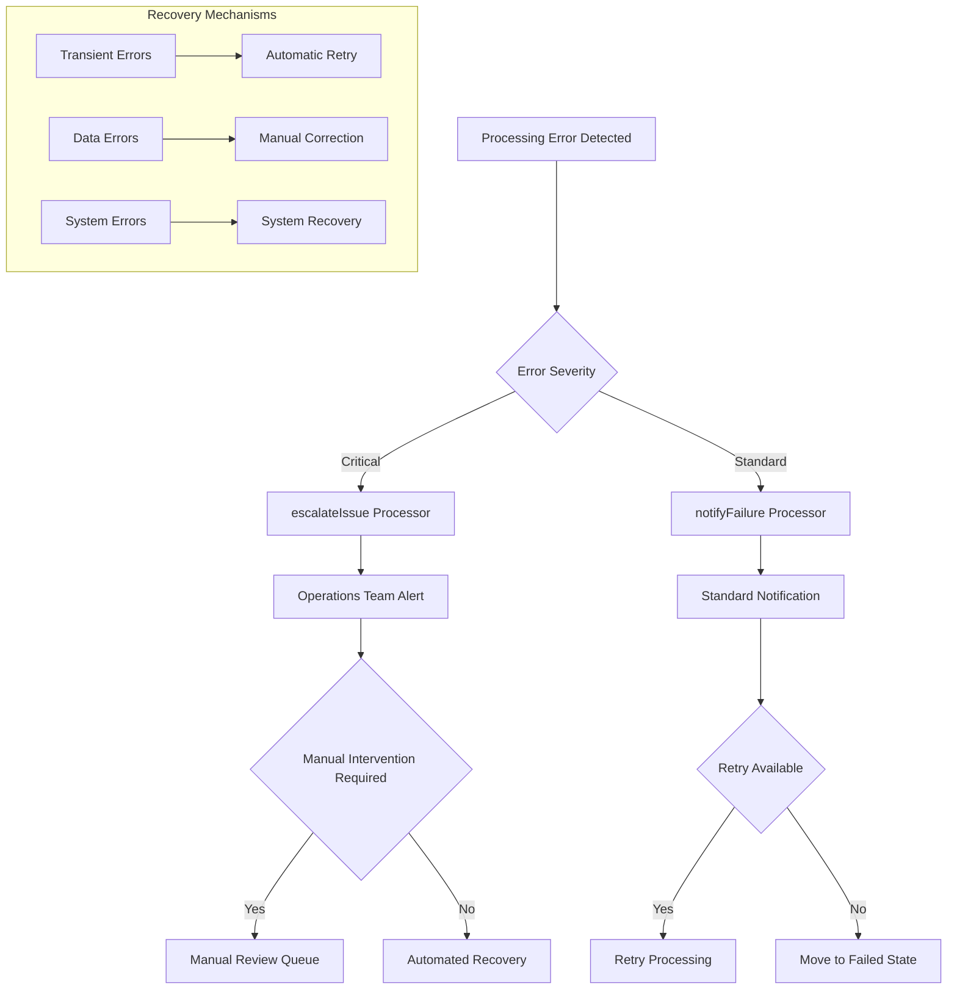
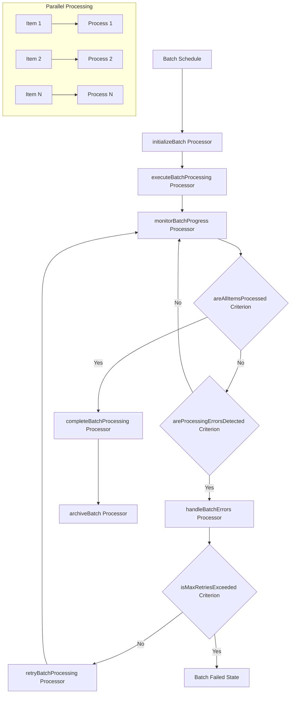
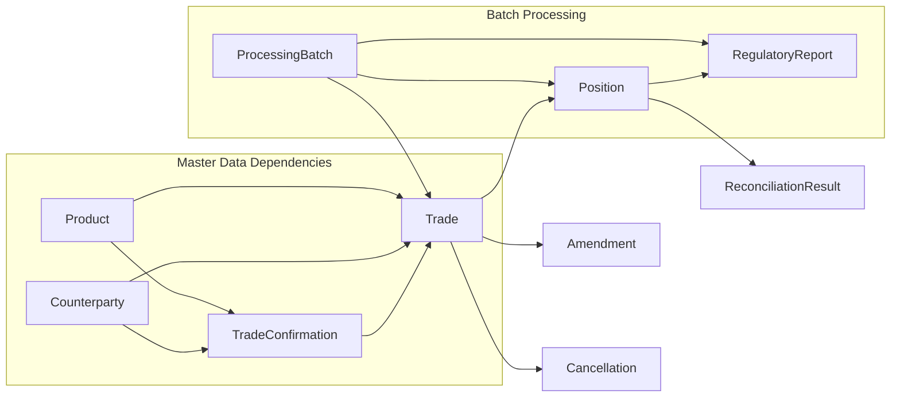
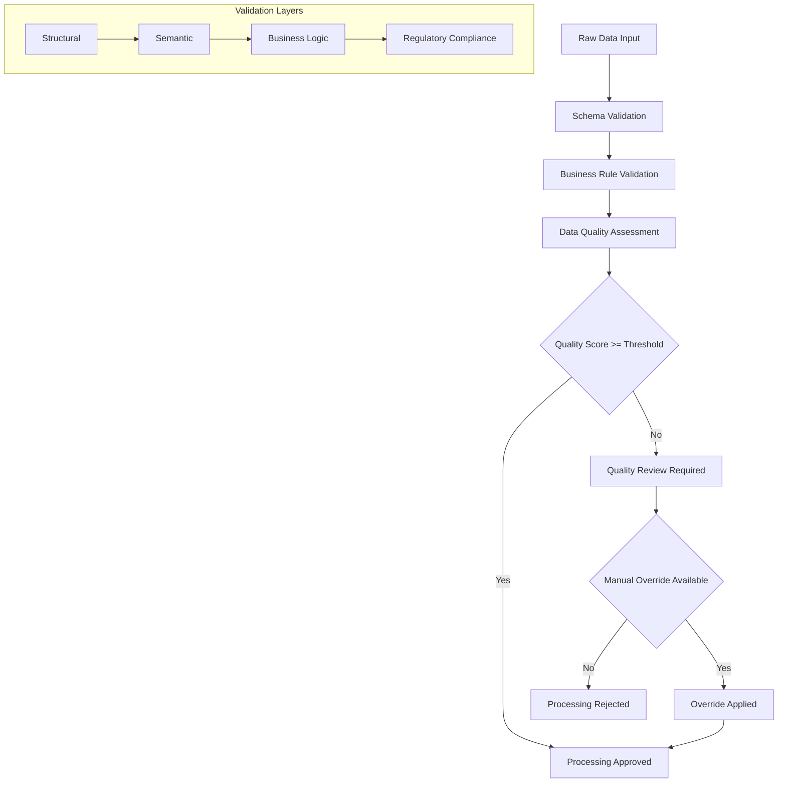
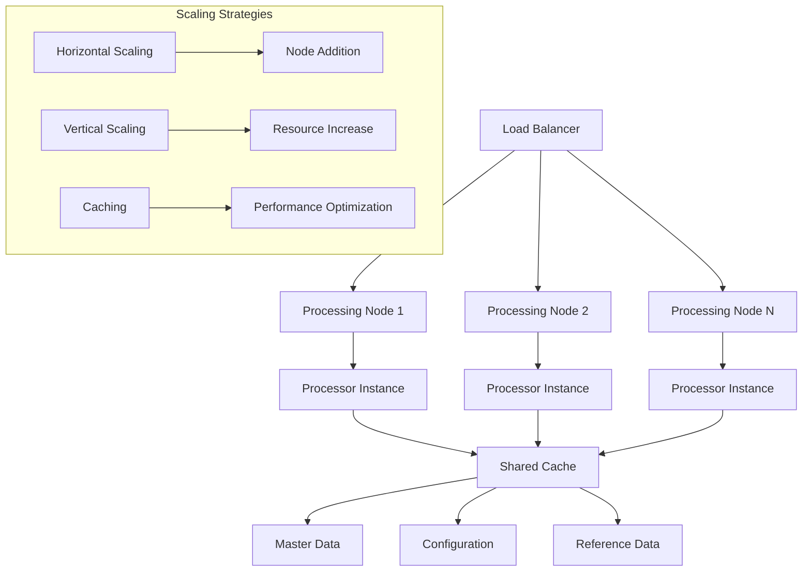
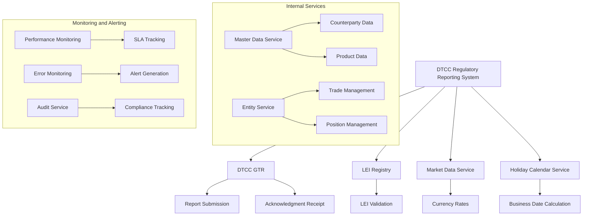

# Entity Workflow Interaction Diagrams

## Overview

This document provides comprehensive diagrams showing entity state transitions and workflow interactions in the DTCC regulatory reporting system. Each diagram illustrates how entity workflows process business events through state machines, with processors and criteria implementing the workflow logic within each entity.

## TradeConfirmation Entity Workflow

## Trade Entity Lifecycle Workflow

## Position Entity Workflow

## RegulatoryReport Entity Workflow

## Error Handling and Escalation Flow

## Batch Processing Coordination

## Cross-Workflow Dependencies

## Data Quality and Validation Chain

## Performance and Scalability Patterns

## Integration Points and External Dependencies

## Entity Workflow Interaction Summary

### Key Entity Workflow Patterns

1. **State-Driven Processing**: Entity workflows execute through defined state transitions with validation gates
2. **Conditional State Transitions**: Criteria determine entity state changes based on business logic
3. **Error State Management**: Failures transition entities to appropriate error states with notification workflows
4. **Concurrent Entity Processing**: Multiple entity workflows execute concurrently across the platform
5. **Entity Data Transformation**: Processors transform entity data during state transitions
6. **External System Integration**: Entity workflows interact with external services through defined interfaces

### Performance Considerations

1. **Entity Caching**: Frequently accessed entities cached for rapid state retrieval
2. **Distributed Processing**: Entity workflows distributed across platform nodes for scalability
3. **Workflow Timeout Management**: Each entity workflow has appropriate timeout configurations
4. **Resource Optimization**: Entity workflows designed for efficient platform resource utilization

### Error Handling Strategy

1. **Error State Management**: Entity workflows transition to appropriate error states for partial failures
2. **Retry Workflows**: Transient errors trigger automatic retry workflows with backoff
3. **Manual Review States**: Complex errors transition entities to manual review states
4. **Escalation Workflows**: Critical errors trigger escalation entity workflows to operations teams

### Entity Data Integrity

1. **State Transition Validation**: Each entity state transition includes validation checkpoints
2. **Audit Trail Entities**: All entity interactions create audit trail entities for compliance
3. **Data Quality Workflows**: Continuous quality assessment through dedicated entity workflows
4. **Cross-Entity Consistency**: Entity relationships maintain data consistency through workflow coordination
